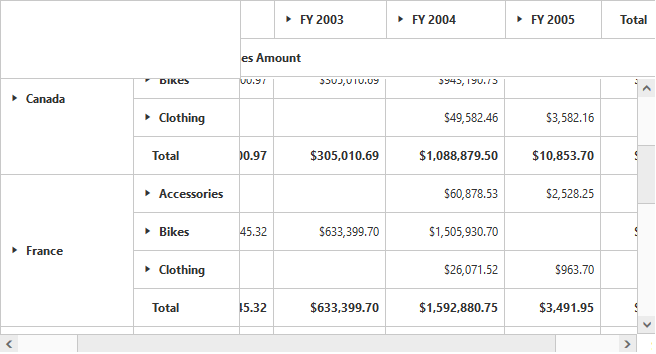
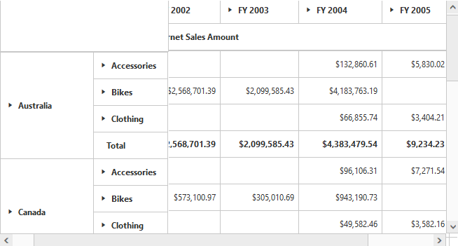
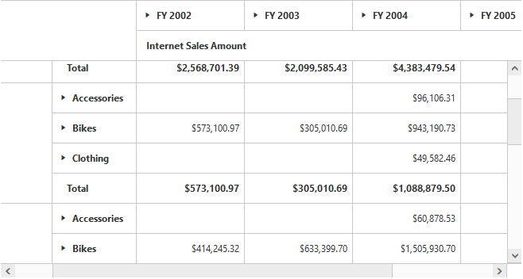

# Frozen header

Allows you to freeze the header of the grid. so, it will be always visible while scrolling the content with large number of rows or columns providing a precise view by this [`enableFrozenHeaders`](/api/js/ejpivotgrid#members:frozenheadersettings-enablefrozenheaders) property under the [`frozenHeaderSettings`](/api/js/ejpivotgrid#members:frozenheadersettings).





You can also freeze the row/column headers individually by setting [`enableFrozenRowHeaders`](/api/js/ejpivotgrid#members:frozenheadersettings-enablefrozenrowheaders)/[`enableFrozenColumnHeaders`](/api/js/ejpivotgrid#members:frozenheadersettings-enablefrozencolumnheaders) properties under the [`frozenHeaderSettings`](/api/js/ejpivotgrid#members:frozenheadersettings).









You can also set the size of the scroller (horizontal and vertical) in the pivot grid by using the [`scrollerSize`](../api/ejpivotgrid#members:frozenheadersettings-scrollersize) property under the [`frozenHeaderSettings`](../api/ejpivotgrid#members:frozenheadersettings).





