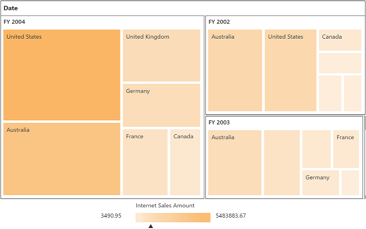

# Getting started with JavaScript PivotTreeMap

## Creating a simple application with pivot tree map and OLAP data source (client mode)

This section covers the information required to populate a simple pivot tree map with the OLAP data completely on the [`client-side`](/api/js/ejpivottreemap#members:operationalmode).

### Scripts and CSS references

Create an HTML page and add scripts and style sheets that are required to render a pivot tree map widget which are highlighted below in an appropriate order:

1. ej.web.all.min.css
2. jQuery-3.0.0.min.js
3. ej.web.all.min.js
4. jsrender.min.js

### Initialize pivot tree map

Place a "div" tag in the HTML page which acts as a container for the pivot tree map widget. Then, initialize the widget by using the "ejPivotTreeMap" method.



<!DOCTYPE html> 
<html> 
<head> 
    <title>PivotTreeMap - Getting Started</title> 
    <link href="http://cdn.syncfusion.com/{{ site.releaseversion }}/js/web/flat-azure/ej.web.all.min.css" rel="stylesheet" type="text/css" />
    
    
    
</head> 
<body> 
    <! --Create a tag which acts as a container for ejPivotTreeMap widget. --> 
    
 
 
     
</body> 
</html>



### Populate pivot tree map with data source

Initialize the OLAP data source for the pivot tree map widget as shown below:



<html> 

//……

<body> 
    
 
 
    

    <!--Tooltip labels can be localized here-->
       
</body> 
</html>



The above code will generate a simple pivot tree map showing customer count over different customer geographic locations across a period of fiscal years.

 

The following table will explain the OLAP [`dataSource`](/api/js/ejpivottreemap#members:datasource) properties at [`client-side`](/api/js/ejpivottreemap#members:operationalmode) in detail:

<table>
    <tr>
        <th>
            Properties
        </th>
        <th>
            Description
        </th>
    </tr>
    <tr>
    <td>
        {{'[`cube`](https://help.syncfusion.com/api/js/ejpivottreemap#members:datasource-cube "cube")'| markdownify }}
    </td>
    <td>
        Contains the respective cube name from OLAP database as string type.
    </td>
    </tr>
    <tr>
    <td>
        {{'[`sourceInfo`](https://help.syncfusion.com/api/js/ejpivottreemap#members:datasource-sourceinfo "sourceInfo")'| markdownify }}
    </td>
    <td>
        To set the data source name to fetch data from that.
    </td>
    </tr>
    <tr>
    <td>
        {{'[`providerName`](https://help.syncfusion.com/api/js/ejpivottreemap#members:datasource-providername "providerName")'| markdownify }}
    </td>
    <td>
        Sets the provider name for PivotTreeMap to identify whether the provider is SSAS or Mondrian.
    </td>
    </tr>
    <tr>
    <td>
        {{'[`data`](https://help.syncfusion.com/api/js/ejpivottreemap#members:datasource-data "data")'| markdownify }}
    </td>
    <td>
        Provides the raw data source for the PivotTreeMap.
    </td>
    </tr>
    <tr>
    <td>
        {{'[`catalog`](https://help.syncfusion.com/api/js/ejpivottreemap#members:datasource-catalog "catalog")'| markdownify }}
    </td>
    <td>
        In connection with an OLAP database, this property contains the database name as string to fetch the data from the given connection string.
    </td>
    </tr>
    <tr>
        <td>
            {{'[`columns`](https://help.syncfusion.com/api/js/ejpivottreemap#members:datasource-columns "columns")'| markdownify }}
        </td>
        <td>
            Lists out the items to be displayed as series of PivotTreeMap.
             <table class="params">
            <thead>
            <tr>
            <th>Properties</th>
            <th>Description</th>
            </tr>
            </thead>
            <tbody>
            <tr>
            <td>{{'[`fieldName`](https://help.syncfusion.com/api/js/ejpivottreemap#members:datasource-columns-fieldname "fieldName")'| markdownify }} </td>
            <td>Allows the user to bind the item by using its unique name as field name.</td>
            </tr>
            <tr>
            <td>{{'[`isNamedSets`](https://help.syncfusion.com/api/js/ejpivottreemap#members:datasource-columns-isnamedsets "isNamedSets")'| markdownify }}</td>
            <td>Allows the user to indicate whether the added item is a named set or not.</td>
            </tr>
            <tr>
            <td>{{'[`filterItems`](https://help.syncfusion.com//api/js/ejpivottreemap#members:datasource-columns-filteritems "filterItems")'| markdownify }}</td>
            <td>Applies filter to the field members.
            <table class="params">
            <thead>
            <tr>
            <th>Properties</th>
            <th>Description</th>
            </tr>
            </thead>
            <tbody>
            <tr>
            <td>
                {{'[`values`](https://help.syncfusion.com//api/js/ejpivottreemap#members:datasource-columns-filteritems-values "values")'| markdownify }} </td>
            <td>Contains the collection of items to be excluded among the field members.</td>
            </tr>
            </tbody>
            </table>
            </td>
            </tr>
            </tbody>
            </table>
        </td>
    </tr>
    <tr>
        <td>
            {{'[`rows`](https://help.syncfusion.com/api/js/ejpivottreemap#members:datasource-rows "rows")'| markdownify }}
        </td>
        <td>
            Lists out the items to be displayed as segments of PivotTreeMap.
             <table class="params">
            <thead>
            <tr>
            <th>Properties</th>
            <th>Description</th>
            </tr>
            </thead>
            <tbody>
            <tr>
            <td>{{'[`fieldName`](https://help.syncfusion.com/api/js/ejpivottreemap#members:datasource-rows-fieldname "fieldName")'| markdownify }} </td>
            <td>Allows the user to bind the item by using its unique name as field name.</td>
            </tr>
            <tr>
            <td>{{'[`isNamedSets`](https://help.syncfusion.com/api/js/ejpivottreemap#members:datasource-rows-isnamedsets "isNamedSets")'| markdownify }}</td>
            <td>Allows the user to indicate whether the added item is a named set or not.</td>
            </tr>
             <tr>
            <td>{{'[`filterItems`](https://help.syncfusion.com/api/js/ejpivottreemap#members:datasource-rows-filteritems "filterItems")'| markdownify }}</td>
            <td>Applies filter to the field members.
            <table class="params">
            <thead>
            <tr>
            <th>Properties</th>
            <th>Description</th>
            </tr>
            </thead>
            <tbody>
            <tr>
            <td>
                {{'[`values`](https://help.syncfusion.com/api/js/ejpivottreemap#members:datasource-rows-filteritems-values "values")'| markdownify }} </td>
            <td>Contains the collection of items to be excluded among the field members.</td>
            </tr>
            </tbody>
            </table>
            </td>
            </tr>
            </tbody>
            </table>
        </td>
    </tr>
    <tr>
        <td>
            {{'[`filters`](https://help.syncfusion.com/api/js/ejpivottreemap#members:datasource-filters "filters")'| markdownify }}
        </td>
        <td>
            Lists out the items which supports filtering of values without displaying the members in UI in PivotTreeMap.
             <table class="params">
            <thead>
            <tr>
            <th>Properties</th>
            <th>Description</th>
            </tr>
            </thead>
            <tbody>
            <tr>
            <td>{{'[`fieldName`](https://help.syncfusion.com/api/js/ejpivottreemap#members:datasource-filters-fieldname "fieldName")'| markdownify }} </td>
            <td>Allows the user to bind the item by using its unique name as field name.</td>
            </tr>
            <tr>
            <td>{{'[`filterItems`](https://help.syncfusion.com//api/js/ejpivottreemap#members:datasource-filters-filteritems "filterItems")'| markdownify }}</td>
            <td>Applies filter to the field members.
            <table class="params">
            <thead>
            <tr>
            <th>Properties</th>
            <th>Description</th>
            </tr>
            </thead>
            <tbody>
            <tr>
            <td>
                {{'[`values`](https://help.syncfusion.com//api/js/ejpivottreemap#members:datasource-filters-filteritems-values "values")'| markdownify }} </td>
            <td>Contains the collection of items to be excluded among the field members.</td>
            </tr>
            </tbody>
            </table>
            </td>
            </tr>
            </tbody>
            </table>
        </td>
    </tr>
    <tr>
        <td>
            {{'[`values`](https://help.syncfusion.com/api/js/ejpivottreemap#members:datasource-values "values")'| markdownify }}
        </td>
        <td>
            Lists out the items supports calculation in PivotTreeMap.
            <table class="params">
            <thead>
            <tr>
            <th>Properties</th>
            <th>Description</th>
            </tr>
            </thead>
            <tbody>
            <tr>
            <td>{{'[`axis`](https://help.syncfusion.com/api/js/ejpivottreemap#members:datasource-values-axis "axis")'| markdownify }} </td>
            <td>Allows you to set the axis name to place measures items.</td>
            </tr>
            <tr>
            <td>{{'[`measures`](https://help.syncfusion.com/api/js/ejpivottreemap#members:datasource-values-measures "measures")'| markdownify }}</td>
            <td>This holds the list of unique names of measures to bind them from the OLAP cube.
            <table class="params">
            <thead>
            <tr>
            <th>Property</th>
            <th>Description</th>
            </tr>
            </thead>
            <tbody>
            <tr>
            <td>
                {{'[`fieldName`](https://help.syncfusion.com/api/js/ejpivottreemap#members:datasource-values-measures-fieldName "fieldName")'| markdownify }} </td>
            <td>Allows the user to bind the measure from OLAP datasource by using its unique name as field name.</td>
            </tr>
            </td>
            </tr>
            </tbody>
            </table>
            </td>
            </tr>
            </tbody>
            </table>
        </td>
        </tr>

</table>

## Creating a simple application with pivot tree map and OLAP data source (server mode)

This section covers the information required to create a simple pivot tree map bound to the OLAP data source.

N> This section is illustrated by creating a simple web application through the Visual Studio IDE, since the pivot tree map can also act as a [`server-side`](/api/js/ejpivottreemap#members:operationalmode) control with .NET dependency. The web application contains an HTML page and a service that will transfer the data to [`server-side`](/api/js/ejpivottreemap#members:operationalmode), process it, and return it to [`client-side`](/api/js/ejpivottreemap#members:operationalmode) for control re-rendering. The service utilized for communication can be either the WCF or WebAPI based on user requirement. Here, both are illustrated for user convenience.

### Project initialization
Create a new **ASP.NET Empty Web Application** by using the Visual Studio IDE and name the project **“PivotTreeMapDemo.”**

Next, you can add an HTML page. To add an HTML page in your web application, right-click the project in the solution explorer and select **Add > New Item.** In the **Add New Item** window, select **HTML Page** and name it **“GettingStarted.html,”** and then click **Add.**

Now, you can set the “GettingStarted.html” page as start-up page. To do so, right-click the “GettingStarted.html” page and select **“Set As Start Page”**.

### Scripts and CSS initialization
The scripts and style sheets that are required to render a pivot tree map widget in the HTML page are highlighted below in an appropriate order:

1. ej.web.all.min.css
2. jQuery-3.0.0.min.js
3. ej.web.all.min.js
4. jsrender.min.js

The scripts and style sheets listed above can be found in any of the following locations:

Local disk: [Click here](https://help.syncfusion.com/js/installation-and-upgrade/install-using-the-web-installer) to know more about script and style sheets installed on the local machine.

CDN link: [Click here](https://help.syncfusion.com/js/cdn) to know more about script and style sheets available in online.

NuGet package: [Click here](https://help.syncfusion.com/js/installation-and-upgrade/install-using-the-web-installer#configuring-syncfusion-nuget-packages) to know more about script and style sheets available in the NuGet package.

### Control initialization
To initialize a pivot tree map widget, first you can define a "div" tag with an appropriate “id” attribute which acts as a container for the pivot tree map widget. Then, you can initialize the widget by using `ejPivotTreeMap` method.
    


<!DOCTYPE html> 
<html xmlns="http://www.w3.org/1999/xhtml">
<head> 
    <title>PivotTreeMap - Getting Started</title> 
    <link href="http://cdn.syncfusion.com/{{ site.releaseversion }}/js/web/flat-azure/ej.web.all.min.css" rel="stylesheet" type="text/css" />
    
    
    
</head> 
<body> 
    <form id="form1" runat="server"> 
        

            <! --Create a tag which acts as a container for ejPivotTreeMap widget. --> 
            
 
 
            

        <!--Tooltip labels can be localized here-->
           
        
 
    </form>
</body> 
</html>



The [`url`](/api/js/ejpivottreemap#members:url) property in the pivot tree map widget points the service endpoint, where the data is processed and fetched in the form of JSON. The service used for the pivot tree map widget as endpoint are WCF and WebAPI.

N> The above "GettingStarted.html" contains WebAPI [`url`](/api/js/ejpivottreemap#members:url), which is **“/Olap”**. If you are using the WCF service then the [`url`](/api/js/ejpivottreemap#members:url) will look like **"/OlapService.svc"**.

Register the referenced assemblies in "Web.config" file available at the root of the application.



<compilation debug="true" targetFramework="4.5.1">
    <assemblies> 
        …… 
        ……
        <add assembly="Syncfusion.EJ, Version= {{ site.45esreleaseversion }}, Culture=neutral, PublicKeyToken=3d67ed1f87d44c89" />
        <add assembly="Syncfusion.EJ.Pivot, Version= {{ site.45esreleaseversion }}, Culture=neutral, PublicKeyToken=3d67ed1f87d44c89" />
        <add assembly="Syncfusion.EJ.Export, Version= {{ site.45esreleaseversion }}, Culture=neutral, PublicKeyToken=3d67ed1f87d44c89" />
        <add assembly="Syncfusion.Linq.Base, Version= {{ site.45esreleaseversion }}, Culture=neutral, PublicKeyToken=3d67ed1f87d44c89" />
        <add assembly="Syncfusion.Olap.Base, Version= {{ site.45esreleaseversion }}, Culture=neutral, PublicKeyToken=3d67ed1f87d44c89" />
        <add assembly="Syncfusion.Compression.Base, Version= {{ site.45esreleaseversion }}, Culture=neutral, PublicKeyToken=3d67ed1f87d44c89" /> 
        <add assembly="Syncfusion.PivotAnalysis.Base, Version= {{ site.45esreleaseversion }}, Culture=neutral, PublicKeyToken=3d67ed1f87d44c89" /> 
        <add assembly="Syncfusion.Pdf.Base, Version= {{ site.45esreleaseversion }}, Culture=neutral, PublicKeyToken=3d67ed1f87d44c89" />
        <add assembly="Syncfusion.XlsIO.Base, Version= {{ site.45esreleaseversion }}, Culture=neutral, PublicKeyToken=3d67ed1f87d44c89" />
        <add assembly="Syncfusion.DocIO.Base, Version= {{ site.45esreleaseversion }}, Culture=neutral, PublicKeyToken=3d67ed1f87d44c89" /> 
    </assemblies>
</compilation>

 

### WebAPI

**Adding a WebAPI controller**

To add a WebAPI controller in your existing web application, right-click the project in the solution explorer and select **Add > New Item.** In the **Add New Item** window, select **WebAPI Controller Class** and name it “OlapController.cs”, and then click **Add.**

The WebAPI controller is added to your application, which, in-turn, comprises the following file. The utilization of this file will be explained in the following sections:
 
* OlapController.cs

N> While adding the WebAPI controller class, add the mandatory suffix “Controller”. For example, in the demo, the controller is named as “OlapController”.

Next, remove all the existing methods such as “Get”, “Post”, “Put”, and “Delete” present in the `OlapController.cs` file.



namespace PivotTreeMapDemo 
{ 
    public class OlapController : ApiController 
    { 
        
    } 
}



**List of dependency libraries**

Next, you can add the below mentioned dependency libraries to your web application. These libraries can be found in the GAC (Global Assembly Cache).

To add them to your web application, right-click **References** in the solution explorer and select **Add Reference.** In the **Reference Manager** dialog, under **Assemblies > Extension**, the following Syncfusion libraries are found. 

N> If you have installed any version of SQL Server Analysis Service (SSAS) or Microsoft ADOMD.NET utility, then the location of Microsoft.AnalysisServices.AdomdClient library is [system drive:\Program Files (x86)\Microsoft.NET\ADOMD.NET]. If you have installed any version of Essential Studio, then the location of Syncfusion libraries is [system drive:\Program Files (x86)\Syncfusion\Essential Studio\{{ site.releaseversion }}\Assemblies].

* Microsoft.AnalysisServices.AdomdClient
* Syncfusion.Compression.Base
* Syncfusion.Linq.Base
* Syncfusion.Olap.Base
* Syncfusion.PivotAnalysis.Base
* Syncfusion.EJ
* Syncfusion.EJ.Export
* Syncfusion.EJ.Pivot

**List of namespaces**

Following are the list of namespaces to be added on top of the main class in the `OlapController.cs` file.



using System.Web;
using System.Collections.Generic;
using System.Configuration;
using System.Linq;
using System.Net;
using System.Net.Http;
using System.Web.Http;
using System.Web.Script.Serialization;
using Syncfusion.Olap.Manager;
using Syncfusion.Olap.Reports;
using Syncfusion.JavaScript;
using OLAPUTILS = Syncfusion.JavaScript.Olap;

namespace PivotTreeMapDemo
{
    public class OlapController : ApiController
    {

    }
}



**Data source initialization**

Now, the connection string to connect the OLAP cube and pivot tree map instances is created immediately in the main class of the `OlapController.cs` file.



namespace PivotTreeMapDemo
{
    public class OlapController : ApiController
    {
        PivotTreeMap htmlHelper = new PivotTreeMap();
        string connectionString = "Data Source=http://bi.syncfusion.com/olap/msmdpump.dll; Initial Catalog=Adventure Works DW 2008 SE;";
        //Other codes
    }
}



**Service methods in WebAPI controller**

Now, you can define the service methods in the OlapController class, find in the `OlapController.cs` file which was created while adding the WebAPI controller class to your web application.
 


namespace PivotTreeMapDemo 
{ 
    public class OlapController : ApiController
    {
        PivotTreeMap htmlHelper = new PivotTreeMap(); 
        string connectionString = "Data Source=http://bi.syncfusion.com/olap/msmdpump.dll; Initial Catalog=Adventure Works DW 2008 SE;";
        
        [System.Web.Http.ActionName("InitializeTreeMap")]
        [System.Web.Http.HttpPost]
        public Dictionary<string, object> InitializeTreeMap(Dictionary<string, object> jsonResult)
        {
            OlapDataManager DataManager = null;
            DataManager = new OlapDataManager(connectionString);
            DataManager.SetCurrentReport(CreateOlapReport());
            return htmlHelper.GetJsonData(jsonResult["action"].ToString(), DataManager);
        }
        [System.Web.Http.ActionName("DrillTreeMap")]
        [System.Web.Http.HttpPost]
        public Dictionary<string, object> DrillTreeMap(Dictionary<string, object> jsonResult)
        {
            OlapDataManager DataManager = new OlapDataManager(connectionString);
            DataManager = new OlapDataManager(connectionString);
            DataManager.SetCurrentReport(OLAPUTILS.Utils.DeserializeOlapReport(jsonResult["olapReport"].ToString()));
            return htmlHelper.GetJsonData(jsonResult["action"].ToString(), DataManager, jsonResult["drillInfo"].ToString());
        }

        private OlapReport CreateOlapReport()
        {
            OlapReport olapReport = new OlapReport();
            olapReport.Name = "Default Report";
            olapReport.CurrentCubeName = "Adventure Works";

            DimensionElement dimensionElementColumn = new DimensionElement();
            //Specifying the Name for the Dimension Element
            dimensionElementColumn.Name = "Date";
            dimensionElementColumn.AddLevel("Fiscal", "Fiscal Year");

            MeasureElements measureElementColumn = new MeasureElements();
            //Specifying the Name for the Measure Element
            measureElementColumn.Elements.Add(new MeasureElement { Name = "Customer Count" });

            DimensionElement dimensionElementRow = new DimensionElement();
            //Specifying the Dimension Name
            dimensionElementRow.Name = "Customer";
            dimensionElementRow.AddLevel("Customer Geography", "Country");
            DimensionElement dimensionElementRow1 = new DimensionElement();

            ///Adding Row Members
            olapReport.SeriesElements.Add(dimensionElementRow);
            ///Adding Column Members
            olapReport.CategoricalElements.Add(dimensionElementColumn);
            ///Adding Measure Element
            olapReport.CategoricalElements.Add(measureElementColumn);
            return olapReport;
        }
    }
}



**Configure routing in global application class**

To add a Global.asax in your existing web application, right-click the project in the solution explorer and select **Add > New Item.** In the **Add New Item** window, select **Global Application Class** and name it “Global.asax”, and then click **Add.**

After adding the **Global.asax** file, immediately add the namespace **“using System.Web.Http;”** and then configure the routing as shown in the following code example:



public class Global : System.Web.HttpApplication
    {
        protected void Application_Start(object sender, EventArgs e)
        {
            System.Web.Http.GlobalConfiguration.Configuration.Routes.MapHttpRoute(
                name: "DefaultApi",
                routeTemplate: "{controller}/{action}/{id}",
                defaults: new { id = RouteParameter.Optional });
            AppDomain.CurrentDomain.SetData("SQLServerCompactEditionUnderWebHosting", true);
        }
}



Now, the pivot tree map is rendered with customer count over different customer geographic locations across a period of fiscal years.

 

### WCF
This section demonstrates the utilization of the WCF service as endpoint binding the OLAP data source to a simple pivot tree map. For more details on this topic, [click here](https://help.syncfusion.com/js/pivottreemap/olap-connectivity#wcf).

