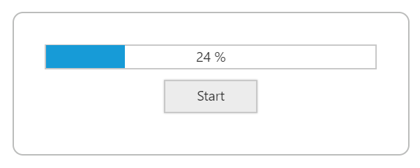
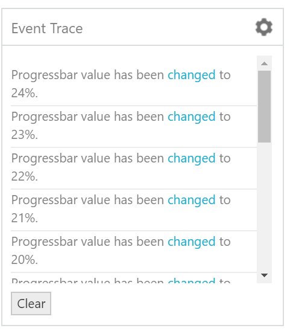

# How To

## How to increment & show the progressbar movement

You can increment the progress percentage and show case the movement by using the below code with the help of [change](https://help.syncfusion.com/api/js/ejprogressbar#events:change), [complete](https://help.syncfusion.com/api/js/ejprogressbar#events:complete) and [start](https://help.syncfusion.com/api/js/ejprogressbar#events:start) events.



        

            

                

            

            

                <input type="checkbox" id="startButton" />
                 <label for="startButton">Toggle</label>
            

        
  
         

                    

                        Event Trace
                        

                            <select name="selectevtprops" id="selectControls">
                                <option value="start">start</option>
                                <option value="complete">complete</option>
                                <option value="change">change</option>
                            </select>
                        

                    

					

						

							

							

						

						

							<input type="button" class="eventclear e-btn" value="Clear" onclick="onClear()" />
						

					
    
            
 
     




       var progressObj, buttonObj, k = 10, timer = window.clearInterval(timer),showComplete=true ;
        $(function () {
            // declaration
            $("#progressBar").ejProgressBar({
                height: 22,
                value: 10,
                start: "onStart",
                change: "onChange",
                complete: "completed"
            });
            progressObj = $("#progressBar").data("ejProgressBar");
            progressObj.option("text", progressObj.getPercentage() + " %");

            $("#startButton").ejToggleButton({
                defaultText: "Start",
                activeText: "Pause",
                size: "small",
                click: "startProcess"
            });
            buttonObj = $("#startButton").data("ejToggleButton");

            $("#selectControls").ejDropDownList({
                popupShown: "adjustPopUpPosition",
                showCheckbox: true,
                checkAll: true,
                change: "propCheckEvent"
            });
        });

        function propCheckEvent(args) {
            if (args.isChecked) {
                switch (args.value) {
                    case "start": progressObj.option(args.value, "onStart"); break;
                    case "change": progressObj.option(args.value, "onChange"); break;
                    case "complete": showComplete=true; break;
                }
            }
            else if(args.value=="complete") 
			{             
                 showComplete=false; 
            }
            else
			   progressObj.option(args.value, null)            
        }

        function startProcess(args) {
            if (args.isChecked) 
                timer = window.setInterval(draw, 100);
            else {
                buttonObj.setModel({ "defaultText": "Start" });
                timer = window.clearInterval(timer);
            }
        }
        function draw() {
            progressObj.option("text", ++k + " %");
            progressObj.option("percentage", k);
        }
        function completed(args) {
            progressObj.option("text", "Completed");
            timer = window.clearInterval(timer);
            k = 0;
            if(showComplete)
            onComplete(args);
            buttonObj.setModel({ "toggleState": false, "defaultText": "Restart" });
        }

        function onComplete(args) {
                jQuery.addEventLog("The process has been completed successfully. ");
        }
        function onStart(args) {
            jQuery.addEventLog("Progressbar has been started. ");
        }
        function onChange(args) {
            jQuery.addEventLog("Progressbar value has been changed to " + args.percentage + "%. ");
        }
        function onClear() {
            $("#EventLog").html("");
        }
    
 




     



The progress bar movement will be as shown below:

