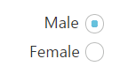

# Easy Customization

## Checked status

You have options to set the state of the radio button as either checked or unchecked. When you select any option from the group of radio buttons, a dot mark appears inside the circle. This is called the **checked** **state**. Previously selected radio buttons in this group are unselected that is they go to the **unchecked state**. The **checked** property is used to set the state of the radio button.

The following steps explain the details about rendering the **RadioButton** with the **checked** option

In the **HTML** page, add the following input elements to configure **RadioButton** widget.



    <table>
        <tr>
            <td>
                <input type="radio" id="Radio_checked" />
            </td>
            <td>
                <label for="Radio_checked" >Male</label>
            </td>
        </tr>
        <tr>
            <td>
                <input type="radio" id="Radio_unchecked" />
            </td>
            <td>
                <label for="Radio_unchecked">Female</label>
            </td>
        </tr>
    </table>





    // Initializes the control in JavaScript
    $(function () {
        // Here we render checked and unchecked type of radio buttons in same group
        // set checked state of radio button as follows
        $("#Radio_checked").ejRadioButton({ name: "Gender", checked: true });
        $("#Radio_unchecked").ejRadioButton({ name: "Gender" });
    
    });
    


Configure the CSS styles to align the radio buttons.





The following image is displayed as the output for the above steps.

 

## Text

Specifies the text content for the radio button. In previous programs, separate labels were created for each radio button. But now you have the option to set the text for radio button using the **text** property. So here you do not have to add a label tag for each radio button in the **HTML** code.

The following steps explain the details about rendering the **RadioButton** with **text** and without using the label tag options.

In the **HTML** page, add the following input elements to configure the **RadioButton** widget.



    <table>
        <tr>
            <td>
                <!--here we did not use label tag-->
                <input type="radio" id="RadBtn_male" />
            </td>
        </tr>
        <tr>
            <td>
               <!-- here we did not use label tag-->
                <input type="radio" id="RadBtn_female" />
            </td>
        </tr>
    </table>





    // Initializes the control in JavaScript
    $(function () {
        // radio button with text property
        $("#RadBtn_male").ejRadioButton({ name: "Gender", checked: true, text: "Male" });
        $("#RadBtn_female").ejRadioButton({ name: "Gender", text: "Female" });
    });



Configure the CSS styles to align the radio buttons.





The following image is displayed as the output for the above steps.

 

## Size

You can render the **RadioButton** in different sizes. There are some predefined size options available for rendering a **RadioButton** in an easy way. Each size option has different height and width. It mainly avoids the complexity in rendering **RadioButton** with complex CSS class. 

Size

<table>
<tr>
<th>Property</th><th>Description</th></tr>
<tr>
<td>
small</td><td>
Creates radio button with Built-in small size height, width specified.</td></tr>
<tr>
<td>
medium</td><td>
Creates radio button with Built-in medium size height, width specified.</td></tr>
</table>

The following steps explain the details about rendering **RadioButton** with different size options.

In the HTML page, add the following input elements to configure RadioButton widget.



    <table>
        <tr>
            <td>Small size Radio buttons
            </td>
        </tr>
        <tr>
            <td>
                <input type="radio" id="Radio_Male" />
                <label for="Radio_Male">Male</label>
            </td>
        </tr>
        <tr>
            <td>
                <input type="radio" id="Radio_Female" />
                <label for="Radio_Female">Female</label>
            </td>
        </tr>
    </table>
    <table>
        <tr>
            <td>Medium size Radio buttons
            </td>
        </tr>
        <tr>
            <td>
                <input type="radio" id="Radio1_Male" />
                <label for="Radio1_Male">Male</label>
            </td>
        </tr>
        <tr>
            <td>
                <input type="radio" id="Radio1_Female" />
                <label for="Radio1_Female">Female</label>
            </td>
        </tr>
    </table>





    // Initializes the control in JavaScript
    $(function () {
        // small size of radio buttons in same group          
        $("#Radio_Male").ejRadioButton({ name: "Gender", size: "small", checked: true });
        $("#Radio_Female").ejRadioButton({ name: "Gender", size: "small" });
        // Medium size of radio buttons in same group          
        $("#Radio1_Male").ejRadioButton({ name: "Gender1", size: "medium", checked: true });
        $("#Radio1_Female").ejRadioButton({ name: "Gender1", size: "medium" });
    
    });



Configure the CSS styles to align the radio buttons.





The following image is displayed as the output for the above steps.

 

## RTL Support 

In some cases you need to use right-to-left alignment. You can give RTL support by using **enableRTL** property.  **RTL** mode works when you use the **text** property in **RadioButton**. The **RadioButtons** and text are aligned in the right-to-left format. For example, when text is right-aligned and RadioButton is left-aligned, after you apply right-to-left alignment, these positions are interchanged. 

The following steps explain the details about rendering the **RadioButton** with right-to-left alignment support. Here the **text** property is necessary.

In the HTML page, add the following button elements to configure RadioButton widget.



    <table class="rightAlign">
        <tr>
            <td>
                <input type="radio" id="RadBtn_male" />
            </td>
        </tr>
        <tr>
            <td>
                <input type="radio" id="RadBtn_female" />
            </td>
        </tr>
    </table>





    // Initializes the control in JavaScript
    $(function () {
        //set radio button with right to left format
        $("#RadBtn_male").ejRadioButton({ name: "Gender", checked: true, text: "Male", enableRTL: true });
        $("#RadBtn_female").ejRadioButton({ name: "Gender", text: "Female", enableRTL: true });
    });



In the above mentioned code, the **text** property has been used. In **LTR** format, the **RadioButton** is on the left side. In **RTL** format, the **RadioButton** appears on the right side. Here the **text** property is used and the **enableRTL** property is set as “**true**”**.** It changes the alignment to right-to-left.

Configure the CSS styles to align the RadioButtons.





The following image is displayed as the output for the above steps.

 

## Styles Customization

RadioButton allows you to customize its appearance by using user-defined CSS and custom skin options such as colors and backgrounds. To apply custom themes, use  **CssClass** property. CssClass property sets the root class for RadioButton theme.

By using this CssClass, you can override the existing styles under the theme style sheet. The theme style sheet applies theme-specific styles like colors and backgrounds. From the root class, you can customize the RadioButton control theme.

In the following example, the border color and border width of the active RadioButton is customized through the custom classes to create the success, and danger indication with RadioButton.



        

            
                <b>Agree terms & conditions:</b>
            
            
                <input type="radio" name="radio1" id="Radio_checked" />
                <input type="radio" name="radio1" id="Radio_unchecked" />
            
             
             
            
                <b>Confirm:</b>
            
            
                <input type="radio" name="radio1" id="RadioButton3" />
                <input type="radio" name="radio1" id="RadioButton4" />
            
        







