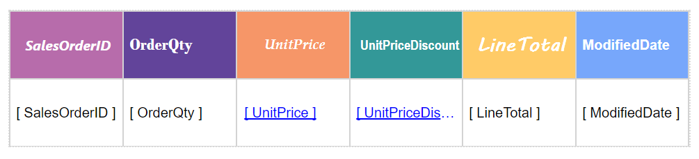
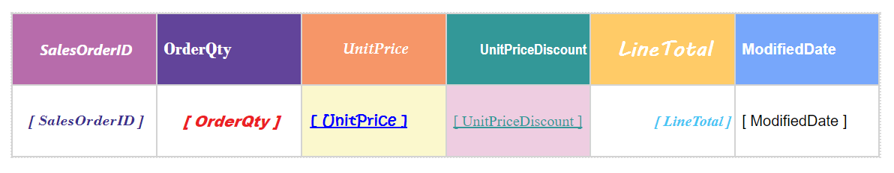
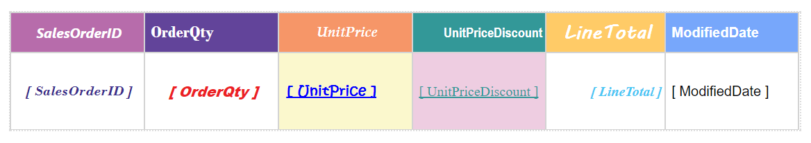
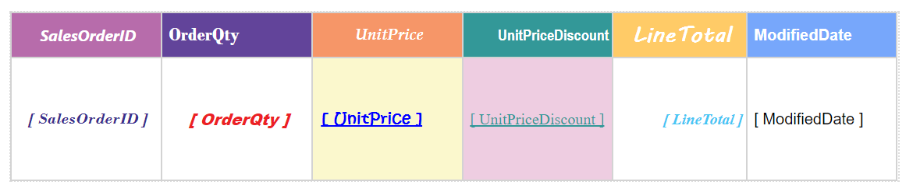
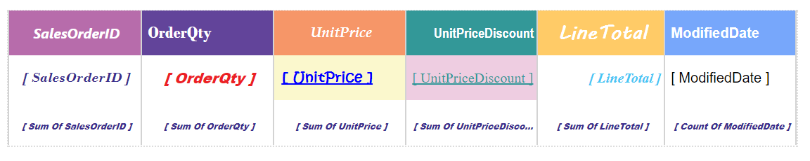
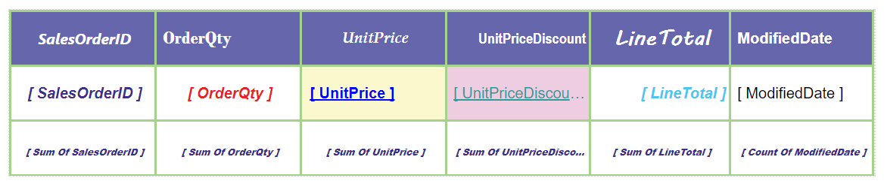

# Grid Report Item in JavaScript Report Designer

The grid data region report item displays report data in cells that are organized into rows and columns. Report data can be a data which is retrieved from the data source.

# To add a grid to a report

* Create a report and define a dataset. For more information refer [Create Dataset](/js/ReportDesigner/Create-Data/Create-New-Data).

  

> Note: **AdventureWorks** database is used for demonstration.

* To add a **Grid** data region to the report, drag and drop the grid from the item panel.

   

    

After adding a grid data region to the design surface, click the properties icon in the configuration panel to display the grid properties panel. In the grid `Properties` pane, click the `Data` tab.

Bind column through drag and drop element from `Measures` section to `Column(s)` section.

Multiple columns can be binded to the columns section.

## Designing a grid

In the grid `Properties` pane, the visual effects of the grid can be designed using the **Properties** tab.

In the `Properties` pane, to add **Expression** or to open **Advanced** options, click the icon in the right corner of each property.

> Note: RDL standard windows fonts are not supported in cross platforms. So, you need to load the unsupported [fonts](/js/ReportDesigner/how-to/Load-Unsupported-Fonts) in application level for cross platforms.

**Name**: Title for the grid report item can be set using this property.

**Basic settings**

**Horizontal grid line**: Horizontal grid lines are used to differentiate the rows in the grid. By default the grid appears with horizontal grid lines.

   * To hide the grid lines, clear the **Horizontal Grid Line** check box.

      

**Vertical grid line**: Vertical grid lines are used to differentiate the columns in the grid. By default the grid appears with vertical grid lines.

 

   * To hide the grid lines, clear the **Vertical Grid Line** check box.

       

**Filters**: Click `Set Filters...` in the filters property. It will launch the `Filter Dialog`.

  

To filter data refer [Filters](/js/ReportDesigner/Compose-Report/Filter-Data).

**Sorting**

In the properties panel, click the **Set Sorts** button to launch sort dialog.

   

To sort data refer [Sorting](/js/ReportDesigner/Compose-Report/Sort-Data).

**Column** and **Row** settings : 

Row and column group headers are created automatically when data assigned to the grid. 

To differentiate each fields from another the visual effects to the column can be added using **Column** and **Row** settings in the properties pane.

**To set column properties**: Select the column number from the **Choose Column** drop-down list in which the  properties can be edited . Now, the column properties fields will be displayed under column settings.

   

   * **Column name**: By default the field is set with the selected column name. You can set the column name of your choice by editing the default name. You can also set expression for the column name field by clicking the expression icon in the right corner of the field.

      
    
**Format**: The numbers and dates in grid data regions can be formatted by selecting a format from the **Format** dialog.

  
  
Click the highlighted button in the above image to open `Format` dialog.

To demonstrate an example, here **Currency** format is applied to the `Unit Price` column.

  

Refer [Format Data](/js/ReportDesigner/Compose-Report/Format-Data) section for more details on how to format data.

 **Enable Link**: To define a hyperlink, or a drill through action to the grid refer [Link Data](/js/ReportDesigner/Compose-Report/Link-Data).

**Header Style**: Using the header style property, the font style, font size,font color, text decoration, text alignment, and padding of the each column header can be changed.

To apply the above mentioned properties click the icon in the right corner and select `Advanced`.

 

> Note: RDL standard windows fonts are not supported in cross platforms. So, you need to load the unsupported [fonts](/js/ReportDesigner/how-to/Load-Unsupported-Fonts) in application level for cross platforms.

 

**Cell Style**: Using the cell style property, the font style, font size,font color, text decoration, text alignment, and padding of the each column cell can be changed.

**Width**:  Present more data readable by adjusting the width of the each column using this property.

**To set row properties**: Select the row type from the **Choose Row** drop-down list to which you want to set the properties.

  * **Header row**: Using this property, the `Height` property of the grid `Header Row` can be customized.

    

    

  * **Data row**: Using this property, the `Height` property of the grid `Data Row` can be customized.

    

    

  * **Summary row**: To provide the summary details of each cell summary row option can be used.
      
     * **Summary style**: Using the summary style property, the font style, font size,font color, text decoration, text alignment, and padding of the each cell's summary text can be changed.

       

      > Note: RDL standard windows fonts are not supported in cross platforms. So, you need to load the unsupported [fonts](/js/ReportDesigner/how-to/Load-Unsupported-Fonts) in application level for cross platforms.

     * **Summary Column**: Enable the **Enable Summary Row** checkbox, will expand the menu with **Summary Column** option, where the summary of each cell can be edited by clicking the `fx` icon.
      
       

       

     > Note: Hover the cursor on each row to enable the `Expression` icon.

     * **Height**: Using this property, the `Height` property of the grid `Summary Row` can be adjusted.

        

        

**Appearance**

In the appearance category, the border style, border width, border color, and background color of the overall grid (Column and Row) can be set to enhance the grid effects.

**Position**: The position and size of the grid can be changed using position and size property. The position and size can also be changed using `Resizer`.

**Miscellaneous** 

 * **No Rows Message**: You can configure to display the custom message when data region has no data to display. Type the text that you want to display as a message in NoRowsMessage property field or click icon in the right side to open the expression dialog and create an expression.

    

 * **Keep Together**: You can keep the entire report content of grid in same page without split when enable the keep together property in property panel.

    

* **Repeat Column Headers**: To display column headers on multiple pages.

    

**Visibility** - Select this option to indicate how the report item is initially displayed in the report.

* Enable the checkbox to show the report item.

   

* Disable the checkbox to hide the report item.

   
