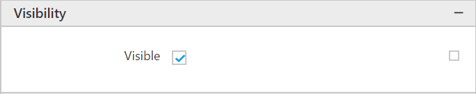
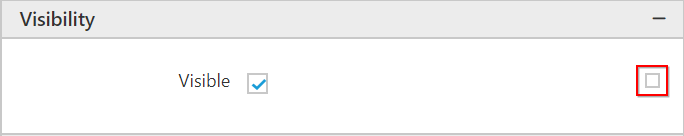

# Image

An image report item contains a reference to an image that is embedded in the report or stored in a database.

## Adding Image to the Report

1. To add an image to the report, **Image** report item can be used.

2. Drag and drop an image report item from item panel to the design area. You can add an image report item to header, footer and body of the report.

    

3. Click on the `Properties` icon in the configuration panel. Now, an image report item properties will be displayed like below.

    

    * **Basic Settings** : 

        

        * **Source** : 

            

            * **External Image** : Include stored images in a report by specifying a URL to an image.

                

            * **Embedded Image** : Using this property, you can add an image from the embedded images list in the report.

                To know how to embed an image, see [Embed Image](/js/ReportDesigner/Image-Manager/Add-image)

                Now, an embedded images in the report will be listed in the value dropdown.

                

                Select an image from the list to design the report.

                

            * **Database Image** : Specify an image that is stored in a database.

                

                * In the source field choose **Database**.

                * In the value field dropdown, choose the field that contains images. For example, `=First(Fields!LargePhoto.Value,"Dataset1")`.

                

                * In the MIME type choose the file format.

                

    * **Sizing** : To set the display size of an image.

        * **AutoSize** : 

            

            

        * **Fit** : 

            

            

        * **FitProportional** : 

            

            

        * **Clip** : 

            

            

    * **Position**: You can change an image size and position under this category.  

        
    
        * **Position** : To adjust the position of an image in the designer area.

        * **Size** : To adjust the height and width of an image.

        You can also achieve the above behavior with the resizer.

    * **Visibility**: Select this option to indicate how the report item is initially displayed in the report.

        

        * Enable  the checkbox to show an image report item.
        * Disable the checkbox to hide an image report item.
        * Show or hide based on an expression

        Click on the icon in the right corner and select **Expression** to edit an expression.

        

    * **Enable Link**: To load image from external report or URL refer [Link Report](/js/ReportDesigner/Compose-Report/Link-Data)

