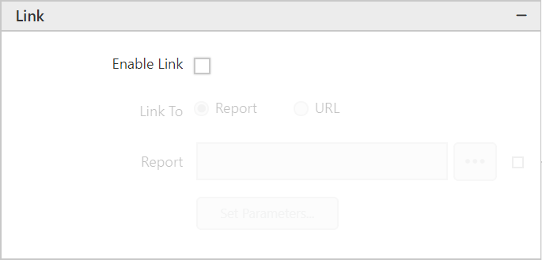
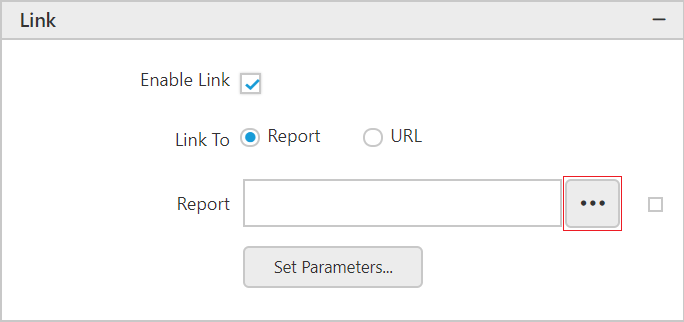
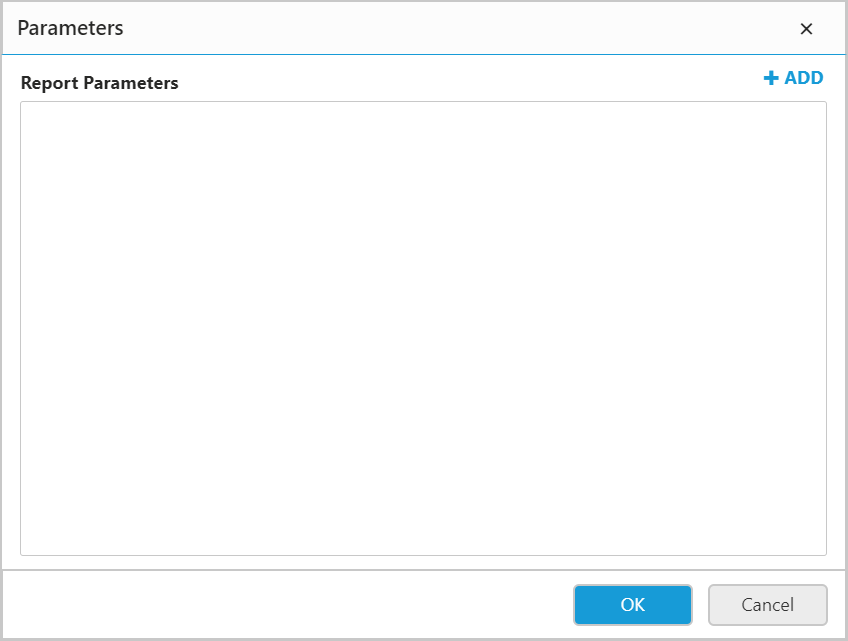
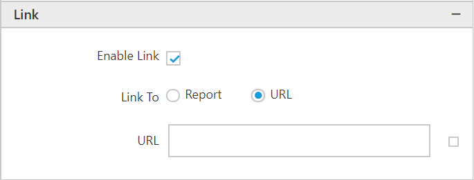
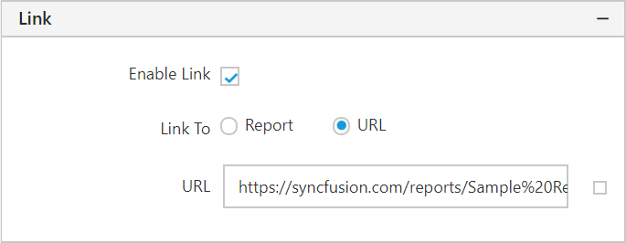

# Linking Actions

Linking actions used to define a hyperlink, a bookmark link, or a drill through action for providing navigation actions to reports.

You can enable this actions by enabling the **Enable Link** checkbox.

   

> Note: The `Enable Link` option is available in the Properties tab of the widgets.

## Drill Through

A drill through report is a report that a user opens by clicking a link within another report. Drill through reports commonly contain details about an item that is contained in an original summary report. You can add drill through links to text boxes, images, charts or any other report item that has an **Action** property.

### Link Report
  
   1. Select **Report** option.

      

   2. Click the `Browse` button in the report fields and select the report from the list.

      

### Link Parameters

A drill through report contains parameters that are passed to it by the summary report. To specify parameters for the drill through report, follow the below steps.

   1. Click the `Set Parameters` button in the report fields, it will launch the `Parameters` dialog.

      

   2. To add parameter, click **Add**.

      

   3. In the **Name** text box, type the name of the report parameter in the drill through report. If the drill through report is in the server, the parameter names are available in the drop-down list.

   4. In **Value** field, type or select the value to pass to the parameter in the drill through report.
     
      Values contain an expression that evaluates the value passed on to the report parameter. The expressions in the value list include the field list for the current report.

      

   5. To set expression, click on the icon in the right side of the value field.

      

      

      The icon will be indicated in `Black color`, if the expression is applied.

      

   6. Click `OK` to save the parameters.

#### Remove Parameters

Click `Close` icon to remove the parameters from the list.

#### Reorder item

To change the order of an item in the list, click and hold the icon in the left corner of **Name** field, and then drag the item to higher or lower position in the list.

The position of dragged item is shown as below:

## Hyperlink

Hyperlink can be added to the report item, so that users can able to click the link in the report and open a browser to the URL that you specify. The static URL or an expression that evaluates URL can be used as hyperlink.

### Add a hyperlink to a URL

Follow the below steps to add a hyperlink to a URL

1. Select **URL** option.

   

2. In **URL** field, type or select a URL or an expression that evaluates to the URL.

   

3. To test the link, click **Preview** to preview the report, and then click the report item that you set on this link to see the navigation result.
