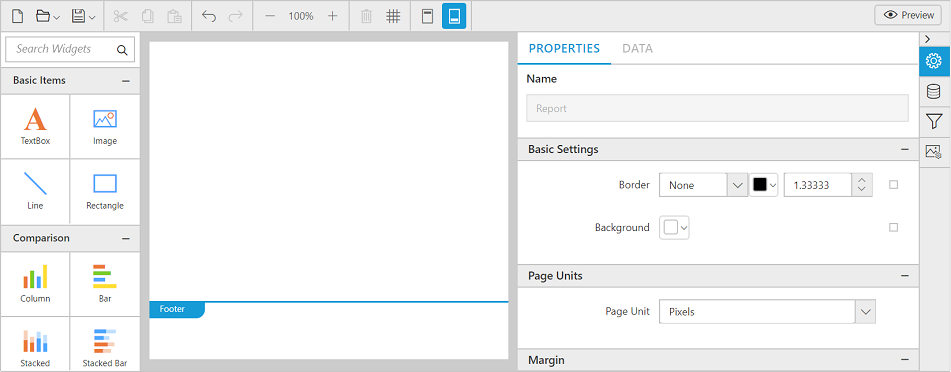
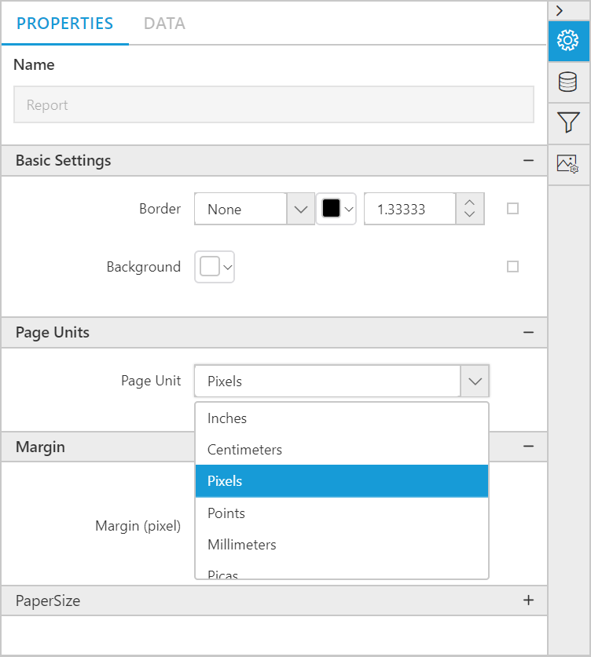

# Unit Switcher

Web designer supports to switch the report unit type.

1. Now, the users can switch report's unit type to the following unit types:

    * Inches
    * Centimeters
    * Pixels
    * Points
    * Millimeters
    * Picas

2. Open the **Report Properties** in the property panel.

    

3. Under the **Page Units** property provided a dropdown to switch the report unit type.

    

4. Select your desired unit type in the dropdown, now the selected unit type will be applied to the report.