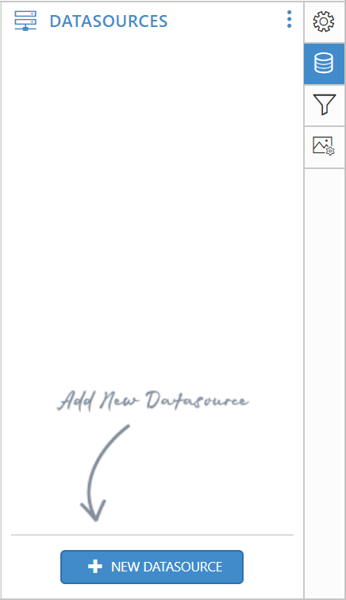

# DataSource

The DataSource contains the connection properties or reference to an existing datasource in RDL. 

## Add a new DataSource

To bind data to a report item, a minimum of one data source is needed. A data source can be created through the following procedure:

In the configuration panel, click the `Data` icon to launch a `Data` configuration panel.

 To create a data source, switch over to the data source panel using the switcher icon on the top-right corner of the `Data` configuration panel.

Click the `DataSources` in context menu, the `DataSource` panel will be switched below.

In the `DataSources` configuration panel, click the `New DataSource` button. In the connection type panel, choose the data source type that you want to connect. Here, `SQL` connection type is used to demonstrate.

 

In the new connection configuration panel, 

* **Name box**: Specify the data source name without special characters.

* **Server name box**: You can select existing server in the local network from the drop-down list or specify the specific remote server name like **myserver.domain.com**.

* **Authentication Type**: In the authentication type select  `Windows` or `SQL Server` authentication. In `SQL Server` type specify the `username` and `password` of the server.

    

* **Database name**: In this field, choose or enter a existing valid database on the specified server e.g. AdventureWorks.

    

Finally, click `Save` in the `New Connection` panel and the new data source will be added in datasource pane like below.

 Now, the datasource will be added in the report and it is ready to create/use the data. 
