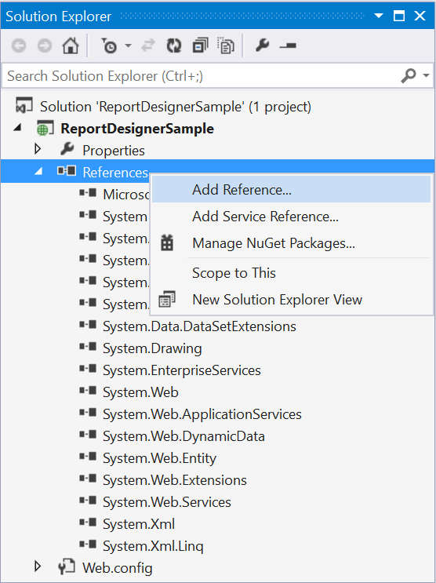

# Getting Started with JavaScript Application

This section explains briefly about how to create a ReportDesigner in your web application with JavaScript.

## Project Creation

Create a new ASP.NET Empty Web application project by selecting the **WEB** category from the listed project template in Microsoft Visual Studio IDE.     

 

### Create HTML Page

To create a new `Web Forms` in the application follow the below steps.

1. Right-Click on the project and select `Add`. 

    

2. Click `New Item` and select `HTML` page from the listed templates.

    

3. Name the page as Default.html and click Add.

### Adding References, Scripts, Styles and Control in HTML Page

Add the References, scripts, styles that are required for the Report Designer.

### Add References

1. In the Solution Explorer, right-click the `References` folder and then click `Add Reference`.

     

2. Add the following assemblies and click OK.

   * System.Web.Routing
   * System.Web.Http
   * System.Web.WebHost
   * System.Net.Http
   * System.Net.Http.WebRequest
   * System.Net.Http.Formatting
   * Syncfusion.Compression.Base   
   * Syncfusion.EJ.ReportViewer
   * Syncfusion.EJ.ReportDesigner
   * Syncfusion.Pdf.Base
   * Syncfusion.XlsIO.Base
   * Syncfusion.Presentation.Base
   * Syncfusion.DocIO.Base
   * Syncfusion.Shared.Wpf
   * Syncfusion.Chart.Wpf
   * Syncfusion.Gauge.Wpf
   * Syncfusion.SfMaps.Wpf

 N> Refer the above assemblies from the installed location, C:\Program Files (x86)\Syncfusion\Essential Studio\{{ site.releaseversion }}\Assemblies
 N>
 N> Refer System.Web.Http, System.Web.Http.WebHost, System.Net.Http.WebRequest and System.Net.Http.Formatting assemblies from ASP.NET WebApi NuGet package. 

### Add Scripts and Styles

Add the script files and theme files in the &lt;title&gt; tag of the default.html page.
  


<link href="http://cdn.syncfusion.com/{{ site.releaseversion }}/js/web/flat-azure/ej.web.all.min.css" rel="stylesheet" />
<link href="http://cdn.syncfusion.com/{{ site.releaseversion }}/js/web/flat-azure/ej.reportdesigner.min.css" rel="stylesheet" />
<link href="https://cdnjs.cloudflare.com/ajax/libs/codemirror/5.37.0/codemirror.min.css" rel="stylesheet" />
<link href="https://cdnjs.cloudflare.com/ajax/libs/codemirror/5.37.0/addon/hint/show-hint.min.css" rel="stylesheet" />

 
 

Use the above code example while adding scripts and styles.

> Note: You can get the themes and scripts from the installed location [Installed Drive]:\Program Files (x86)\Syncfusion\Essential Studio\JavaScript\{{ site.releaseversion }}\JavaScript\assets\

## Control Initialization

Initialize Report Designer by using the following code example in the &lt;body&gt; tag of the Default.html page.





### Add WebAPI controller for Report Designer
 
The JavaScript Report Designer uses WebApi services to process the report file and get the request from control.

### IReportDesignerController
 
The ApiController inherits the `IReportDesignerController` and to process the report file add the following code example to its method definition. The interface IReportDesignerController contains the required actions and helper methods declaration to process the report. The ReportDesignerHelper and ReportHelper class contains helper methods that helps to process Post/Get request from control and return the response to control.



using System;
using Syncfusion.EJ.ReportViewer;
using System.Collections.Generic;
using System.Linq;
using System.Net;
using System.Net.Http;
using System.Web.Http;
using Syncfusion.Reports.EJ;
using System.Collections;
using System.Web;
using Syncfusion.EJ.ReportDesigner;
using System.IO;

namespace ReportDesignerSample
{
    public class ReportingAPIController : ApiController, Syncfusion.EJ.ReportDesigner.IReportDesignerController
    {

    public ReportingAPIController()
    {
    }

    [HttpPost]
    public void UploadReportAction()
    {
        ReportDesignerHelper.ProcessDesigner(null, this, HttpContext.Current.Request.Files[0]);
    }

    [HttpGet]
    public object GetImage(string key, string image)
    {
        return ReportDesignerHelper.GetImage(key, image, this);
    }

    [HttpPost]
    public object PostDesignerAction(Dictionary<string, object> jsonResult)
    {
        return ReportDesignerHelper.ProcessDesigner(jsonResult, this, null);
    }

    public object PostReportAction(Dictionary<string, object> jsonResult)
    {
        return ReportHelper.ProcessReport(jsonResult, this as IReportController);
    }

    public void OnInitReportOptions(Syncfusion.EJ.ReportViewer.ReportViewerOptions reportOption)
    {
    }

    public void OnReportLoaded(Syncfusion.EJ.ReportViewer.ReportViewerOptions reportOption)
    {

    }

    public object GetResource(string key, string resourcetype, bool isPrint)
    {
        return ReportHelper.GetResource(key, resourcetype, isPrint);
    }

    public bool UploadFile(HttpPostedFile httpPostedFile)
    {
        string targetFolder = HttpContext.Current.Server.MapPath("~/");
        string fileName = !string.IsNullOrEmpty(ReportDesignerHelper.SaveFileName) ? ReportDesignerHelper.SaveFileName : Path.GetFileName(httpPostedFile.FileName);
        targetFolder += "Cache";

        if (!Directory.Exists(targetFolder))
        {
            Directory.CreateDirectory(targetFolder);
        }

        if (!Directory.Exists(targetFolder + "\\" + ReportDesignerHelper.EJReportDesignerToken))
        {
            Directory.CreateDirectory(targetFolder + "\\" + ReportDesignerHelper.EJReportDesignerToken);
        }

        httpPostedFile.SaveAs(targetFolder + "\\" + ReportDesignerHelper.EJReportDesignerToken + "\\" + fileName);
        return true;
    }

    public List<Syncfusion.EJ.ReportDesigner.FileModel> GetFiles(Syncfusion.EJ.ReportDesigner.FileType fileType)
    {
        List<FileModel> databases = new List<FileModel>();
        var folderPath = HttpContext.Current.Server.MapPath("~/") + "Cache\\" + ReportDesignerHelper.EJReportDesignerToken + "\\";
        if (Directory.Exists(folderPath))
        {
            DirectoryInfo directoryInfo = new DirectoryInfo(folderPath);
            FileInfo[] Files = directoryInfo.GetFiles(this.GetFileExtension(fileType));
            foreach (FileInfo file in Files)
            {
                databases.Add(new FileModel() { Name = file.Name, Path = "../" + "Cache/" + ReportDesignerHelper.EJReportDesignerToken + "/" + file.Name });
            }
        }
        return databases;
    }

    private string GetFileExtension(Syncfusion.EJ.ReportDesigner.FileType fileType)
    {
        if (fileType == FileType.Sdf)
        {
            return "*.sdf";
        }
        else if (fileType == FileType.Xml)
        {
            return "*.xml";
        }
        return "*.rdl";
    }

    public string GetFilePath(string fileName)
    {
        string targetFolder = HttpContext.Current.Server.MapPath("~/");
        targetFolder += "Cache";

        if (!Directory.Exists(targetFolder))
        {
            Directory.CreateDirectory(targetFolder);
        }

        if (!Directory.Exists(targetFolder + "\\" + ReportDesignerHelper.EJReportDesignerToken))
        {
            Directory.CreateDirectory(targetFolder + "\\" + ReportDesignerHelper.EJReportDesignerToken);
        }

        var folderPath = HttpContext.Current.Server.MapPath("~/") + "Cache\\" + ReportDesignerHelper.EJReportDesignerToken + "\\";
        return folderPath + fileName;
    }

    public FileModel GetFile(string filename, bool isOverride)
    {
        throw new NotImplementedException();
    }
    }
}



### WebAPI Routing

1. Right-click the project and select Add and select Global.asax file from the listed templates.

    

2. Route the WebAPI in Application_Start event into Global.asax file as follows.



using System;
using System.Collections.Generic;
using System.Linq;
using System.Web;
using System.Web.Security;
using System.Web.SessionState;
using System.Web.Http;

namespace ReportDesignerSample
{
    public class Global : System.Web.HttpApplication
    {
    protected void Application_Start(object sender, EventArgs e)
    {
        System.Web.Http.GlobalConfiguration.Configuration.Routes.MapHttpRoute(
        name: "DefaultApi",
        routeTemplate: "api/{controller}/{action}/{id}",
        defaults: new { id = RouteParameter.Optional });
        AppDomain.CurrentDomain.SetData("SQLServerCompactEditionUnderWebHosting", true);
    }
    }
}



On running the application, Report Designer will be rendered like below.

   

## Integrate the component with Report Server

Report Designer can be integrated with the Report Server by using below code snippet. After integrating you can open, browse and edit the reports in the Report Server using Report designer.

Set the Report Server `serviceUrl` and `serviceAuthorizationToken` in the ReportDesigner properties.



 

## Integrate the component with External Server

Report Designer can be integrated with the External Server or Server file browsing by using below code snippet. After integrating you can open, browse and edit the reports in External Server or Application Data using Report designer.



 



using Syncfusion.EJ.ReportViewer;
using System.Collections.Generic;
using System.Linq;
using System.Net;
using System.Net.Http;
using System.Web.Http;
using Syncfusion.Reports.EJ;
using System.Collections;
using System.Web;
using Syncfusion.EJ.ReportDesigner;
using System.IO;
using Reporting.ExternalServer;

namespace EJServices.Controllers
{
    public class ReportDesignerController : ApiController, Syncfusion.EJ.ReportDesigner.IReportDesignerController
    {
        public ReportDesignerController()
        {
            ExternalServer externalServer = new ExternalServer();
            externalServer.ReportServerUrl = "Your Path";
            ReportDesignerHelper.ReportingServer = externalServer;
        }

        public FileModel GetFile(string filename, bool isOverride)
        {
            throw new NotImplementedException();
        }

        public string GetFilePath(string key)
        {
            throw new NotImplementedException();
        }

        public List<FileModel> GetFiles(FileType fileType)
        {
            throw new NotImplementedException();
        }

        [HttpGet]
        public object GetImage(string key, string image)
        {
            throw new NotImplementedException();
        }

        [HttpPost]
        public object PostDesignerAction(Dictionary<string, object> jsonResult)
        {
            throw new NotImplementedException();
        }

        public bool UploadFile(HttpPostedFile httpPostedFile)
        {
            throw new NotImplementedException();
        }

        [HttpPost]
        public void UploadReportAction()
        {
            throw new NotImplementedException();
        }

        public object GetResource(string key, string resourcetype, bool isPrint)
        {
            throw new NotImplementedException();
        }

        public void OnInitReportOptions(ReportViewerOptions reportOption)
        {
            throw new NotImplementedException();
        }

        public void OnReportLoaded(ReportViewerOptions reportOption)
        {
            throw new NotImplementedException();
        }

        public object PostReportAction(Dictionary<string, object> jsonResult)
        {
            throw new NotImplementedException();
        }
    }
}



N> You can refer the External Server sample and service from the installed location 
N> sample: %public%\Documents\Syncfusion\JavaScript\{{ site.releaseversion }}\samples\web\reportdesigner\ReportBuilder.html
N> API Service: %public%\Documents\Syncfusion\JavaScript\{{ site.releaseversion }}\ejservices\Controllers\ReportDesignerController.cs
N> External Server: %public%\Documents\Syncfusion\JavaScript\{{ site.releaseversion }}\ejservices\Controllers\ExternalReportServer.cs

