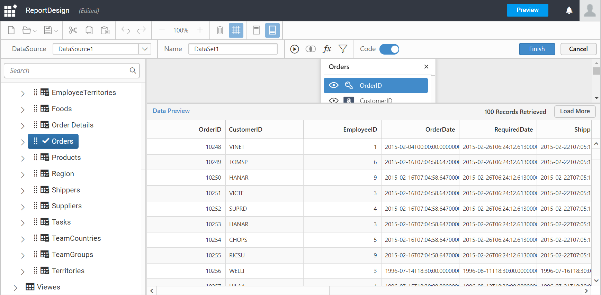
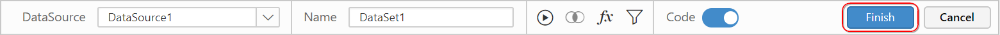

# Report Creation

This is a simple steps to create a report with Web Report Designer application. An AdventureWorks and Northwind database is used to demonstrate each of the features in the Web Report Designer.

## Connecting to data

Add a new data source by establishing a data connection with any of the supported data connection types like below:

### Setting up connection

RDL dataset contains the information that is needed to retrieve a specific set of data from a data source.

Click the `Data` icon in the configuration panel to launch a `Data` configuration.

 

Click the `Add DataSet` button in `Data` panel.

Click `Create New` in the context menu, it will launch connection type panel. In the connection type panel, click on the data source type that you want to connect. Here, `SQL` connection type is used to demonstrate.

 

In the new data source configuration panel, fill the server name and related details. 

Click the `Connect` button. Now the following view will be displayed.

You can enter the query directly in the Query Editor or use the Query Designer to interactively build the query and view the result of the query. Here, the data is created with the help of the Query Designer.

1. Build query using the Query Editor.

   * To switch over to Query Editor, click the switcher icon in the designer toolbar.

      

      

2. Build query using the Query Designer.

   The left pane holds the tables and views associated with the connected database. Drag your preferred table or view from the left pane and drop into the center pane labeled with `Drag and Drop table here` like below:

   

   

The dropped tables will be tick marked before the name of table in the left pane like below:

The primary key defined in the connected database table will be marked like below:

The data type of the each column is represented with visual icons as shown below:

Add more than one table by following the same drag and drop procedure as mentioned in above steps, if required.

To rename columns refer [Rename Columns](/report-platform/reportdesigner/web/transforming-data/rename-column).

You can filter specific data out of huge database by using [Data Filters](/report-platform/reportdesigner/web/transforming-data/configure-data-filters).

> Note: At present, you can experience full fledged query design for **SQL** datasource only.

### Execute query

You can visualize the data by using `Execute` option from the tools pane in data design view.

Now the data will be retrieved based on the specified query.

Click the `Finish` button in the tools pane to add the data with the report.

Now, the table fields will be listed in `Data` panel like below.

## Adding a report item to design view

The item panel at left consists of Basic Items, Data Visualization, Data Regions and SubReport
that you can utilize to design a report.

You can `drag and drop` report items into the `Header`, `Footer`, and `Design` area.

> Note: You can only drag and drop `Basic Items` category into the `Header` and `Footer` area.

### Enable header and footer

You can enable and disable header/footer by clicking the below icons from the designer toolbar pane.

Click and drag the preferable report item from the toolbox by holding the mouse left button and drop into the design panel like below:

After you drop the report item, you can resize it by placing the focus over the report item and dragging its corner like below, if required.

## Assigning data to report item

> Note: This step is applicable only for report items other than basic items category.

To bind the data to a report item that is placed in the design area, focus on that report item.

Click the `Properties` icon in the configuration panel.

Now, the report item properties panel displayed like below:

Click the `Data Assign` tab in the properties panel. Now, the data assign tab switches like below:

Data assign panel shows the data configuration view. The numeric columns are listed under the `Measures` section; other type columns are listed under the `Dimensions` section.

Select and drag the numeric column (measure element) from the `Measures` section that you want to visualize the data and drop into the `Y Value(s)` section.

Now, the report item preview will look like below:

Click the `Settings` icon (highlighted below) to open the aggregation type drop-down list.

You can set the aggregation type by which you can compute the selected column.

Select and drag the dimension element from the `Dimensions` section to measure against any of the selected numeric column(s) in `Y Value(s)` section, and drop into the `Column(s)` section.  

Now, the report item preview will look like below:

To group the added column element with another column, add the respective dimension element into Row(s) section.

Now, the report item design will look like below.

To filter the data from getting bounded to report item, apply filters to the selected measure type or dimension type column(s).

## Configuring report item

> Note: This step is applicable only for report items other than basic items category.

Navigate to the properties pane in the properties tab.

This pane holds some general settings and some specific settings to the report item. 

You can add more report items by following the above procedure.

## Preview report

Preview the changes made in the report item by clicking the `Preview` in the top-right corner of the Report Server menu.

Now, the report preview can be visualized through the built-in report viewer like below:

To launch design area, click the `Design` button  in the top-right corner of the Report Server menu.

### Save report

To **Save** report refer [Save Report](open-save-report).
