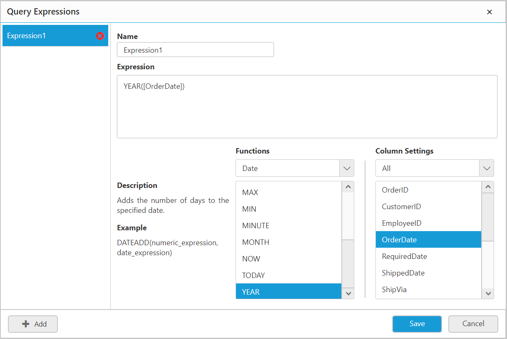

# Expressions

An expression column is used to create an expression which is a combination of data columns, operators and built-in functions. This expression column will act as a calculated measure that can be configured to report item like other normal numeric columns as a quantitative measure.

Expression Dialog can be launched through the **Expression** icon in the query designer toolbar highlighted below:

Now the expression dialog will be launched.

> Note: The expression icon in the tools pane will be in disabled state, if there is no table found dropped in table design view.

## Adding an Expression Column

* Click `Add` button in the `Expression Dialog` to add a new expression column.

* Enter a suitable name for the expression in the `Name` text area available in right pane. By default, it will be `Expression1`.

  

* Define an expression in an **Expression** text area. The syntax for defining a simple expression is,

  `{function name(}[columnname]{operator[columnname])…}`

  where, content within curly braces is optional.

  Some expressions for reference:

  1. YEAR([Order Date]) – To compute year of order date.

  2. [Freight]+100 – To compute the total with 100 added to Freight.

  Following built-in functions are supported in Expression Designer.

   <table>
   <tr>
   <th>Category</th>
   <th>Functions</th>
   <th>Syntax & Descriptions</th>
   </tr>
   <td>Numbers</td>
   <td>ABS</td>
   <td><ul style="list-style-type:none"><b>Syntax:</b> 
   ABS(numeric_expression) 
   <b>Description:</b> 
   Returns the absolute value of the given expression. </ul>
   </td>
   <tr>
   <td>Numbers</td>
   <td>ACOS</td>
   <td><ul style="list-style-type:none"><b>Syntax:</b> 
   ACOS(numeric_expression) 
   <b>Description:</b> 
   Returns the inverse cosine (also known as arccosine) of the given numeric expression. </ul>
   </td>
   </tr>
   <tr>
   <td>Numbers</td>
   <td>ASIN</td>
   <td><ul style="list-style-type:none"><b>Syntax:</b> 
   ASIN(numeric_expression) 
   <b>Description:</b> 
   Returns the inverse sine (also known as arcsine) of the given numeric expression. </ul>
   </td>
   </tr>
   <tr>
   <td>Numbers</td>
   <td>ATAN</td>
   <td><ul style="list-style-type:none"><b>Syntax:</b> 
   ATAN(numeric_expression) 
   <b>Description:</b> 
   Returns the inverse tangent (also known as arctangent) of the given numeric expression. </ul>
   </td>
   </tr>
   <tr>
   <td>Numbers</td>
   <td>COS</td>
   <td><ul style="list-style-type:none"><b>Syntax:</b> 
   COS(numeric_expression) 
   <b>Description:</b> 
   Returns the cosine of the angle specified in radians, in the given expression. </ul>
   </td>
   </tr>
   </tr>
   <tr>
   <td>Numbers</td>
   <td>DEGREES</td>
   <td><ul style="list-style-type:none">
   <b>Syntax:</b>  DEGREES(numeric_expression) 
   <b>Description:</b>  Returns the angle in degrees for the one specified in radians, in the given numeric expression.
    </ul>
   </td>
   </tr>
   <tr>
   <td>Numbers</td>
   <td>EXP</td>
   <td><ul style="list-style-type:none">
   <b>Syntax:</b>  EXP(numeric_expression) 
   <b>Description:</b>  Returns the exponential value of the given expression.
    </ul>
   </td>
   </tr>
   <tr>
   <td>Numbers</td>
   <td>LOG</td>
   <td><ul style="list-style-type:none">
   <b>Syntax:</b>  LOG(numeric_expression) 
   <b>Description:</b>  Returns the logarithm of the given expression to the specified base.
    </ul>
   </td>
   </tr>
   <tr>
   <td>Numbers</td>
   <td>PI</td>
   <td><ul style="list-style-type:none">
   <b>Syntax:</b>  PI() 
   <b>Description:</b>  Returns the constant value of PI. </ul>
   </td>
   </tr>
   <tr>
   <td>Numbers</td>
   <td>POWER</td>
   <td><ul style="list-style-type:none">
   <b>Syntax:</b>  POWER(numeric_expression, numeric_expression) 
   <b>Description:</b>  Returns the value of the given expression (expression1) to the specified power (expression2). 
   </ul>
   </td>
   </tr>
   <tr>
   <td>Numbers</td>
   <td>ROUND</td>
   <td><ul style="list-style-type:none">
   <b>Syntax:</b>  ROUND(numeric_expression) 
   <b>Description:</b>  Returns a rounded value. 
   </ul>
   </td>
   </tr>
   <td>Numbers</td>
   <td>RADIANS</td>
   <td><ul style="list-style-type:none">
   <b>Syntax:</b>  RADIANS(numeric_expression) 
   <b>Description:</b>  Returns the angle in radians for the one specified in degrees in the given numeric expression. 
   </ul>
   </td>
   </tr>
   <tr>
   <td>Numbers</td>
   <td>SIGN</td>
   <td><ul style="list-style-type:none">
   <b>Syntax:</b>  SIGN(numeric_expression) 
   <b>Description:</b>  Returns a value representing the positive (+1), zero (0), or negative (-1) sign of the given numeric expression. 
   </ul>
   </td>
   </tr>
   <tr>
   <td>Numbers</td>
   <td>SIN</td>
   <td><ul style="list-style-type:none">
   <b>Syntax:</b>  SIN(numeric_expression) 
   <b>Description:</b>  Returns the sine of the angle specified in radians, in the given expression. </ul>
   </td>
   </tr>
   <tr>
   <td>Numbers</td>
   <td>SQRT</td>
   <td><ul style="list-style-type:none">
   <b>Syntax:</b>  SQRT(numeric_expression) 
   <b>Description:</b>  Returns the square root of the given numeric expression. 
   </ul>
   </td>
   </tr>
   <tr>
   <td>Numbers</td>
   <td>TAN</td>
   <td><ul style="list-style-type:none">
   <b>Syntax:</b>  TAN(numeric_expression) 
   <b>Description:</b>  Returns the tangent of the given numeric expression. </ul>
   </td>
   </tr>
   <tr>
   <td>Conditional</td>
   <td>IF</td>
   <td><ul style="list-style-type:none">
   <b>Syntax:</b>  IF(expression, true_part, false_part) 
   <b>Description:</b>  Returns either true part or false part, depending on the evaluation of the expression. 
   </ul> 
   </td>
   </tr>
   <tr>
   <td>Conditional</td>
   <td>IFNULL</td>
   <td><ul style="list-style-type:none">
   <b>Syntax:</b>  IFNULL(expression1,expression2) 
   <b>Description:</b>  If the expression is numeric/string/date, returns the first expression. If the first expression is NULL, returns the second expression. </ul>
   </td>
   </tr>
   <tr>
   <td>Conditional</td>
   <td>ISNOTNULL</td>
   <td><ul style="list-style-type:none">
   <b>Syntax:</b>  ISNOTNULL(expression) 
   <b>Description:</b>  If the expression is numeric/string/date is NULL, returns a string representing false, otherwise returns true. </ul>
   </td>
   </tr>
   <tr>
   <td>Conditional</td>
   <td>ISNULL</td>
   <td><ul style="list-style-type:none">
   <b>Syntax:</b>  ISNULL(expression) 
   <b>Description:</b>  Returns true if the given expression evaluates to null. </ul>
   </td>
   </tr>
   <tr>
   <td>Logical</td>
   <td>AND</td>
   <td><ul style="list-style-type:none">
   <b>Syntax:</b>  (expression1) AND (expression2) 
   <b>Description:</b>  Returns true if both the expressions evaluates to true. 
   </ul>
   </td>
   </tr>
   <tr>
   <td>Logical</td>
   <td>NOT</td>
   <td><ul style="list-style-type:none">
   <b>Syntax:</b>  NOT(expression) 
   <b>Description:</b>  Returns the reversed logical value of the expression being evaluated. 
   </ul>
   </td>
   </tr>
   <tr>
   <td>Logical</td>
   <td>OR</td>
   <td><ul style="list-style-type:none">
   <b>Syntax:</b>  (expression1) OR (expression2) 
   <b>Description:</b>  Returns true if any of the expressions evaluates to true. 
   </ul>
   </td>
   </tr>
   <tr>
   <td>Date</td>
   <td>DATEADD</td>
   <td><ul style="list-style-type:none">
   <b>Syntax:</b>  DATEADD(numeric_expression, date_expression) 
   <b>Description:</b>  Adds the number of days to the specified date. 
   </ul>
   </td>
   </tr>
   <tr>
   <td>Date</td>
   <td>DATENAME</td>
   <td><ul style="list-style-type:none">
   <b>Syntax:</b>  DATENAME(date_part, date_expression) 
   <b>Description:</b>  Returns a string representing the specified date_part of the given date expression. 
   </ul>
   </td>
   </tr>
   <tr>
   <td>Date</td>
   <td>DATEPART</td>
   <td><ul style="list-style-type:none"> 
   <b>Syntax:</b>  DATEPART(date_part, date_expression) 
   <b>Description:</b>  Returns an integer value representing the specified date_part of the given date expression. </ul>
   </td>
   </tr>
   <tr>
   <td>Date</td>
   <td>DATESUB</td>
   <td><ul style="list-style-type:none">
   <b>Syntax:</b>  DATESUB(numeric_expression, date_expression) 
   <b>Description:</b>  Returns the date subtracted from the specified date. 
   </ul>
   </td>
   </tr>
   <tr>
   <td>Date</td>
   <td>DAY</td>
   <td><ul style="list-style-type:none">
   <b>Syntax:</b>  DAY(date_expression) 
   <b>Description:</b>  Returns a numeric value representing the day part of the specified date. 
   </ul>
   </td>
   </tr>
   <tr>
   <td>Date</td>
   <td>DAYDIFF</td>
   <td><ul style="list-style-type:none">
   <b>Syntax:</b>  DAYDIFF(start_date_expression, end_date_expression) 
   <b>Description:</b>  Returns a numeric value representing the difference between two specified dates. </ul>
   </td>
   </tr>
   <tr>
   <td>Date</td>
   <td>HOUR</td>
   <td><ul style="list-style-type:none">
   <b>Syntax:</b>  HOUR(date_expression) 
   <b>Description:</b>  Returns the hour of the given date as an integer. </ul>
   </td>
   </tr>
   <tr>
   <td>Date</td>
   <td>MINUTE</td>
   <td><ul style="list-style-type:none">
   <b>Syntax:</b>  MINUTE(date_expression) 
   <b>Description:</b>  Returns a numeric value representing the minute part of the date resulted from specified date expression. 
   </ul>
   </td>
   </tr>
   <tr>
   <td>Date</td>
   <td>MONTH</td>
   <td><ul style="list-style-type:none"> 
   <b>Syntax:</b>  MONTH(date_expression) 
   <b>Description:</b>  Returns a numeric value representing the month part of the date resulted from specified date expression. 
   </ul>
   </td>
   </tr>
   <tr>
   <td>Date</td>
   <td>NOW</td>
   <td><ul style="list-style-type:none">
   <b>Syntax:</b>  NOW() 
   <b>Description:</b>  Returns the current date and time. 
   </ul>
   </td>
   </tr>
   <tr>
   <td>Date</td>
   <td>TODAY</td>
   <td><ul style="list-style-type:none">
   <b>Syntax:</b>  TODAY() 
   <b>Description:</b>  Returns the current date. 
   </ul>
   </td>
   </tr>
   <tr>
   <td>Date</td>
   <td>YEAR</td>
   <td><ul style="list-style-type:none">
   <b>Syntax:</b>  YEAR(date_expression) 
   <b>Description:</b>  Returns a numeric value representing the year part of the date resulting from the specified date expression. 
   </ul>
   </td>
   </tr>
   <tr>
   <td>Date</td>
   <td>MAX</td>
   <td><ul style="list-style-type:none">
   <b>Syntax:</b>  MAX(expression) 
   <b>Description:</b>  Returns the maximum value in the given expression. 
   </ul>
   </td>
   </tr>
   <tr>
   <td>Date</td>
   <td>MIN</td>
   <td><ul style="list-style-type:none">
   <b>Syntax:</b>  MIN(expression) 
   <b>Description:</b>  Returns the minimum value in the given expression.   
   </ul>
   </td>
   </tr>
   <tr>
   <td>String</td>
   <td>CHAR</td>
   <td><ul style="list-style-type:none">
   <b>Syntax:</b>  CHAR(integer_expression) 
   <b>Description:</b>  Converts the given integer ASCII code into a character. 
   </ul>
   </td>
   </tr>
   <tr>
   <td>String</td>
   <td>CONCAT</td>
   <td><ul style="list-style-type:none">
   <b>Syntax:</b>  CONCAT(string_expression1, string_expression2,…, string_expressionN) 
   <b>Description:</b>  Returns a string value resulting from the concatenation of two or more string values.  
   </ul>
   </td>
   </tr>
   <tr>
   <td>String</td>
   <td>CONTAINS</td>
   <td><ul style="list-style-type:none">
   <b>Syntax:</b>  CONTAINS(string_expression, substring_expression) 
   <b>Description:</b>  Returns true if the given string expression contains the specified substring expression. 
   </ul>
   </td>
   </tr>
   <tr>
   <td>String</td>
   <td>ENDSWITH</td>
   <td><ul style="list-style-type:none">
   <b>Syntax:</b>  ENDSWITH(string_expression substring_expression) 
   <b>Description:</b>  Returns true if the given string expression ends with the specified substring expression. 
   </ul>
   </td>
   </tr>
   <tr>
   <td>String</td>
   <td>LEFT</td>
   <td><ul style="list-style-type:none">
   <b>Syntax:</b>  LEFT(string_expression, numeric_expression) 
   <b>Description:</b>  Returns the specified number of characters from start of the given string expression. </ul>
   </td>
   </tr>
   <tr>
   <td>String</td>
   <td>LEN</td>
   <td><ul style="list-style-type:none">
   <b>Syntax:</b>  LEN(string_expression) 
   <b>Description:</b>  Returns the number of characters in the given string expression. 
   </ul>
   </td>
   </tr>
   <tr>
   <td>String</td>
   <td>LOWER</td>
   <td><ul style="list-style-type:none">
   <b>Syntax:</b>  LOWER(string_expression) 
   <b>Description:</b>  Returns a lower case converted string value from a given string expression. 
   </ul>
   </td>
   </tr>
   <tr>
   <td>String</td>
   <td>LTRIM</td>
   <td><ul style="list-style-type:none">
   <b>Syntax:</b>  LTRIM(string_expression) 
   <b>Description:</b>  Returns the string value with any leading blanks removed from string expression. 
   </ul>
   </td>
   </tr>
   <tr>
   <td>String</td>
   <td>MAX</td>
   <td><ul style="list-style-type:none">
   <b>Syntax:</b>  MAX(expression) 
   <b>Description:</b>  Returns the maximum value in the given expression.
    </ul>
   </td>
   </tr>
   <tr>
   <td>String</td>
   <td>MIN</td>
   <td><ul style="list-style-type:none">
   <b>Syntax:</b>  MIN(expression) 
   <b>Description:</b>  Returns the minimum value in the given expression.
    </ul>
   </td>
   </tr>
   <tr>
   <td>String</td>
   <td>RIGHT</td>
   <td><ul style="list-style-type:none">
   <b>Syntax:</b>  RIGHT(string_expression, numeric_expression) 
   <b>Description:</b>  Returns the specified number of characters from end of the given string expression. 
   </ul>
   </td>
   </tr>
   <tr>
   <td>String</td>
   <td>RTRIM</td>
   <td><ul style="list-style-type:none">
   <b>Syntax:</b>  RTRIM(string_expression) 
   <b>Description:</b>  Returns the string value with any trailing blanks removed from string expression. 
   </ul>
   </td>
   </tr>
   <tr>
   <td>String</td>
   <td>STARTSWITH</td>
   <td><ul style="list-style-type:none">
   <b>Syntax:</b>  STARTSWITH(string_expression, substring_expression) 
   <b>Description:</b>  Returns true if the given string expression starts with the specified substring expression. 
   </ul>
   </td>
   </tr>
   <tr>
   <td>String</td>
   <td>SUBSTR</td>
   <td><ul style="list-style-type:none">
   <b>Syntax:</b>  SUBSTR(string_expression, starting_index, length_of_the_string) 
   <b>Description:</b>  Returns a specific length of string starting from specific index from the given string expression.
    </ul>
   </td>
   </tr>
   <tr>
   <td>String</td>
   <td>UPPER</td>
   <td><ul style="list-style-type:none">
   <b>Syntax:</b>  UPPER(string_expression) 
   <b>Description:</b>  Returns an upper case converted string value from a given string expression. </ul>
   </td>
   </tr>
   </table>

* You can use the functions list and column fields list to include the function names and the column names in the `Expression` text area, by double-clicking the specific name in respective lists.

* Finally, click `Save` in Expression Dialog to add the expression in the list. The saved expression list will be listed in the left pane like below.

## Deleting an Expression Column

* Select an expression column in left pane.

* Click `Close` icon to remove the selected expression column.

  

## Edit an Expression Column

* Select an expression column in left pane that need to be updated.

* Edit the Name and Expression text areas, if required.

* Click `Save` button in Expression Dialog to save the modifications handled.
