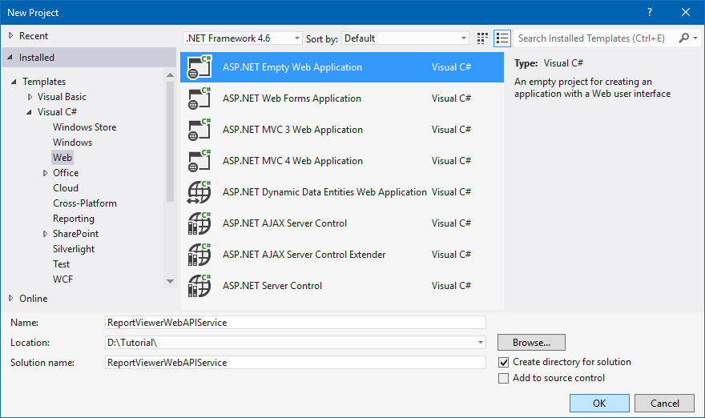
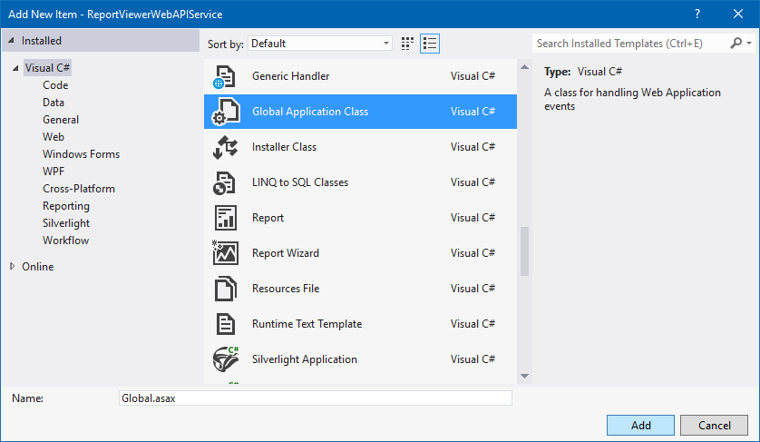

# Create ASP.NET Web API Service
In this section, you will learn how to create a Web API Service for Report Viewer using the new ASP.NET Empty Web Application template.

1.Open Visual Studio 2012, from the **File** menu, select **New Project**. 
2.Select the Visual C#, Web project type from the project type, then select the **ASP.NET Empty Web Application** project type. Set the project name and click OK.

## List of dependency libraries
The Web API service configuration requires reporting server-side assembly references.

1.In the Solution Explorer, right-click the **References** and click Add Reference.
2.Add the following mentioned libraries to the application from the installed location or GAC (Global Assembly Cache).

N> If you have installed any version of Essential Studio, then the location of Syncfusion libraries is `System drive:\Program Files (x86)\Syncfusion\Essential Studio\JavaScript\{{ site.releaseversion }}\Assemblies`.

   * System.Web.Routing  
   * System.Web.Http
   * System.Web.Http.WebHost
   * System.Net.Http
   * System.Net.Http.WebRequest
   * System.Net.Http.Formatting
   * Syncfusion.Linq.Base
   * Syncfusion.Compression.Base
   * Syncfusion.EJ.ReportViewer
   * Syncfusion.Pdf.Base
   * Syncfusion.XlsIO.Base
   * Syncfusion.DocIO.Base
   * Syncfusion.Shared.Wpf
   * Syncfusion.Chart.Wpf
   * Syncfusion.Gauge.Wpf
   * Syncfusion.SfMaps.Wpf  

N> If you have not installed any version of Essential Studio, then you can add the above assemblies from the Syncfusion NuGet package `Syncfusion.Web.ReportViewer`. The Syncfusion reporting NuGet packages are published in public `NuGet.org`. So, any additional configurations are not required to utilize the `Syncfusion.Web.ReportViewer` NuGet package.

I> Starting with `v16.2.0.x`, if you refer to the Syncfusion assemblies from trial setup or from the NuGet feed, include a license key in your projects. Refer to this [link](https://help.syncfusion.com/common/essential-studio/licensing/license-key) to learn about registering Syncfusion license key in the ASP.NET application to use our components.

3.Install the `Newtonsoft.Json` NuGet package via the NuGet package manager console.



Install-Package Newtonsoft.Json -Version 9.0.1



N> It is a mandatory package for the report viewer to serialize and deserialize the JSON data and the package version should be  9.0.1 or higher.

4.Make sure to add `<bindingRedirect>` for `Newtonsoft.Json` inside the &lt;configuration&gt; tag in the project's `web.config` file.


  <runtime>
    <assemblyBinding xmlns="urn:schemas-microsoft-com:asm.v1">
      <dependentAssembly>
        <assemblyIdentity name="Newtonsoft.Json" publicKeyToken="30ad4fe6b2a6aeed" culture="neutral" />
        <bindingRedirect oldVersion="0.0.0.0-9.0.0.0" newVersion="9.0.0.0" />
      </dependentAssembly>
    </assemblyBinding>
  </runtime>


## Add Web API Service
1.Right-click the project and select **Add &gt; New Item** from the context menu.
2.In the Add New Item dialog, select **Web API Controller** class and name it as `ReportsApiController`, and then click **Add**.

N> While adding Web API Controller class, name it with the suffix `Controller` that is mandatory.

## Inherit IReportController
The `IReportController` interface contains the required actions and helper methods declaration to process the report. The `ReportHelper` class contains methods that help to process Post or Get request from the control and return the response.  

1.Open the `ReportsApiController` and add the following using statement.


using Syncfusion.EJ.ReportViewer;


2.Inherit the `IReportController` interface, and implement its methods (replace the following code in newly created Web API controller).


    public class ReportsApiController : ApiController, IReportController
    {
        //Post action for processing the rdl/rdlc report 
        public object PostReportAction(Dictionary<string, object> jsonResult)
        {
            return ReportHelper.ProcessReport(jsonResult, this);
        }

        //Get action for getting resources from the report
        [System.Web.Http.ActionName("GetResource")]
        [AcceptVerbs("GET")]
        public object GetResource(string key, string resourcetype, bool isPrint)
        {
            return ReportHelper.GetResource(key, resourcetype, isPrint);
        }

        //Method will be called when initialize the report options before start processing the report        
        public void OnInitReportOptions(ReportViewerOptions reportOption)
        {
            //You can update report options here
        }

        //Method will be called when reported is loaded
        public void OnReportLoaded(ReportViewerOptions reportOption)
        {
            //You can update report options here
        }
    }



## Add Routing Information
The following steps guide you to configure the routing to include an action name in the URI.

1.Right-click the project in the solution explorer and select **Add > New item**.
2.In the Add New Item window, select **Global Application class** and name it as `Global.asax`, and then click Add.

3.Open the code-behind file `Global.asax.cs` and add the following using statement.



using System.Web.Http;



4.Then add the following code to the `Application_Start` method:


        protected void Application_Start(object sender, EventArgs e)
        {
            System.Web.Http.GlobalConfiguration.Configuration.Routes.MapHttpRoute(
                name: "DefaultApi",
                routeTemplate: "api/{controller}/{action}/{id}",
                defaults: new { id = RouteParameter.Optional });
        }


N> For more information about routing tables, see [Routing in ASP.NET Web API](https://docs.microsoft.com/en-us/aspnet/web-api/overview/web-api-routing-and-actions/routing-in-aspnet-web-api).

5.Compile and run the Web API service application.
