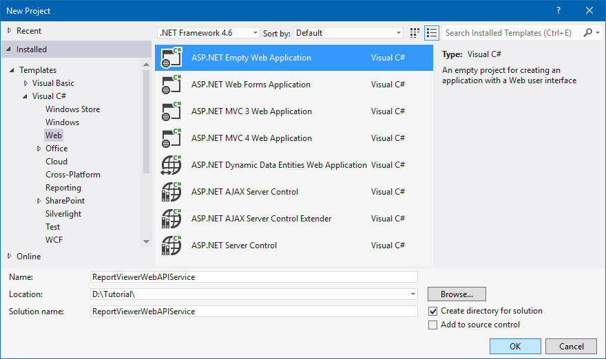
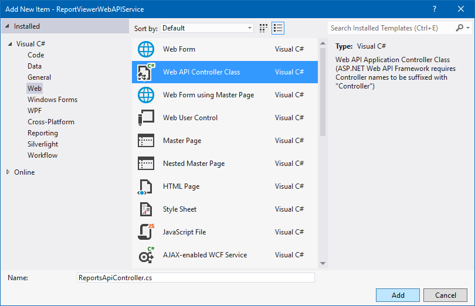
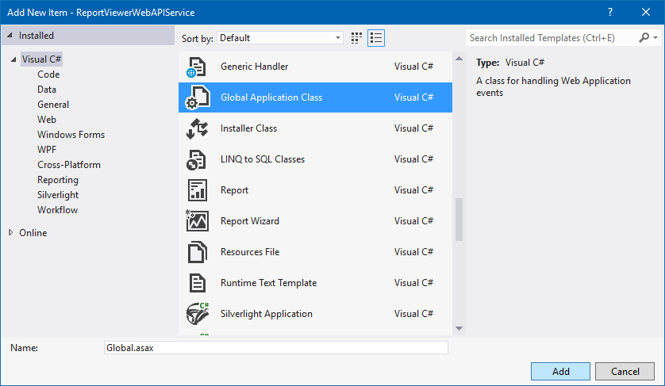

# Create ASP.NET Web API Service
In this section, you will use the new ASP.NET web project templates to create a Web API for Report Viewer to process the report actions.

1. Open Visual Studio 2012, from the File menu, select New Project. 
2. Select the Visual C#, Web project type from the project type, then select the ASP.NET Empty Web Application project type. Set the project's Name to “ReportViewerWebAPIService” then click OK.

## List of dependency libraries
The Web API service configuration requires reporting server-side assembly references.

1. In the Solution Explorer, right-click the References then click Add Reference.
2. Add the below mentioned libraries to the application from installed location or GAC (Global Assembly Cache).

N> If you have installed any version of Essential Studio, then the location of Syncfusion libraries is 
System drive:\Program Files (x86)\Syncfusion\Essential Studio\JavaScript\{{ site.releaseversion }}\Assemblies.

   * System.Web.Routing  
   * System.Web.Http
   * System.Web.Http.WebHost
   * System.Net.Http
   * System.Net.Http.WebRequest
   * System.Net.Http.Formatting
   * Syncfusion.Linq.Base
   * Syncfusion.Compression.Base
   * Syncfusion.EJ.ReportViewer
   * Syncfusion.Pdf.Base
   * Syncfusion.XlsIO.Base
   * Syncfusion.DocIO.Base
   * Syncfusion.Shared.Wpf
   * Syncfusion.Chart.Wpf
   * Syncfusion.Gauge.Wpf
   * Syncfusion.SfMaps.Wpf  

N> If you have not installed any version of Essential Studio then you can add the above assemblies from Syncfusion NuGet package `Syncfusion.Web.ReportViewer`. The Syncfusion reporting NuGet packages are published in public NuGet.org so, no need any additional configurations to utilize the Syncfusion.Web.ReportViewer NuGet package.

## Add Web API Service
1. Right-click the project and select Add -> New Item from the context menu.
2. In the Add New Item dialog, select Web API Controller class and name it as ReportsApiController then, click Add.

N> While adding WebAPI Controller class, name it with the suffix “Controller” that is mandatory.

## Inherit IReportController
The ‘IReportController’ interface contains the required actions and helper methods declaration to process the report. The `ReportHelper` class contains methods that helps to process Post/Get request from control and return the response. Open the ReportsApiController, inherit the IReportController interface and implement its methods (you can use the following codes).


using Syncfusion.EJ.ReportViewer;
using Syncfusion.EJ.ReportViewer;
using System;
using System.Collections.Generic;
using System.Linq;
using System.Net;
using System.Net.Http;
using System.Web.Http;

namespace ReportViewerWebAPIService
{
    public class ReportsApiController : ApiController, IReportController
    {
        //Post action for processing the rdl/rdlc report 
        public object PostReportAction(Dictionary<string, object> jsonResult)
        {
            return ReportHelper.ProcessReport(jsonResult, this);
        }

        //Get action for getting resources from the report
        [System.Web.Http.ActionName("GetResource")]
        [AcceptVerbs("GET")]
        public object GetResource(string key, string resourcetype, bool isPrint)
        {
            return ReportHelper.GetResource(key, resourcetype, isPrint);
        }

        //Method will be called when initialize the report options before start processing the report        
        public void OnInitReportOptions(ReportViewerOptions reportOption)
        {
            //You can update report options here
        }

        //Method will be called when reported is loaded
        public void OnReportLoaded(ReportViewerOptions reportOption)
        {
            //You can update report options here
        }
    }
}



## Configure routing in global application class
The following steps guides you to configure the routing to include action name in the URI.

1. Right-click the project in the solution explorer and select Add > New item.
2. In the Add New Item window, select Global Application class and name it as “Global.asax”, and then click Add.

3. In the Global.asax file, add namespace “using System.Web.Http;”, then configure the routing in Application_Start event as shown in the below code.


using System;
using System.Collections.Generic;
using System.Linq;
using System.Web;
using System.Web.Http;
using System.Web.Security;
using System.Web.SessionState;

namespace ReportViewerWebAPIService
{
    public class Global : System.Web.HttpApplication
    {

        protected void Application_Start(object sender, EventArgs e)
        {
            System.Web.Http.GlobalConfiguration.Configuration.Routes.MapHttpRoute(
                name: "DefaultApi",
                routeTemplate: "api/{controller}/{action}/{id}",
                defaults: new { id = RouteParameter.Optional });
        }
    }
}



4. Compile and run the Web API service application.
