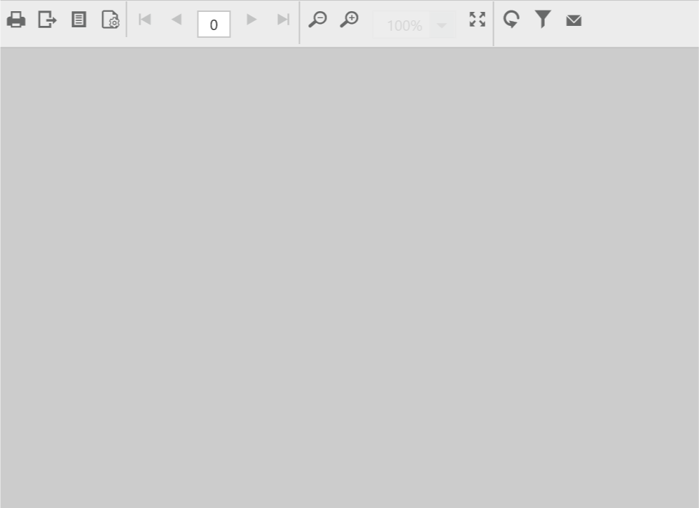

# Custom Actions
Add user defined buttons in the toolbar and invoke custom actions using the Report Viewer property. In this section, custom email option is created to email the rendered report to the users.

## Add email button

1.Create email button option in the toolbar using the [`customItems`](../api/ejreportviewer#members:toolbarsettings-customitems) property with the values such as `groupIndex`, `index`, `itemType`, `cssClass`, `tooltip`, `toolBarItemClick` event to fire when you click the button.
2.Access the Report Viewer model and create a JSON array for sending requests to the Web API server. You can use the following codes for creating the event with custom action.


        


## Create custom email action

1.Create a new action method `SendEmail` in the Web API service.
2.Export the report to the required type using `ReportHelper.GetReport` to send report stream as an attachment.
3.The following code sample exports the report to stream and send it as an attachment to a specified mail address. In the code, `SmtpClient` is used to send the report as an email attachment.


        public object SendEmail(Dictionary<string, object> jsonResult)
        {
            string _token = jsonResult["reportViewerToken"].ToString();
            var stream = ReportHelper.GetReport(_token, jsonResult["exportType"].ToString());
            stream.Position = 0;
            
            if (!ComposeEmail(stream, jsonResult["reportName"].ToString()))
            {
                return "Mail not sent !!!";
            }

            return "Mail Sent !!!";
        }

        public bool ComposeEmail(Stream stream, string reportName)
        {
            try
            {
                MailMessage mail = new MailMessage();
                SmtpClient SmtpServer = new SmtpClient("smtp.gmail.com");
                mail.IsBodyHtml = true;
                mail.From = new MailAddress("xx@gmail.com");
                mail.To.Add("xx@gmail.com");
                mail.Subject = "Report Name : " + reportName;
                stream.Position = 0;

                if (stream != null)
                {
                    ContentType ct = new ContentType();
                    ct.Name = reportName + DateTime.Now.ToString() + ".pdf";
                    System.Net.Mail.Attachment attachment = new System.Net.Mail.Attachment(stream, ct);
                    mail.Attachments.Add(attachment);
                }

                SmtpServer.Port = 587;
                SmtpServer.Credentials = new System.Net.NetworkCredential("xx@gmail.com", "xx");
                SmtpServer.EnableSsl = true;
                SmtpServer.Send(mail);

                return true;
            }
            catch (Exception ex)
            {
                return ex.ToString();
            }

            return false;
        }


N> In the above code sample, the report is exported to PDF and sent to users using `SmptClient`.

4.Build and run the application, to view the Report Viewer with the custom toolbar option.
