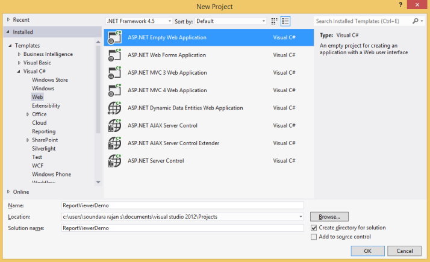
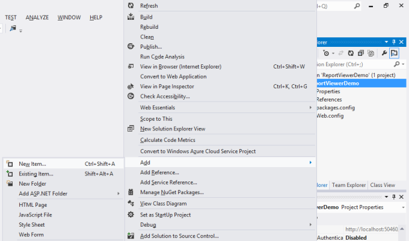
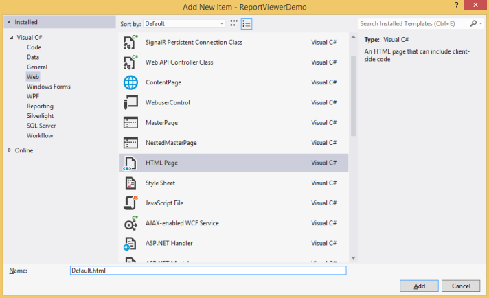
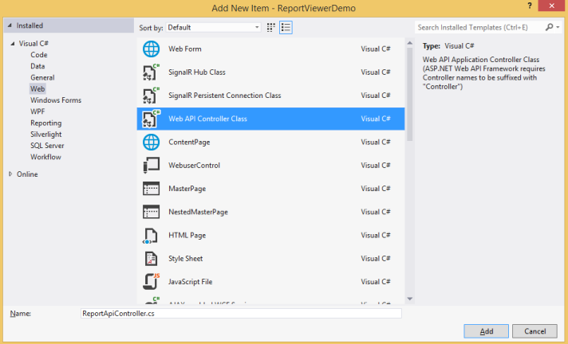
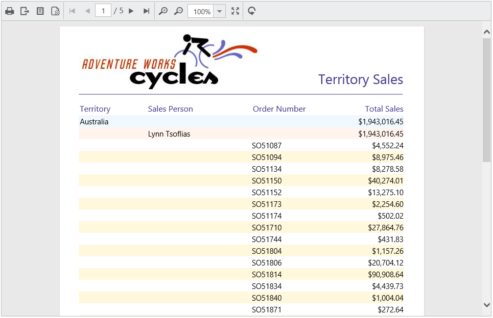
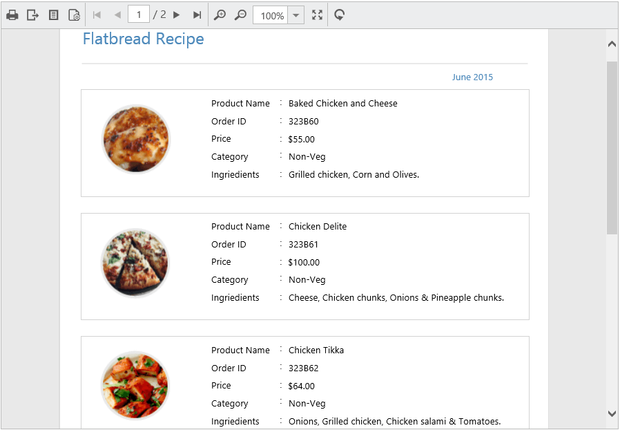

# Getting Started

This section explains briefly about how to create a ReportViewer in your web application with JavaScript.

## Create your first ReportViewer in JavaScript

This section explains how to configure a ReportViewer component in web application. As ReportViewer uses WebApi to process the report file, you can also learn how to create WebApi Service to process the report for ReportViewer. In the following example, the ReportViewer component displays the Sales Dashboard Report.    

Open Visual Studio and create a new project by clicking New Project. Select the Web category, select the ASP.NET Empty Web Application template, and then click OK. The following screenshot displays the Project Creation Wizard.

 

Project Creation Wizard
{:.caption}

### Create HTML Page

To create a new Web Form in the application

1. Right-Click on the project and select Add

    
   
   New Item Wizard
   {:.caption}

2. Click New Item and select HTML Page from the listed templates

    
   
   Adding HTML Form
   {:.caption}

3. Name the page as Default.html and click OK.

### Add References, Scripts, Styles and Control in HTML Page

### Add References

1. In the Solution Explorer, right-click the References folder and then click Add Reference

    
   
   Adding Reference
   {:.caption}

2. Add the following assemblies

   * System.Web.Routing  
   * System.Web.Http
   * System.Web.Http.WebHost
   * System.Net.Http
   * System.Net.Http.WebRequest
   * System.Net.Http.Formatting
   * Syncfusion.Linq.Base
   * Syncfusion.Compression.Base
   * Syncfusion.EJ.ReportViewer
   * Syncfusion.Pdf.Base
   * Syncfusion.XlsIO.Base
   * Syncfusion.DocIO.Base
   * Syncfusion.Shared.Wpf
   * Syncfusion.Chart.Wpf
   * Syncfusion.Gauge.Wpf
   * Syncfusion.SfMaps.Wpf 

   N> Refer the above assemblies from the installed location, C:\Program Files (x86)\Syncfusion\Essential Studio\{{ site.releaseversion }}\Assemblies
   N>
   N> Refer System.Web.Http, System.Web.Http.WebHost, System.Net.Http.WebRequest and System.Net.Http.Formatting assemblies from ASP.NET WebApi NuGet package. 
   
   
3. Click OK

### Add Scripts and Styles

Add the script files and CSS files in the &lt;title&gt; tag of the default.html page.



<link href="http://cdn.syncfusion.com/{{ site.releaseversion }}/js/web/flat-azure/ej.web.all.min.css" rel="stylesheet" />



### Add Control in HTML Page

Add the following code example in the &lt;body&gt; tag in the Default.html page. Set the desired `reportPath` and `reportServiceUrl` to ReportViewer.



    <!-- Creating a div tag which will act as a container for ejReportViewer widget.-->
    

    <!-- Setting property and initializing ejReportViewer widget.-->
    



N> Add your report files to your application’s App_Data folder. You can obtain sample rdl/rdlc files from Syncfusion installed location (%userprofile%\AppData\Local\Syncfusion\EssentialStudio\{{ site.releaseversion }}\Common\Data\ejReportTemplate).

### Add WebAPI controller for ReportViewer

The JavaScript ReportViewer uses WebApi services to process the report file and process the request from control.

 

Adding WebApi Controller
{:.caption}

#### Inherit IReportController

The ApiController inherits the `IReportController` and you can add the following code example to its methods definition in order to process the report file. The interface `IReportController` contains the required actions and helper methods declaration to process the report. The `ReportHelper` class contains helper methods that helps to process Post/Get request from control and return the response to control.



using Syncfusion.EJ.ReportViewer;
using System;
using System.Collections.Generic;
using System.Linq;
using System.Net;
using System.Net.Http;
using System.Web.Http;

namespace ReportViewerDemo.Api 
{
    public class ReportApiController: ApiController,IReportController 
    {
        //Post action for processing the rdl/rdlc report 
        public object PostReportAction(Dictionary < string, object > jsonResult 
        {
            return ReportHelper.ProcessReport(jsonResult, this);
        }
        
        //Get action for getting resources from the report
        [System.Web.Http.ActionName("GetResource")]
        [AcceptVerbs("GET")]
        public object GetResource(string key, string resourcetype, bool isPrint) 
        {
            return ReportHelper.GetResource(key, resourcetype, isPrint);
        }
        
        //Method will be called when initialize the report options before start processing the report        
        public void OnInitReportOptions(ReportViewerOptions reportOption)
        {
            //You can update report options here
        }
        
        //Method will be called when reported is loaded
        public void OnReportLoaded(ReportViewerOptions reportOption) 
        {
            //You can update report options here
        }
    }
}



### WebAPI Routing

1. Right-Click the Project, select Add  and select Global.asax file from the listed templates.

    
   
   Adding Global.asax
   {:.caption}

2. You can route the WebAPI in Application_Start event into Global.asax file as follows.

   ~~~ csharp
   
	   using System;
	   using System.Collections.Generic;
	   using System.Linq;
	   using System.Web;
	   using System.Web.Security;
	   using System.Web.SessionState;
	   using System.Web.Http;
	   
	   namespace ReportViewerDemo 
	   {
		   public class Global: System.Web.HttpApplication 
		   {
			   protected void Application_Start(object sender, EventArgs e) 
			   {
				   System.Web.Http.GlobalConfiguration.Configuration.Routes.MapHttpRoute(
				   name: "DefaultApi",
				   routeTemplate: "api/{controller}/{action}/{id}",
				   defaults: new { id = RouteParameter.Optional });
			   }
		   }
	   }
   ~~~

### Run the Application

Run the sample application and you can see the ReportViewer on the page as displayed in the following screenshot.

 

ReportViewer with Sales Dashboard Report
{:.caption}

## Load SSRS Server Reports

ReportViewer supports to load RDL/RDLC files from SSRS Server. The following steps help you to load reports from SSRS Server.

1. Set the `reportPath` from SSRS and SSRS `reportServerUrl` in the ReportViewer properties.

   ~~~ html
   
	   

		   <!-- Creating a div tag which will act as a container for ejReportViewer widget.-->
		   

		   <!-- Setting property and initializing ejReportViewer widget.-->
		   
	   

   ~~~

2. Add the credential information in ReportApiController’s `OnInitReportOptions` method which is available in `IReportController`.

   ~~~ csharp
   
	   public void OnInitReportOptions(ReportViewerOptions reportOption)
	   {
		   //Add SSRS Server and database credentials here
		   reportOption.ReportModel.ReportServerCredential = new System.Net.NetworkCredential("ssrs", "RDLReport1");
		   reportOption.ReportModel.DataSourceCredentials.Add(new DataSourceCredentials("AdventureWorks", "ssrs1", "RDLReport1"));
	   }
   ~~~

3. Run the application and you can see the ReportViewer on the page as displayed in the following screenshot.

    
   
   Report from SSRS
   {:.caption}

## Load RDLC Reports

The ReportViewer has data binding support to visualize the RDLC reports. The following code example helps you to bind data to ReportViewer.

1. Assign the RDLC report path to ReportViewer’s `reportPath` property and set the data sources to the ReportViewer’s `dataSources` property.

   ~~~ html
   
	   

		   <!-- Creating a div tag which will act as a container for ejReportViewer widget.-->
		   

		   <!-- Setting property and initializing ejReportViewer widget.-->
		   
	   

   ~~~

2. Run the application and you can see the ReportViewer on the page as displayed in the following screenshot.

    
   
   Product List RDLC Report
   {:.caption}

