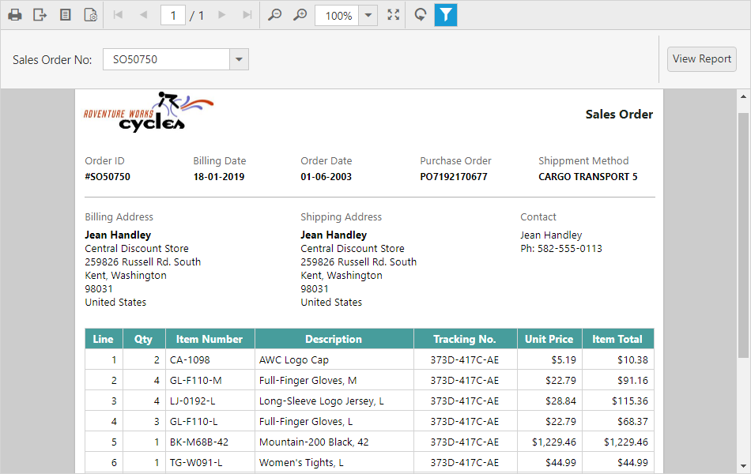

# Getting Started with JavaScript Report Viewer
This section explains you the steps required to display a report which is already created and added to your application. The Report Viewer requires a Web API service to process the report files, so you must create any one of the following Web API service.

* [ASP.NET Web API Service](/js/reportviewer/create-aspnet-web-api-service)
* [ASP.NET Core Web API Service](/js/reportviewer/create-aspnet-core-web-api-service)

After creating the Web API service, add the Report Viewer to your application page to render the reports.

I> The Report Viewer is only for rendering the reports. You must use a report generation tool to create a report and to learn more about this, refer to the [Create Report](/js/reportviewer/how-to/create-report) section for creating new reports.

This tutorial uses the same Web API service application created in [Create ASP.NET Web API Service](/js/reportviewer/create-aspnet-web-api-service) tutorial.

## Adding already created report
Create a folder `App_Data` in your application for storage and add already created reports to it.

N> In this tutorial, the `Sales Order Detail.rdl` report is used, and it can be downloaded from [here](http://www.syncfusion.com/downloads/support/directtrac/general/ze/Sales_Order_Detail-1633189686). You can add the reports from Syncfusion installation location. For more information, see [Samples and demos](/js/reportviewer/samples-and-demos).

## Adding scripts and CSS references
Create an HTML page in your application, then add scripts and style sheets that are mandatorily required to use the Report Viewer which are listed as follows in an appropriate order.

1.	`ej.web.all.min.css`
2.	`jquery-1.10.2.min.js`
3.	`jquery.easing.min.js`
4.	`ej.web.all.min.js`

You can use the following code in &lt;head&gt; tag of the Report Viewer HTML page.


<link href="https://cdn.syncfusion.com/{{ site.releaseversion }}/js/web/flat-azure/ej.web.all.min.css" rel="stylesheet" />



## Initialize Report Viewer 

Add the following code in the &lt;body&gt; tag in the Report Viewer HTML page. Set the [`reportPath`](../api/ejreportviewer#members:reportpath) and [`reportServiceUrl`](../api/ejreportviewer#members:reportserviceurl) properties of the Report Viewer


    

        <!-- Creating a div tag which will act as a container for ejReportViewer widget.-->
        

        <!-- Setting property and initializing ejReportViewer widget.-->
        
    



N> The report path property is set to the RDL report that is added in the project `App_Data` folder.
In this tutorial the Report Viewer page and Web API service are in the same application.

## Run the application
Build and run the application, the report rendered in the Report Viewer as shown in the following screenshot.

## Render report in print mode
By default, reports are rendered in normal layout in which the print margins are not displayed. To view the render the report as like printable output, set the [`printMode`](../api/ejreportviewer#members:printmode) property value as true as shown in the following code snippet. 


    


## Set data source credential
You can specify credentials in the Web API service for the report data sources that use Windows Authentication, database authentication, or custom authentication. Create a new `DataSourceCredentials` object with the data source name, username and password then add it to the `DataSourceCredentials` property in the `OnInitReportOptions` method as in the below code snippet.


public void OnInitReportOptions(ReportViewerOptions reportOption)
{
    //Here the "AdventureWorks" is the data source name provided in report definition. Name property is case sensitive.
    reportOption.ReportModel.DataSourceCredentials.Add(new Syncfusion.Reports.EJ.DataSourceCredentials("AdventureWorks", "demoreadonly@data-platform-demo", "N@c)=Y8s*1&dh"));
}


N> The data source name is case sensitive, so the name should be same as available in the report definition.

## Change data source connection string
You can change the connection string of a report data source before it is loaded in the Report Viewer. The `DataSourceCredentials` class provides the option to set and update the modified connection string as in the following code snippet.


    public class ReportsApiController : ApiController, IReportController
    {
        ……        
        public void OnInitReportOptions(ReportViewerOptions reportOption)
        {
            reportOption.ReportModel.DataSourceCredentials.Add(new Syncfusion.Reports.EJ.DataSourceCredentials("AdventureWorks", "demoreadonly@data-platform-demo","N@c)=Y8s*1&dh","Data Source=dataplatformdemodata.syncfusion.com;Initial Catalog=AdventureWorks;"));        
        }
    }


N> The previous code shows an option to change the connection string only, but the class provides multiple options to change data source information. To learn more about this, refer to the [`DataSourceCredentials`](https://help.syncfusion.com/cr/aspnetmvc/Syncfusion.JavaScript.DataSources.html) class.
