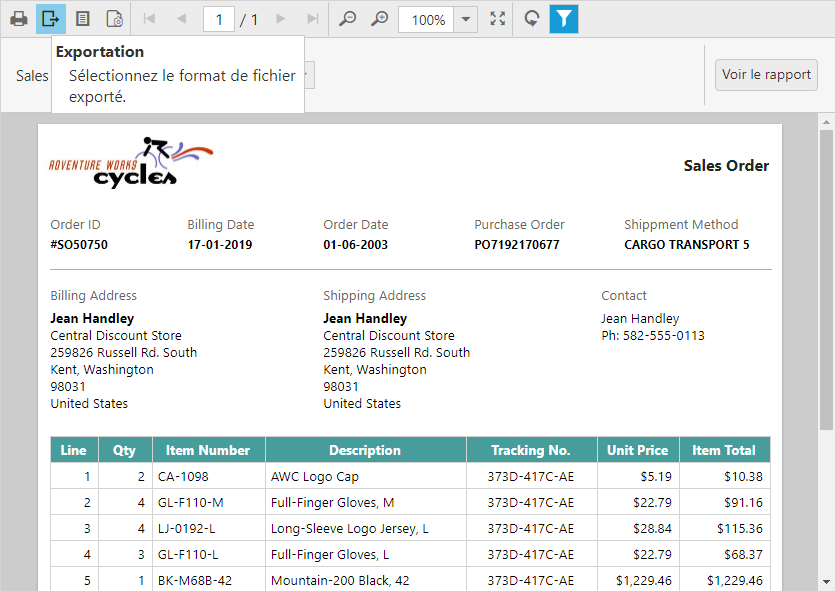

# Localization
You can localize the Report Viewer static text and tooltip. To render the static text with specific culture, refer to the corresponding culture script and set culture name to the [`locale`](../api/ejreportviewer#members:locale) property of the Report Viewer.


<head>
    <title>Render Report Viewer in French localization</title>
    <link href="http://cdn.syncfusion.com/{{ site.releaseversion }}/js/web/flat-azure/ej.web.all.min.css" rel="stylesheet" />
    
    
    
    
    
</head>
<body>
    

        <!-- Creating a div tag which will act as a container for ejReportViewer widget.-->
        

        <!-- Setting property and initializing ejReportViewer widget.-->
        
    

</body>


N> Refer to the [Localization](../localization) document to get the culture specific script files.

View the online Report Viewer localization demo [here](https://js.syncfusion.com/demos/web/#!/bootstrap/reportviewer/localization).
