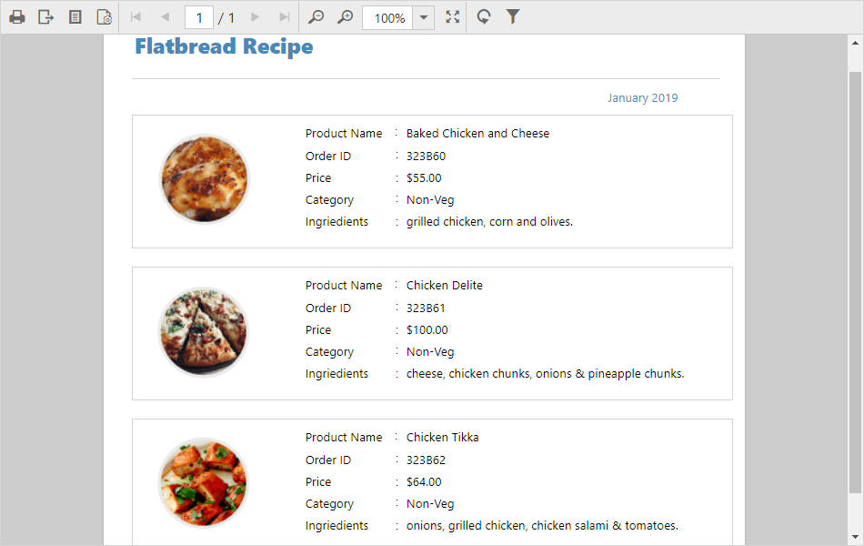

# Render RDLC report

The data binding support, allows you to view RDLC reports that exist on the local file system with JSON array and custom business object data collection. The following steps demonstrates how to render a RDLC report with JSON array and custom business object data collection.

N> Add the RDLC report `Product List.rdlc` from Syncfusion installation location to your application `App_Data` folder. For more information, see [Samples and demos](/js/reportviewer/samples-and-demos).

## Bind data source at client side
1.Set the RDLC report path to the `reportPath` property.
2.Assign the [`processingMode`](../api/ejreportviewer#members:processingmode) property to `ProcessingMode.Local`.
3.Bind the JSON array collection to the [`dataSources`](../api/ejreportviewer#members:datasources) property as shown in following code.


    

        

        
    



4.Build and run the application to view the output result.

## Bind data source in Web API controller
The following steps help you to configure the Web API to render the RDLC report with business object data collection.

1.Create a class and methods that returns business object data collection. Use the following code in your application Web API Service.


    public class ProductList
    {
        public string ProductName { get; set; }
        public string OrderId { get; set; }
        public double Price { get; set; }
        public string Category { get; set; }
        public string Ingredients { get; set; }
        public string ProductImage { get; set; }

        public static IList GetData()
        {
            List<ProductList> datas = new List<ProductList>();
            ProductList data = null;
            data = new ProductList()
            {
                ProductName = "Baked Chicken and Cheese",
                OrderId = "323B60",
                Price = 55,
                Category = "Non-Veg",
                Ingredients = "grilled chicken, corn and olives.",
                ProductImage = ""
            };
            datas.Add(data);
            data = new ProductList()
            {
                ProductName = "Chicken Delite",
                OrderId = "323B61",
                Price = 100,
                Category = "Non-Veg",
                Ingredients = "cheese, chicken chunks, onions & pineapple chunks.",
                ProductImage = ""
            };
            datas.Add(data);
            data = new ProductList()
            {
                ProductName = "Chicken Tikka",
                OrderId = "323B62",
                Price = 64,
                Category = "Non-Veg",
                Ingredients = "onions, grilled chicken, chicken salami & tomatoes.",
                ProductImage = ""
            };
            datas.Add(data);

            return datas;
        }
    }


2.Set the `ProcessingMode` to `ProcessingMode.Local` and `ReportPath` to the RDLC report location.
3.Bind the business object data values collection by adding new item to the `DataSources` as in the following code snippet.


    public void OnInitReportOptions(ReportViewerOptions reportOption)
    {
        reportOption.ReportModel.ProcessingMode = ProcessingMode.Local;
        reportOption.ReportModel.ReportPath = System.Web.Hosting.HostingEnvironment.MapPath(@"~/App_Data/Product List.rdlc");
        reportOption.ReportModel.DataSources.Add(new Syncfusion.Reports.EJ.ReportDataSource { Name = "list", Value = ProductList.GetData() });
    }


N> Here the `Name` is case sensitive and it should be same as in the data source name in the report definition.

T> The `Value` accepts IList, DataSet, and DataTable inputs.

4.Build and run the application, the result shown as in the following screenshot.

## Load report as stream
To load report as a stream, create a report stream using the `FileStream` class and assign the report stream to the `Stream` property.


    public void OnInitReportOptions(ReportViewerOptions reportOption)
    {
        string filePath = System.Web.Hosting.HostingEnvironment.MapPath(@"~/App_Data/Product List.rdlc"); ;
        // Opens the report from application App_Data folder using FileStream
        FileStream reportStream = new FileStream(filePath, FileMode.Open, FileAccess.Read);
        reportOption.ReportModel.Stream = reportStream;
        reportOption.ReportModel.DataSources.Add(new Syncfusion.Reports.EJ.ReportDataSource { Name = "list", Value = ProductList.GetData() });
    }


N> In the above code, `Product List.rdlc` report is loaded from the `App_Data` folder location.
