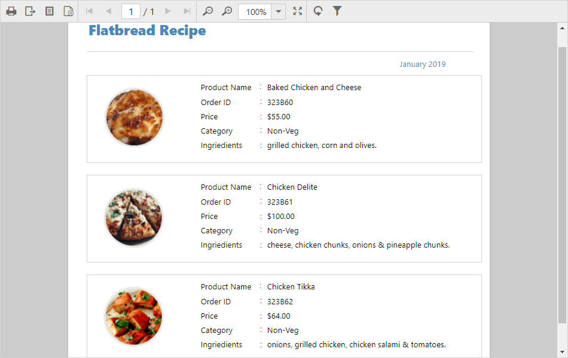

# Render RDLC report

Report Viewer has data binding support, which allows you to view RDLC reports that exist on the local file system with JSON array and custom business object data collection. The following steps demonstrates how to render a RDLC report with JSON array and custom business object data collection.

## Bind data source at client side
1. Set the RDLC report path to `reportPath` property.
2. Assign the [`processingMode`](../api/ejreportviewer#members:processingmode) property to `ProcessingMode.Local`.
3. Bind the JSON array collection to [`dataSources`](../api/ejreportviewer#members:datasources) property as shown in below code.



        

        
    



N> The RDLC report used in the above example is taken from the Syncfusion build installed location. You can obtain sample rdlc files from below location. (%userprofile%\AppData\Local\Syncfusion\EssentialStudio\{{ site.releaseversion }}\Common\Data\ejReportTemplate).

4. Build and run the application to view the output result.

## Bind data source in Web API controller
To bind the custom business object data collection in Web API controller.  The following code shows the steps to configure the Web API controller to render RDLC report with business object data collection.

1. Create class and methods that returns business object data collection.


    public class ProductList
    {
        public string ProductName { get; set; }
        public string OrderId { get; set; }
        public double Price { get; set; }
        public string Category { get; set; }
        public string Ingredients { get; set; }
        public string ProductImage { get; set; }

        public static IList GetData()
        {
            List<ProductList> datas = new List<ProductList>();
            ProductList data = null;
            data = new ProductList()
            {
                ProductName = "Baked Chicken and Cheese",
                OrderId = "323B60",
                Price = 55,
                Category = "Non-Veg",
                Ingredients = "grilled chicken, corn and olives.",
                ProductImage = ""
            };
            datas.Add(data);
            data = new ProductList()
            {
                ProductName = "Chicken Delite",
                OrderId = "323B61",
                Price = 100,
                Category = "Non-Veg",
                Ingredients = "cheese, chicken chunks, onions & pineapple chunks.",
                ProductImage = ""
            };
            datas.Add(data);
            data = new ProductList()
            {
                ProductName = "Chicken Tikka",
                OrderId = "323B62",
                Price = 64,
                Category = "Non-Veg",
                Ingredients = "onions, grilled chicken, chicken salami & tomatoes.",
                ProductImage = ""
            };
            datas.Add(data);

            return datas;
        }
    }


2. Set the `ProcessingMode` to Local and `ReportPath` to the RDLC report location.
3. Bind the business object data values collection by adding new item to `DataSources` as in the below code snippet.


public class ReportsApiController : ApiController, IReportController
    {
        ..
        public void OnInitReportOptions(ReportViewerOptions reportOption)
        {
            reportOption.ReportModel.ProcessingMode = ProcessingMode.Local;
            reportOption.ReportModel.ReportPath = System.Web.Hosting.HostingEnvironment.MapPath(@"~/App_Data/Product List.rdlc");
            reportOption.ReportModel.DataSources.Add(new Syncfusion.Reports.EJ.ReportDataSource { Name = "list", Value = ProductList.GetData() });
        }
        ..
    }


N> Here the `Name` is case sensitive and it should be same as in the data source name in the report definition. The `Value` property accepts IList, DataSet, and DataTable inputs.

4. Build and run the application, the result shown as in below screenshot.

