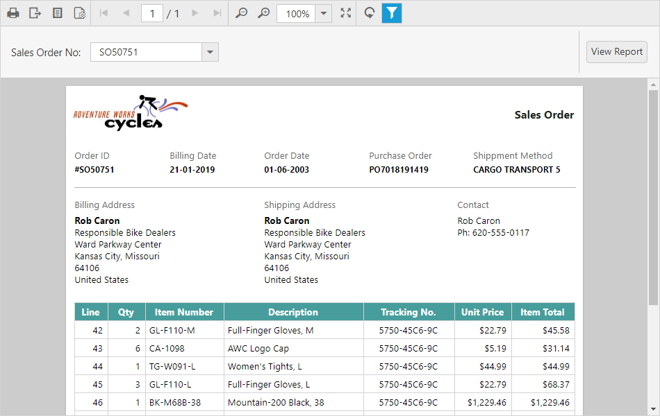

# Report Parameters

Provides property options to pass or set report parameters default values at run-time using the [`parameters`](../api/ejreportviewer#members:parameters) property. You can set the report parameters while creating the Report Viewer control in a script or in the Web API Controller.

N> In this tutorial, the `Sales Order Detail.rdl` report is used, and it can be downloaded from [here](http://www.syncfusion.com/downloads/support/directtrac/general/ze/Sales_Order_Detail-1633189686).

## Set parameter at client
The [`parameters`](../api/ejreportviewer#members:parameters) property takes the JSON array value input with parameter details.
 
1.Set the default value data to the [`values`](../api/ejreportviewer#members:parameters-values) property and name of the report parameter to the [`name`](../api/ejreportviewer#members:parameters-name) property.

N> The parameter name is case sensitive, it should be same as available in the report definition.

2.The following code example illustrates how to set report parameter in the script.


    


3.Run the application and the result shown as in the following screenshot.

## Set parameters in Web API Controller
To set parameter default value in Web API Controller, use the following code in the `OnReportLoaded` method.


public void OnReportLoaded(ReportViewerOptions reportOption)
{
    List<Syncfusion.Reports.EJ.ReportParameter> userParameters = new List<Syncfusion.Reports.EJ.ReportParameter>();
    userParameters.Add(new Syncfusion.Reports.EJ.ReportParameter()
    {
        Name = "SalesOrderNumber",
        Values = new List<string>() { "SO50756" }
    });
    reportOption.ReportModel.Parameters = userParameters;
}


## Get report parameter
The `ReportHelper` class provides methods that help you to get the report parameters used in the report. The following helper methods used to get parameter with or without values.

<table>
<tr>
<th>
Methods</th><th>
Description</th></tr>
<tr>
<td>
GetParameters</td><td>
Returns the parameters that are used in the current report without the processed values.</td></tr>
<tr>
<td>
GetParametersWithValues</td><td>
Returns the report parameters with processed data values that are used in the current report.</td></tr>
</table>

You can use the following code sample to get parameter names and set parameter default values.


    public class ReportsApiController : ApiController, IReportController
    {
        Dictionary<string, object> jsonArray = null;
        public object PostReportAction(Dictionary<string, object> jsonResult)
        {
            jsonArray = jsonResult;
            return ReportHelper.ProcessReport(jsonResult, this);
        }

        ....
        public void OnReportLoaded(ReportViewerOptions reportOption)
        {
            var reportParameters = ReportHelper.GetParameters(jsonArray, this);
            List<Syncfusion.Reports.EJ.ReportParameter> setParameters = new List<Syncfusion.Reports.EJ.ReportParameter>();

            if (reportParameters != null)
            {
                foreach (var rptParameter in reportParameters)
                {
                    setParameters.Add(new Syncfusion.Reports.EJ.ReportParameter()
                    {
                        Name = rptParameter.Name,
                        Values = new List<string>() { "SO50756" }
                    });
                }

                reportOption.ReportModel.Parameters = setParameters;
            }
        }
    }
