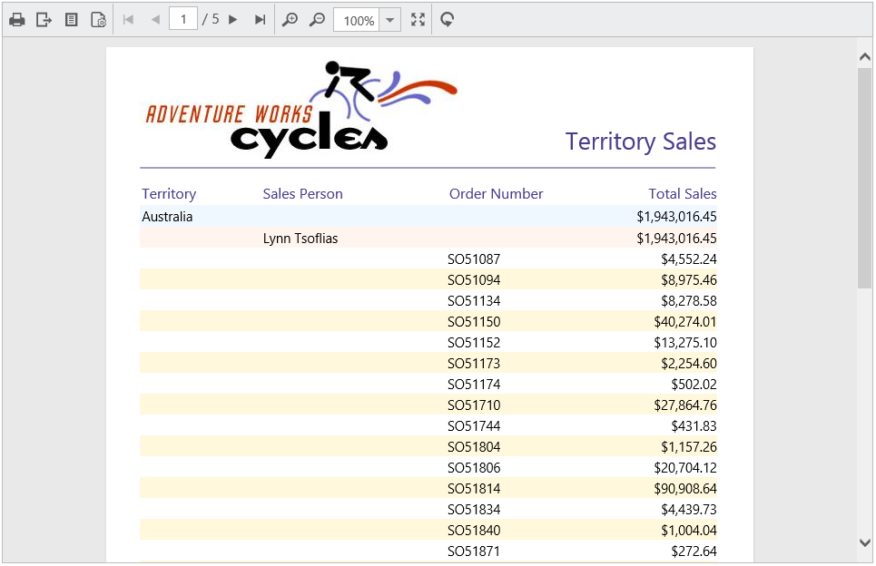

# Load SSRS RDL reports

ReportViewer has support to load RDL reports from SSRS Report Server. To render SSRS Reports set the [`reportServerUrl`](../api/ejreportviewer#members:reportserverurl), [`reportPath`](../api/ejreportviewer#members:reportpath), `reportServiceUrl` properties as in the below code snippet.


    

        

        
    



N> Report Server URL should be in the format of http://<servername>/reportserver$instanceName
The report path should be in the format of /folder name/report name.

## Network credentials for SSRS
The network credentials are required to connect with the specified SSRS Report Server using Report Viewer. Specify the `ReportServerCredential` property in Web API Controller `OnInitReportOptions` method.


public void OnInitReportOptions(ReportViewerOptions reportOption)
{
    //Add SSRS Report Server credential
    reportOption.ReportModel.ReportServerCredential = new System.Net.NetworkCredential("ssrs", "RDLReport1");
}


## Data source credential for shared data sources

The SSRS Report Server does not provide options to get credential information of the report data source deployed on SSRS server. If the report has any data source that uses credentials to connect with database, then you must specify the `DataSourceCredentials` for each report data source to establish database connection.


public void OnInitReportOptions(ReportViewerOptions reportOption)
{
    //Add SSRS Report Server and data source credentials
    reportOption.ReportModel.ReportServerCredential = new System.Net.NetworkCredential("ssrs", "RDLReport1");

    reportOption.ReportModel.DataSourceCredentials.Add(new Syncfusion.Reports.EJ.DataSourceCredentials("AdventureWorks", "ssrs1", "RDLReport1"));
}


N> DataSource credentials must be added for shared data sources that do not have credentials in the connection strings.

Build and run the application and you can see the ReportViewer on the page as displayed in the following screenshot.

