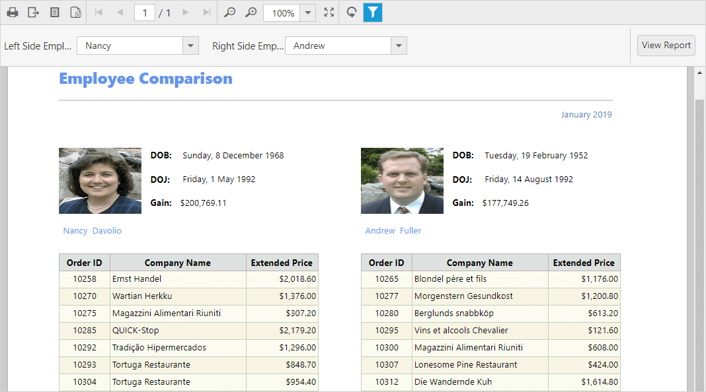

# Preview subreport

You can display another report inside the body of a main report using the Report Viewer. The following steps helps you to customize the subreport properties such as data source, report path, and parameters.

1.Add the sub report and main reports to your application `App_Data` folder. In this tutorial, using the already created reports. Refer to the [Create Report](/js/reportviewer/how-to/create-report) section to create a new report.

    N> Download the `Side_By_SideMainReport.rdl`, `Side_By_SideSubReport.rdl` reports from [here](http://www.syncfusion.com/downloads/support/directtrac/general/ze/Subreports-1004880284). Also, you can add the report from Syncfusion installation location. For more information, see [Samples and demos](/js/reportviewer/samples-and-demos). The reports used from installed location, requires `NorthwindIO_Reports.sdf` database to run, so add it to your application.

2.Set the `reportPath` and `reportServiceUrl` properties of the Report Viewer as in following code snippet.


        



3.Build and run the application, to view the following result

## Change subreport path
To change the subreport file path, set the `ReportPath` property of SubReportModel in the `OnInitReportOptions` method.


        public void OnInitReportOptions(ReportViewerOptions reportOption)
        {
            if (reportOption.SubReportModel != null)
            {
                reportOption.SubReportModel.ReportPath = System.Web.Hosting.HostingEnvironment.MapPath(@"~/App_Data/SubReport_Detail.rdl");
            }
        }


## Set subreport parameter
You can change the parameter default values of a subreport in the Web API Controller `OnReportLoaded`, method as given in the following code snippet.


        public void OnReportLoaded(ReportViewerOptions reportOption)
        {
            if (reportOption.SubReportModel != null)
            {
                reportOption.SubReportModel.Parameters = new Syncfusion.Reports.EJ.ReportParameterInfoCollection();
                reportOption.SubReportModel.Parameters.Add(new Syncfusion.Reports.EJ.ReportParameterInfo()
                {
                    Name = "SalesPersonID",
                    Values = new List<string>() { "2" }
                });
            }
        }


## Modify subreport data source connection string
You can change the credential and connection information of the data sources used in the subreport using the SubReportModel in `OnInitReportOptions` method.


        public void OnInitReportOptions(ReportViewerOptions reportOption)
        {
            if (reportOption.SubReportModel != null)
            {
                reportOption.SubReportModel.DataSourceCredentials = new List<Syncfusion.Reports.EJ.DataSourceCredentials>();
                reportOption.SubReportModel.DataSourceCredentials.Add(new Syncfusion.Reports.EJ.DataSourceCredentials("NorthWind", "Data Source=dataplatformdemodata.syncfusion.com;Initial Catalog=Northwind;user id=demoreadonly@data-platform-demo;password=N@c)=Y8s*1&dh"));
            }
        }


## Set subreport data source

You can bind local business object data source collection only for RDLC reports. To specify data source of a RDLC subreport, set the `ReportDataSource` property in `OnReportLoaded` method. 

N> The RDL report has the connection information in report definition itself, so no need to bind data source.

1.Add the RDLC sub report and main reports to your application `App_Data` folder. You can downloaded it from [here](http://www.syncfusion.com/downloads/support/directtrac/general/ze/Product_List-795139675).
2.Set the `reportPath` and `reportServiceUrl` properties of the Report Viewer as in following code snippet.


        


3.Create a class and methods that returns business object data collection. Use the following code in your application Web API Service.


    public class ProductList
    {
        public string ProductName { get; set; }
        public string OrderId { get; set; }
        public double Price { get; set; }
        public string Category { get; set; }
        public string Ingredients { get; set; }
        public string ProductImage { get; set; }

        public static IList GetData()
        {
            List<ProductList> datas = new List<ProductList>();
            ProductList data = null;
            data = new ProductList()
            {
                ProductName = "Baked Chicken and Cheese",
                OrderId = "323B60",
                Price = 55,
                Category = "Non-Veg",
                Ingredients = "grilled chicken, corn and olives.",
                ProductImage = ""
            };
            datas.Add(data);
            data = new ProductList()
            {
                ProductName = "Chicken Delite",
                OrderId = "323B61",
                Price = 100,
                Category = "Non-Veg",
                Ingredients = "cheese, chicken chunks, onions & pineapple chunks.",
                ProductImage = ""
            };
            datas.Add(data);
            data = new ProductList()
            {
                ProductName = "Chicken Tikka",
                OrderId = "323B62",
                Price = 64,
                Category = "Non-Veg",
                Ingredients = "onions, grilled chicken, chicken salami & tomatoes.",
                ProductImage = ""
            };
            datas.Add(data);

            return datas;
        }
    }


4.Bind the business object data values collection to subreport by adding new item to the `DataSources` as in the following code snippet.


        public void OnReportLoaded(ReportViewerOptions reportOption)
        {
            //Assigning the data source for 'Product List.rdlc'
            if (reportOption.SubReportModel != null)
            {
                reportOption.SubReportModel.DataSources = new Syncfusion.Reports.EJ.ReportDataSourceCollection();
                reportOption.SubReportModel.DataSources.Add(new Syncfusion.Reports.EJ.ReportDataSource { Name = "list", Value = ProductList.GetData() });
            }
        }


N> The data source name is case sensitive, it should be same as in the report definition.

## Load subreport stream

To load subreport as stream, set the `Stream` property in `OnInitReportOptions` method.


        public void OnInitReportOptions(ReportViewerOptions reportOption)
        {
            if (reportOption.SubReportModel != null)
            {
                // Opens the report from application App_Data folder using FileStream and loads the sub report stream.
                FileStream reportStream = new FileStream(System.Web.Hosting.HostingEnvironment.MapPath(@"~/App_Data/Product List.rdlc"), FileMode.Open, FileAccess.Read);
                reportOption.SubReportModel.Stream = reportStream;
            }
        }
        public void OnReportLoaded(ReportViewerOptions reportOption)
        {
            //Assigning the data source for 'Product List.rdlc'
            if (reportOption.SubReportModel != null)
            {
                reportOption.SubReportModel.DataSources = new Syncfusion.Reports.EJ.ReportDataSourceCollection();
                reportOption.SubReportModel.DataSources.Add(new Syncfusion.Reports.EJ.ReportDataSource { Name = "list", Value = ProductList.GetData() });
            }
        }
