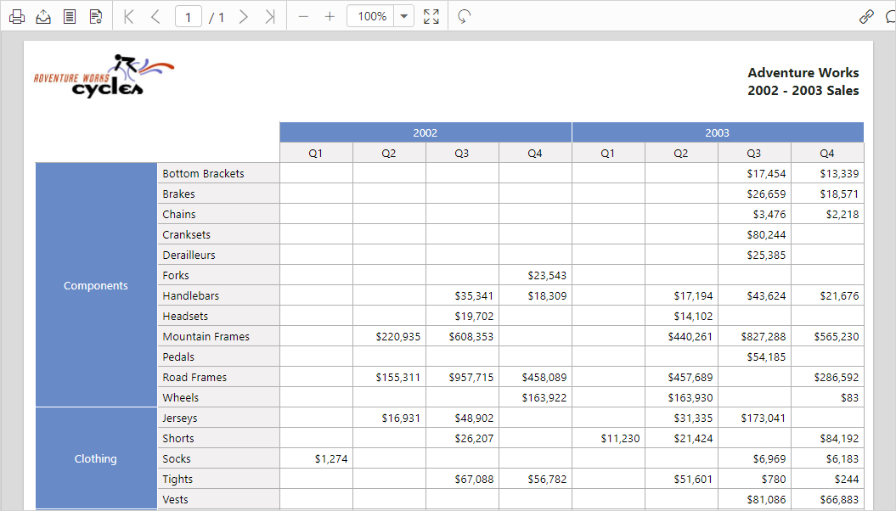

# Load Syncfusion Report Server reports

You can render the Syncfusion Report Server hosted reports in the Report Viewer easily without creating a Web API service. Syncfusion Report Server provides the built-in Web API service that helps you to display the server reports.

1.The Report Viewer requires the [`serviceAuthorizationToken`](../api/ejreportviewer#members:members:serviceauthorizationtoken) to connect and download the items from the Syncfusion Report Server. Create a token for the user by using the server RESTful API, the following code is used to generate the token.


    



2.Set the Syncfusion Report Server built-in service URL to the `reportServiceUrl` property. Assign the created token to [`serviceAuthorizationToken`](../api/ejreportviewer#members:members:serviceauthorizationtoken) and `reportPath` to a report deployed on the server. You can use the following complete code in your HTML page.


    


T> You can also load the report using Guid instead of report location. Set the Guid of the report in `reportPath` as like as `reportPath: ‘91f24bf1-e537-4488-b19f-b37f77481d00’`.

3.View the HTML file in a web browser and the report result shows as in the following screenshot.
