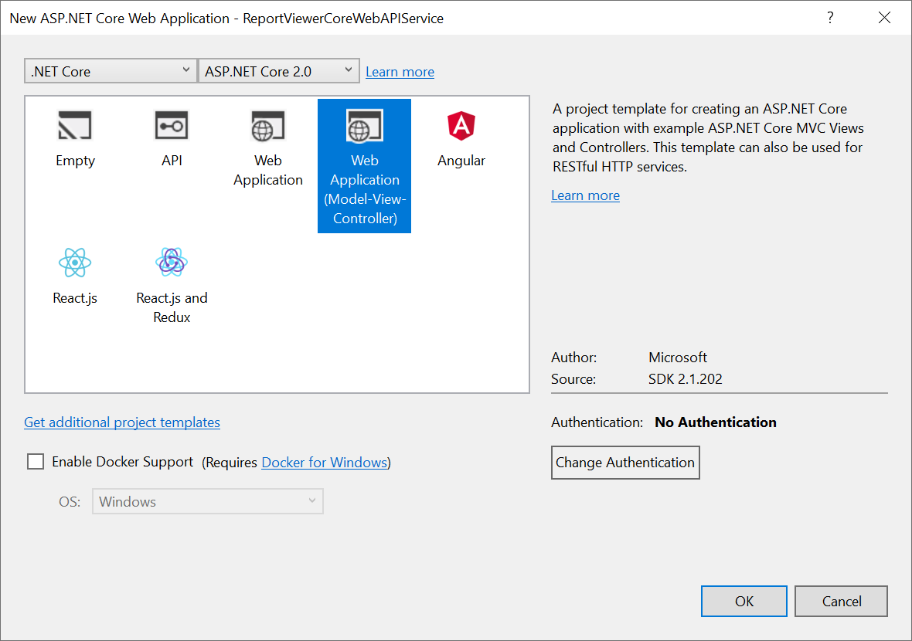

# Create ASP.NET Core Web API Service
In this section, you will learn how to create a ASP.NET Core Web API for Report Viewer using the new ASP.NET Core Web Application template.

1.Open Visual Studio 2017, from the File menu, select New Project. 
2.Select the ASP.NET Core Web Application template. Name the project and click OK.
3.Choose the ASP.NET Core version. Select the Web Application(Model-View-Controller) template and click OK. Do not select Enable Docker Support.

## List of dependency libraries
The Web API service configuration requires the following reporting server-side packages. In the Solution Explore, right-click the Dependencies, select Manage NuGet Packages and then search the package `Syncfusion.EJ.ReportViewer.ASPNET.Core` and install to the application. The following provides detail of the packages and its usage.

<table>
<tr>
<th>
Package</th>
<th>
Purpose
</th>
</tr>
<tr>
<td>Syncfusion.EJ.ReportViewer.ASPNET.Core</td>
<td>Builds the server-side implementations.</td>
</tr>
<tr>
<td>Syncfusion.EJ</td>
<td>Builds the report viewer controls with the tag helper.</td>
</tr>
<tr>
<td>Syncfusion.EJ.ASPNET.Core</td>
<td>Builds the report viewer controls with the tag helper.</td>
</tr>
<tr>
<td>Syncfusion.Report.NETStandard</td>
<td>It is a base library for the <b>Syncfusion.EJ.ReportViewer.ASPNET.Core</b> package.</td>
</tr>
<tr>
<td>Syncfusion.Compression.NETStandard</td>
<td>Supports for exporting the report to PDF, Microsoft Word, and Microsoft Excel format. It is a base library for the packages <b>Syncfusion.Pdf.NETStandard</b> , <b>Syncfusion.DocIO.NETStandard</b> and <b>Syncfusion.XlsIO.NETStandard</b>. </td>
</tr>
<tr>
<td>Syncfusion.Pdf.NETStandard</td>
<td>Supports for exporting the report to a PDF.</td>
</tr>
<tr>
<td>Syncfusion.DocIO.NETStandard</td>
<td>Supports for exporting the report to a Word.</td>
</tr>
<tr>
<td>Syncfusion.XlsIO.NETStandard</td>
<td>Supports for exporting the report to an Excel.</td>
</tr>
<tr>
<td>Syncfusion.OfficeChart.NETStandard</td>
<td>It is a base library of the <b>Syncfusion.XlsIO.NETStandard package</b>.</td>
</tr>
<tr>
<td>Newtonsoft.Json</td>
<td>Serialize and deserialize the data for report viewer. It is a mandatory package for the report viewer, and the package version should be higher of 10.0.1 for NET Core 2.0 and others should be higher of 9.0.1.</td>
</tr>
<tr>
<td>System.Data.SqlClient</td>
<td>This is an optional package for the report viewer. It should be referred in project when renders the RDL report and which contains the SQL Server and SQL Azure data source. Also, the package version should be higher of 4.1.0 . </td>
</tr>
</table>

I> Starting with `v16.2.0.x`, if you refer to the Syncfusion assemblies from trial setup or from the NuGet feed, include a license key in your projects. Refer to this [link](https://help.syncfusion.com/common/essential-studio/licensing/license-key) to learn about registering Syncfusion license key in the ASP.NET Core application to use our components.

## Inherit IReportController
The `IReportController` interface contains the required actions and helper methods declaration to process the report. The `ReportHelper` class contains methods that help to process Post or Get request from the control and return the response. 
1.Open the `HomeController`, inherit the IReportController interface and implement its methods (replace the template code with the following code).


    public class HomeController : Controller, IReportController
    {
        // Report viewer requires a memory cache to store the information of consecutive client request and
        // have the rendered report viewer information in server.
        private Microsoft.Extensions.Caching.Memory.IMemoryCache _cache;

        // IHostingEnvironment used with sample to get the application data from wwwroot.
        private Microsoft.AspNetCore.Hosting.IHostingEnvironment _hostingEnvironment;

        // Post action to process the report from server based json parameters and send the result back to the client.
        public HomeController(Microsoft.Extensions.Caching.Memory.IMemoryCache memoryCache,
            Microsoft.AspNetCore.Hosting.IHostingEnvironment hostingEnvironment)
        {
            _cache = memoryCache;
            _hostingEnvironment = hostingEnvironment;
        }

        // Post action to process the report from server based json parameters and send the result back to the client.
        [HttpPost]
        public object PostReportAction([FromBody] Dictionary<string, object> jsonArray)
        {
            return Syncfusion.EJ.ReportViewer.ReportHelper.ProcessReport(jsonArray, this, this._cache);
        }

        // Method will be called to initialize the report information to load the report with ReportHelper for processing.
        public void OnInitReportOptions(Syncfusion.EJ.ReportViewer.ReportViewerOptions reportOption)
        {
            string basePath = _hostingEnvironment.WebRootPath;
            // Here, we have loaded the sample report report from application the folder wwwroot. Sample.rdl should be there in wwwroot application folder.
            FileStream reportStream = new FileStream(basePath + @"\Reports\Sales Order Detail.rdl", FileMode.Open, FileAccess.Read);
            reportOption.ReportModel.Stream = reportStream;
        }

        // Method will be called when reported is loaded with internally to start to layout process with ReportHelper.
        public void OnReportLoaded(Syncfusion.EJ.ReportViewer.ReportViewerOptions reportOption)
        {
        }

        //Get action for getting resources from the report
        [ActionName("GetResource")]
        [AcceptVerbs("GET")]
        // Method will be called from Report Viewer client to get the image src for Image report item.
        public object GetResource(Syncfusion.EJ.ReportViewer.ReportResource resource)
        {
            return Syncfusion.EJ.ReportViewer.ReportHelper.GetResource(resource, this, _cache);
        }

        [HttpPost]
        public object PostFormReportAction()
        {
            return Syncfusion.EJ.ReportViewer.ReportHelper.ProcessReport(null, this, _cache);
        }
    }



N> You cannot load the application report with path information in ASP.NET Core service. So, you must load the report as Stream like an example provided above in `OnInitReportOptions`. The `Sales Order Detail.rdl` report can be downloaded from [here](http://www.syncfusion.com/downloads/support/directtrac/general/ze/Sales_Order_Detail-1633189686). Also, you can add the report from Syncfusion installation location. For more information on installed sample location, see [Samples and demos](/js/reportviewer/samples-and-demos).

2.Run the application and use the API URL (http://localhost:port number/Home) in the Report Viewer `reportServiceUrl` property.

## Enable Cross-Origin Requests
Browser security prevents Report Viewer from making requests to your Web API Service when both runs in a different domain. To allow access to your Web API service from a different domain, you must enable cross-origin requests.

Call `AddCors` in `Startup.ConfigureServices` to add CORS services to the app's service container. Replace the following code to allow any origin requests.


    public void ConfigureServices(IServiceCollection services)
    {
        services.AddMvc();
        services.AddCors(o => o.AddPolicy("AllowAllOrigins", builder =>
        {
            builder.AllowAnyOrigin()
                    .AllowAnyMethod()
                    .AllowAnyHeader();
        }));
    }



To specify the CORS policy for Home controller, add the `[EnableCors]` attribute to the controller class. Specify the policy name.


    [Microsoft.AspNetCore.Cors.EnableCors("AllowAllOrigins")]
    public class HomeController : Controller, IReportController
    {
        public IActionResult Index()
        {
            return View();
        }
        ....
    }

