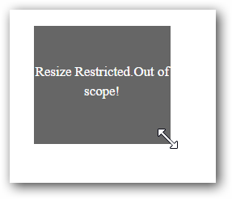

# Functionalities

## Delay Resize

We can set the required distance the mouse should travel in order to initiate resize using [distance](https://help.syncfusion.com/api/js/ejresizable#members:distance) property.



   

        <!-- Resizable element-->
        

            Resize
        

    

    

 




   jQuery(function ($) {
          $("#resizeElement").ejResizable({
              helper: function (event) {
                  return $(event.element); // Object of the Resizable element.
              },
              distance:20
          });

      });



## Cursor Distance

We can set the offset for resize helper with respect to the mouse cursor using [cursorAt](https://help.syncfusion.com/api/js/ejresizable#members:cursorat) property.



    

        <!-- Resizable element-->
        

            Resize
        

    

    





         jQuery(function ($) {
          $("#resizeElement").ejResizable({
              helper: function (event) {
                  return $(event.element); // Object of the Resizable element.
              },
             cursorAt:{ top: 3, left: -2 }
          });
      });



## Restrict Resize Height and Width:

We have some properties [minHeight](https://help.syncfusion.com/api/js/ejresizable#members:minheight), [minWidth](https://help.syncfusion.com/api/js/ejresizable#members:minwidth), [maxHeight](https://help.syncfusion.com/api/js/ejresizable#members:maxheight) and [maxWidth](https://help.syncfusion.com/api/js/ejresizable#members:maxwidth) which can be used to restrict the height and width below or above which the element cannot be resized.



     

        <!-- Resizable element-->
        

            Resize
        

    

    





           jQuery(function ($) {
          $("#resizeElement").ejResizable({
              helper: function (event) {
                  return $(event.element); // Object of the Resizable element.
              },
              minHeight: 80,
              minWidth: 90,
              maxHeight: 130,
              maxWidth: 150,
             scope:"Container",
              minHeight: 80,
              minWidth: 90,
              maxHeight: 130,
              maxWidth: 150,
              resizeStop:function(event)
              {
                  if ((event.element.height() == 130)||(event.element.width() == 150)||(event.element.height() == 80)||(event.element.width() == 90))
                      $(".ResizeText")[0].innerText = "Resize Restricted.Out of scope!";
                  
              }
          });

      });



Before Resize:

When resize done out of these limits:

