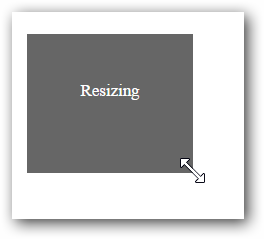

# Getting Started with JavaScript Resizable

The external script dependencies of  Resizable widget are,

* [jQuery 1.7.1](http://jquery.com/) and later versions.

And the internal script dependencies of the Resizable are:

<table>
	<tr>
		<th>File </th>
		<th>Description / Usage </th>
	</tr>
	<tr>
		<td>ej.core.min.js</td>
		<td>Must be referred always before using all the JS controls.</td>
	</tr>
	<tr>
		<td>ej.draggable.min.js</td>
		<td>Main file for Resize</td>
	</tr>
</table>

For getting started you can use the ‘ej.web.all.min.js’ file, which encapsulates all the 'ej' controls and frameworks in one single file.  

For themes, you can use the ‘ej.web.all.min.css’ CDN link from the snippet given. To add the themes in your application, please refer [this link](https://help.syncfusion.com/js/theming-in-essential-javascript-components#adding-specific-theme-to-your-application).

## Configure the sample

Create a new HTML file and add [CDN](https://help.syncfusion.com/js/cdn) links to the [JavaScript](https://help.syncfusion.com/js/dependencies) and [CSS](https://help.syncfusion.com/js/theming-in-essential-javascript-components) dependencies to your project.



    <!DOCTYPE html>

    <html>

    <head>

        <meta name="viewport" content="width=device-width, initial-scale=1.0" charset="utf-8" />

        <!-- style sheet for default theme(flat azure) -->

        <link href="http://cdn.syncfusion.com/{{ site.releaseversion }}/js/web/flat-azure/ej.web.all.min.css"
              rel="stylesheet" />

        <!--scripts-->

        

        

    </head>

    <body>

        <!--Place div element to perform Resize-->

        

    </body>

    </html>



N>  In production, we highly recommend you to use our [custom script generator](https://help.syncfusion.com/js/custom-script-generator#) to create custom script file with required controls and its dependencies only. Also to reduce the file size further please use [GZip compression](https://developers.google.com/web/fundamentals/performance/optimizing-content-efficiency/optimize-encoding-and-transfer?hl=en#text-compression-with-gzip) in your server. 

## Initialize Resize

HTML elements can be resized  by using ejResizable widget. This section explains how to perform resize.

 
	
	 

        <!-- Resizable element-->
        

            Resize
        

    

    

		

	
	
	
       jQuery(function ($) {
          $("#resizeElement").ejResizable({
              helper: function (event) {
                  return $(event.element); // Object of the Resizable element.
              },
            resize: function(event)
              {
                  $(".ResizeText")[0].innerText ="Resizing";
                   $(".Resize").css("cursor","nw-resize");
              }

          });

      });



Output of the above code will be as shown below:

Before Resize:

During Resize:

### Helper

 We can resize an element by using helper which will return the object of corresponding resizable element. . 

	

    jQuery(function ($) {
          $("#resizeElement").ejResizable({
              helper: function (event) {
                  return $(event.element); // Object of the Resizable element.
              }

          });

      });

