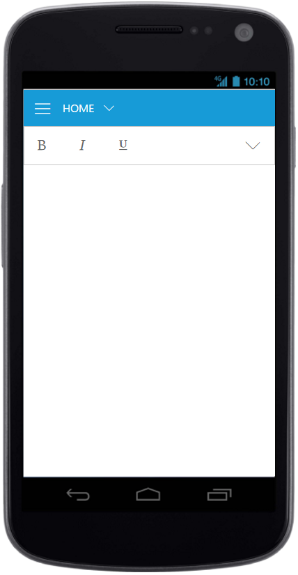
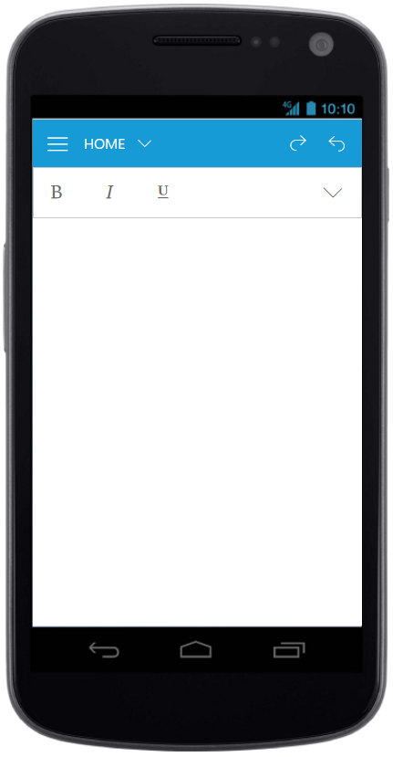
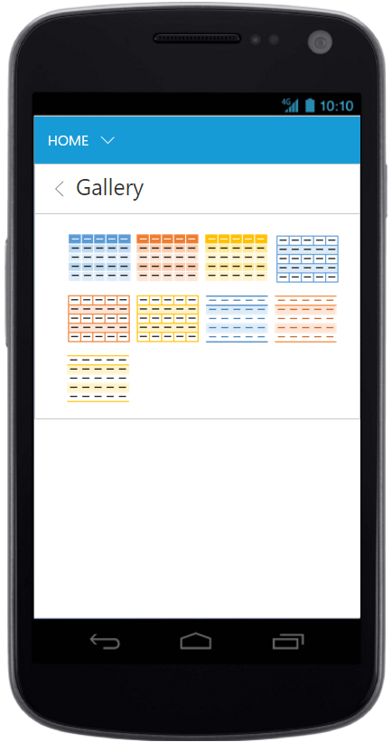

# Resize 

Ribbon control dynamically resizes to display possible number of controls in the optimal layout as the application window size changes.

As the window is narrowed, controls in the Ribbon will be combined as group button with dropdown arrow, in which controls can be expanded with dropdown arrow.

## Tablet Layout 

Set [`isResponsive`](https://help.syncfusion.com/api/js/ejribbon#members:isresponsive) as true to enable responsive layout in Ribbon.If client width is above  420px or control content exceeds the page then, the ribbon will render in Tablet mode.



    

    <ul id="ribbonMenu">
        <li><a>FILE </a>
            <ul>
                <li><a>New</a></li>
                <li><a>Open</a></li>
            </ul>
        </li>
    </ul>
    



## Mobile Layout

If client width is less than 420px, the ribbon will render in mobile mode. In which, you can see that ribbon user interface is customized and redesigned for best view in small screens.
The customized features includes responsive tab & group rendering, backstage, gallery and button controls.

### Responsive Tab and group

Set [`isResponsive`](https://help.syncfusion.com/api/js/ejribbon#members:isresponsive) as true to enable responsive mode in Ribbon.
   



    

    



{:caption}
Ribbon Responsive with tab content 

N> To make the Ribbon control to react as responsive in mobile devices, it is necessary to refer the additional `ej.responsive.css` file in the application.

## Mobile Toolbar Customization

 Set [`isMobileOnly`](https://help.syncfusion.com/api/js/ejribbon#members:ismobileonly) as true to group control to show the controls 
 in the Mobile Toolbar of the ribbon. For each tab , first row of mobile ribbon will pick and display the controls which is set as `isMobileOnly` with look adapt to mobile mode.If `isMobileOnly` property is not defined to any of the control within tab, then by default first group content will be displayed in first row toolbar.

 To adapt to proper display of controls , following layout will be customized with constants display.

  * First ribbon toolbar and Button controls with min-height. 
  * Drop down control will adapt to full screen width.
  * All button controls icon will be displayed commonly as Top position.
  
  

    

    



{:caption}
Ribbon Responsive with MobileToolbar 

### Customized Features

The customized layout for  Quick Access Toolbar, backstage, gallery can be seen following screen shots.
 
 
 {:caption}
Ribbon Responsive with Quick Access Toolbar 
 
 
 
 {:caption}
Ribbon Responsive with backstage
 
 
 {:caption}
Ribbon Responsive with gallery

## Group Button Customization

Based on window size, detailed group is shrined into single button and you can expand group items with group button click.

For each group shirked for resizing, Custom Class will be added based on group text.For example, `e-action` whereas `action` is group text. Using this custom class, group button can be customized such as to set icons etc.



    

    
    <ul id="ribbonMenu">
        <li>
            <a>FILE</a>
            <ul>
                <li><a>New</a></li>
                <li><a>Open</a></li>
            </ul>
        </li>
    </ul>
    
    



