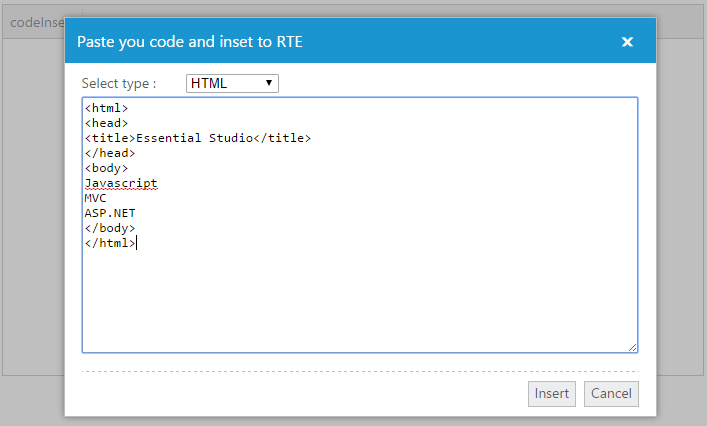
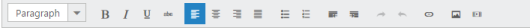

# Customized tools option

In RichTextEditor, toolbars are customizable. To include a new tool item with new functionality that is not available in the existing **RTE** toolbar items, you can create a new tool item by using the custom tool option. The following example illustrates how to insert an **HTML**, **JavaScript**, or **CSS** code in the editing area as a code block. 

Add the following code example in your **HTML** page to render **RTE** with new tool item.



   <textarea id="rteSample" rows="10" cols="30" style="width: 740px; height: 440px"></textarea>
   

      <table>
         <tr>
            <td style="width: 100px">
               Select type :
            </td>
            <td>
               

                  <select id="languageList">
                     <option value="javascript">Java Script</option>
                     <option value="text/html">HTML</option>
                     <option value="css">CSS</option>
                  </select>
               

            </td>
         </tr>
         <tr>
            <td colspan="2">
               <textarea id="srcCode" style="width: 550px; height: 250px">
                        

                    </textarea>
            </td>
         </tr>
         <tr>
            <td colspan="2">
               

                  <button id="src_insert" class="e-rte-btn" tabindex="">Insert</button>
                  <button id="src_cancel" class="e-rte-btn" tabindex="">Cancel</button>
               

            </td>
         </tr>
      </table>
   





    //Add the following code in your script section to render RTE and set the action of the new tool item.
    $(function() {
       $("#rteSample").ejRTE({
          toolsList: ["customTools"],
          tools: {
             customTools: [{
                name: "codeInsert",
                text: "codeInsert",
                tooltip: "Insert code snippets ",
                css: "codeInsert",
                action: function() {
                   $("#srcCode").val("").show();
                   $("#cutomSourceCode").ejDialog("open");
                }
             }]
          }
       });
       var rteObj;

       $("#cutomSourceCode").ejDialog({
          enableResize: false,
          enableModal: true,
          showOnInit: false,
          width: "auto"
       }); //dialog initialization
       $("#cutomSourceCode").find(".e-rte-btn").ejButton({
          click: "allowText"
       });

    });

    function click() {
       $("#srcCode").val("").show();
       $("#cutomSourceCode").ejDialog("open");
    }

    function allowText() {
       rteObj = $("#rteSample").data("ejRTE");
       if (this._id == "src_insert") {
          rteObj.executeCommand("inserthtml", $("#srcCode")[0].value);
       }
       $("#cutomSourceCode").ejDialog("close");
    }



The following screenshot demonstrates the functionality of new tool item.

## Remove the tool item

In certain cases, to remove a particular item from the existing toolbar item of RTE, use the **removeToolBarItem** property in **RTE**. Consider a content blog that does not require "insert table" option. In that case, you can remove the “**createTable**” tool item from the toolbar. The following code example illustrates how to remove the “**createTable**” tool item from list of toolbars.

Add the following code in your **HTML** page.



    <textarea id="rteSample" rows="10" cols="30" style="width: 740px; height: 440px"></textarea>





    //Add the following code in your script section to render the RTE and remove the “createTable” tool from the toolbar.
    $(function() {
       $("#rteSample").ejRTE();
       var rteeObj = $("#rteSample").data("ejRTE");
       rteeObj.removeToolbarItem("createTable"); // remove toolbar item
    });


