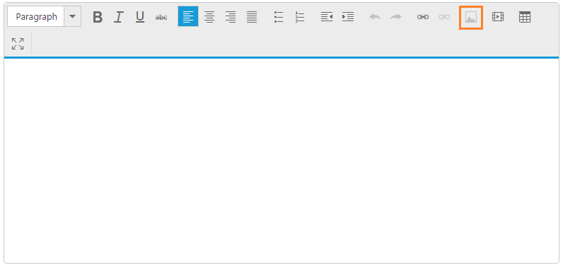

# Enable or disable

You can enable or disable the tool items that are available in the **RTE** toolbar. Intermittently, it is not possible to allow some tool item actions in the editing area. To avoid mistakes in such a situation, you can disable the unnecessary tool items. Later, you can enable the disabled tool items, and when you are not going to use images in your blog you can disable the image tool item by using the “**disableToolbarItem**” method. The following example illustrates how to disable the “**image**” tool.

Add the following code in your **HTML** page.



    <textarea id="disable_tool"></textarea>





    //Add the following code in your script section to render RTE
    var rteobj;
    $(function () {
        $("#disable_tool").ejRTE();
        rteobj = $("#disable_tool").data("ejRTE");
        rteobj.disableToolbarItem("image");
    });



