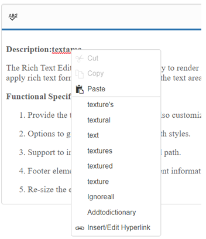
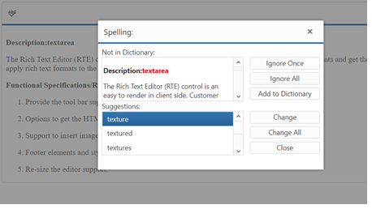

# How To

## Add Google web fonts to editor 

To use web fonts in EJ RTE, it is not needed for the web fonts to be present in local machine. To add the web fonts to EJ RTE, we need to append the web font link to the RTE Iframe <head> tag. We can achieve this in the “create” event of the RTE as shown below. 



    <textarea id="rteSample" rows="10" cols="30" style="width: 740px; height: 440px">
        Description:
        The Rich Text Editor (RTE) control is an easy to render in
        client side.Customer easy to edit the contents and get the HTML content for
        the displayed content.A rich text editor control provides users with a toolbar
        that helps them to apply rich text formats to the text entered in the text
        area.
    </textarea>

    
     


In the above sample, you can see that we have added two Google web fonts (“Roboto” and “Great vibes”) to ejRTE. [Demo Link](http://jsplayground.syncfusion.com/Sync_ce43lcpy)

## Increase RTE max word count 

To increase the RTE content maximum word count, we suggest you to set the [maxLength](https://help.syncfusion.com/api/js/ejrte#members:maxlength) property for it. By default, maxLength value is 7000, assign it with a value based on your requirement. 

Refer the following API reference link: [Link](https://help.syncfusion.com/api/js/ejrte#members:maxlength) 

## Add multiple editor instances to a single page 

This is in fact a common use case, especially when you may wish to break your content into sections (e.g. titles, paragraphs) that the user can edit individually. 

### Multiple editor instances sharing same RTE properties 

In the following example, the page is broken into two separate editable areas, each sharing the same RTE configuration. Each individual `textarea` is provided the same class of 'myEdit'. 



        <textarea class="myEdit" rows="10" cols="30" style="width: 740px; height: 440px">
            Title
        </textarea>
         
        <textarea class="myEdit" rows="10" cols="30" style="width: 740px; height: 440px">
            Description
        </textarea>
    
    


### Multiple editor instances sharing a unique RTE properties

In this next example each editable area will be loaded with an instance of RTE with a unique configuration. This is especially helpful when different content areas have different needs. For example, you may want to provide a very simple configuration for editing titles and a more complete configuration for editing body content. This is accomplished by defining a RTE property for each desired configuration.



        <textarea class="myEdit1" rows="10" cols="30" style="width: 740px; height: 440px">
            Title
        </textarea>
         
        <textarea class="myEdit2" rows="10" cols="30" style="width: 740px; height: 440px">
            Description
        </textarea>
    
    


## Prevent the cut or copy of content in RTE

Bind the “keydown” event to the RTE’s Iframe, from which we can prevent the copy or cut action inside the RTE. Please refer the below code snippet.

[Demo Link](http://jsplayground.syncfusion.com/Sync_1qyhztoy)



    <textarea id="rteSample" rows="10" cols="30" style="width: 740px; height: 440px">
        The RichTextEditor (RTE) control enables you to edit the contents with insert table and images
        It also provides a toolbar that helps to apply rich text formats to the content entered in the TextArea.
    </textarea>
    
    


## Capture ctrl+s keypress event inside the RichTextEditor 

Yes, we can capture the ctrl + s keypress inside Rich Text Editor. To achieve this, we need to bind the “keydown” event to the RTE content (which is an iframe) and capture the ctrl + s keypress using its keyCode. 

1.	Render the RTE control 



    <textarea id="rteSample" rows="10" cols="30" style="width: 740px; height: 440px">
        Description:
        The Rich Text Editor (RTE) control is an easy to render in
        client side.Customer easy to edit the contents and get the HTML content for
        the displayed content.A rich text editor control provides users with a toolbar
        that helps them to apply rich text formats to the text entered in the text
        area.
    </textarea>
    


2.	Bind the “keydown” event to the RTE and capture the “ctrl” + “s” keypress , if those keys has pressed, get the content of RTE.



    var rteObj;
    $(function () {
    //RTE control creation
    $("#rteSample").ejRTE({width:"100%", minWidth:"100px",isResponsive:true});
    //Object for RTE is created
    rteObj = $("#rteSample").data("ejRTE");
    $("#" + rteObj.element[0].id + "_Iframe").contents().on("keydown", function (e){

        //Capture the "ctrl + s" inside RTE
        if (e.ctrlKey && e.keyCode === 83) { 
            //Prevent the default browser action
            e.preventDefault();
            //Get the contents of RTE using getText method
            var content = rteObj.getText();
            //You can now save the content as per your requirement.
            setTimeout(function () {
                alert(content);
            }, 0);
        }

    });

    


[Demo Link](http://jsplayground.syncfusion.com/Sync_5d51o0xw)

## Save the content of RichTextEditor control automatically when the control loses its focus 

This can be achieved by binding the click event to the iframe element. Also we need to bind document click event for capture the iframe focus out. Since `focusout` and blur events cannot be cached within the iframe, when we click the document we can get the HTML string from the RTE instance to save it. Please refer the below code.

1.	Render the RTE control



    <textarea id="rteSample" rows="10" cols="30" style="width: 740px; height: 440px">
        Description:
        The Rich Text Editor (RTE) control is an easy to render in
        client side.Customer easy to edit the contents and get the HTML content for
        the displayed content.A rich text editor control provides users with a toolbar
        that helps them to apply rich text formats to the text entered in the text
        area.
    </textarea>
    


2.	When the content of the RTE is modified and control lose its focus, then the content will be saved. 



    var rteObj, isFocus, data;
    $(function () {
        $("#rteSample").ejRTE({
            width: "100%",
            showFooter: true,
        });
        rteObj = $("#rteSample").data("ejRTE");
        $("#" + rteObj.element[0].id + "_Iframe").contents().on("click", function () {
            //html string in iframe textarea
            if (!isFocus) data = rteObj.getHtml();
            //maintain flag variable for element focused or not.
            isFocus = true;
        });
        //when click the document or any other popup element append in body the document click will triggered
        $(document).click(function (e) {
            //validate the iframe is focused in previously or not, then made any changes in html string
            if (isFocus && rteObj.getHtml() !== data) {
                // You can now save the content as per your requirement.
                alert("content saved");
                isFocus = false;
            }
        });
    });



[Demo Link](http://jsplayground.syncfusion.com/Sync_y53vvpkl)

## Find the current cursor location in RTE?

You can find the cursor location by getting the offset value of desired text using the getRange method as shown below: 



    



This “getRange” method will return the startContainer, endContainer, startOffset, endOffset parameters of the selected text or cursor location. By using this method, you can get the current cursor location.   

## Set the horizontal scroller rather than text wrapping in the RTE? 

This can be achieved by setting the CSS “whitespace” as nowrap in RTE body element in the create event of RTE as shown below code: 



    <textarea id="rteSample" rows="10" cols="30" style="width: 740px; height: 440px">
        The RichTextEditor (RTE) control enables you to edit the contents with insert table and images
        It also provides a toolbar that helps to apply rich text formats to the content entered in the TextArea.
    </textarea>
    
    


## Set the cursor at the Specific Location? 

This can be achieved by using “selectRange” method in the RTE. In this below sample, we have passed the text node (specific location in RTE content) in setStart and setEnd method and passed the whole range in “selectRange” method of RTE.



    <textarea id="rteSample" rows="10" cols="30" style="width: 740px; height: 440px">
        The RichTextEditor (RTE) control enables you to edit the contents with insert table and images
        It also provides a toolbar that helps to apply rich text formats to the content entered in the TextArea.
    </textarea>

    

        <button class="e-btn inputbtn" value="SpecificText" onclick="SpecificText()">EndOf SpecificText</button>
    

    



## Set the cursor at the end of inserted text 

First insert the text to the RTE using “executeCommand” in the RTE. 



    editor = $("#rteSample").ejRTE("instance");
    editor.executeCommand("inserthtml", text);



Second manually set the cursor location using “_getRange” method. Please refer the following sample



    <textarea id="rteSample" rows="10" cols="30" style="width: 740px; height: 440px">
        The RichTextEditor (RTE) control enables you to edit the contents with insert table and images
        It also provides a toolbar that helps to apply rich text formats to the content entered in the TextArea.
    </textarea>
    

        <button class="e-btn inputbtn" value="SpecificText" onclick="SpecificText()">EndOf SpecificText</button>
    
 
    
    


## Set Toolbar Height

We do not have any property for adjusting the height of the RTE Toolbar. But it is possible to adjust the height by overriding the class of the RTE toolbar. Override the class as below,



    
    


## Add Separator in the Toolbar

we can add separator in the RTE toolbar list. We have a property [“enableSeparator”](https://help.syncfusion.com/api/js/ejtoolbar#members:enableseparator) in the toolbar control. So we need to set this property as true by creating the object of toolbar in the “preRender” event of RTE as shown below code:



    



## Custom image for the Tools

This requirement can have achieved by using [“cssClass”](https://help.syncfusion.com/api/js/ejrte#members:cssclass) API of RichTextEditor component. It is used to customize the default “CSS” styles of the control. Using this API to define our own custom “CSS” and images to overwrite the default “CSS” styles of the control. 



    <textarea id="rteSample" rows="10" cols="30" style="width: 740px; height: 440px">
        The RichTextEditor (RTE) control enables you to edit the contents with insert table and images
        It also provides a toolbar that helps to apply rich text formats to the content entered in the TextArea.
    </textarea>

    



Apply the following style and In the below sample, the sprite image has been used for the icons



    
    


## RTE - Spellcheck Integration

We have integrated Spellcheck with RTE component. This spellchecker will validate the text present in RTE and provide suggestion in both context menu and dialog mode.

Spellcheck can be integrated with RTE in application side using RTE custom tools. Render RTE iframe element as Spellcheck control and set required SpellCheck properties for context menu and dialog mode. 

Refer [here](https://js.syncfusion.com/demos/web/#!/bootstrap/rte/spellcheck) for live demo of SpellCheck integration. 

## RTE - Spellcheck Integration ContextMenu Mode

By default , RTE has a context menu with few options which will be displayed during right click inside RTE editor area. After integrating spellcheck, suggestion list for error words will be shown along with the existing RTE context menu. 

N> We have prevented the default Spellcheck context menu using "contextBeforeOpen" event and merged the Spellcheck suggestion list to RTE context menu. 

## RTE - Spellcheck Integration Dialog Mode

A custom tool can be included in toolbar of RTE for validating the text inside RTE. SpellCheck dialog will be opened on clicking this custom tool.Invoke showInDialog() method of SpellCheck in the custom tool action. Refer to the following code.



    <textarea id="rteSample" rows="10" cols="30" style="width: 740px; height: 440px">
        The RichTextEditor (RTE) control enables you to edit the contents with insert table and images
        It also provides a toolbar that helps to apply rich text formats to the content entered in the TextArea.
    </textarea>

    



SpellCheck icon can be included by setting the required image as background through class name in default.CSS file. Refer to the following code



         



## Resolve content overflow issue with RichTextEditor in IE, Edge, and FireFox browsers

While rendering RichTextEditor inside the bootstrap tab, the content of RichTextEditor may overflow outside iframe editor area in some browsers. To resolve this issue, invoke the refresh method of RichTextEditor using its instance inside the show method of the bootstrap tab.

Refer to the following code.



    <ul class="nav nav-tabs">
     <li class="active"><a data-toggle="tab" href="#home">Home</a></li>
     <li><a data-toggle="tab" href="#menu3">Rich Text Editor</a></li>
    </ul>
    

        

        <h3>HOME</h3>
    

    

        <h3>Rich Text Editor</h3>
        

            <textarea id="editor"></textarea>
        

      

     

    


Refer to the sample [link](http://jsplayground.syncfusion.com/jkycg2xq)

## Remove the url validation when insert hyperlink in RichTextEditor

By default, the url entered in textbox for inserting hyperlink will be validated in source to check whether it is valid. If you need to skip this validation and allow users to insert any type of url, override the `_isUrl` method of RichTextEditor. Refer to the following code. 



    <textarea id="rteSample" rows="10" cols="30" style="width: 740px; height: 440px">
                  &lt;p&gt;&lt;b&gt;Description:&lt;/b&gt;&lt;/p&gt;
         &lt;p&gt;The Rich Text Editor (RTE) control is an easy to render in
         client side. Customer easy to edit the contents and get the HTML content for
         the displayed content. A rich text editor control provides users with a toolbar
         that helps them to apply rich text formats to the text entered in the text
          area. &lt;/p&gt;
         &lt;p&gt;&lt;b&gt;
     </textarea>

    



Refer to the sample [link](https://jsplayground.syncfusion.com/o0phxjc2)

## Paste large content into RTE

By default , the maximum content length for RTE is 7000 characters. If the pasted content exceeds this limit, then the paste operation will be prevented.To paste large content inside RTE, specify the content length using  `maxLength` property of RTE. Refer to the following code.

 

    <textarea id="rteSample">
                  &lt;p&gt;&lt;b&gt;Description:&lt;/b&gt;&lt;/p&gt;
         &lt;p&gt;The Rich Text Editor (RTE) control is an easy to render in
         client side. Customer easy to edit the contents and get the HTML content for
         the displayed content. A rich text editor control provides users with a toolbar
         that helps them to apply rich text formats to the text entered in the text
          area. &lt;/p&gt;
         &lt;p&gt;&lt;b&gt;
     </textarea>

    



Refer to the sample [link](https://jsplayground.syncfusion.com/g5acwr3h)

## Modify the default font in RTE

By default, the RTE content will be rendered inside iframe, and styles defined in sample will not be loaded inside iframe. However, the required styles can be defined in external stylesheet, and this can be loaded into iframe using the `externalCSS` property. 

In the following code, the `font-family` style is defined for body in external stylesheet and referred using the `externalCSS` property. 

 

     <textarea id="rteSample">
                  &lt;p&gt;&lt;b&gt;Description:&lt;/b&gt;&lt;/p&gt;
         &lt;p&gt;The Rich Text Editor (RTE) control is an easy to render in
         client side. Customer easy to edit the contents and get the HTML content for
         the displayed content. A rich text editor control provides users with a toolbar
         that helps them to apply rich text formats to the text entered in the text
          area. &lt;/p&gt;
         &lt;p&gt;&lt;b&gt;
    </textarea>

    



Styles defined in external style sheet as shown below

 
   
   body { 
       font-family:Arial; 
     } 

 