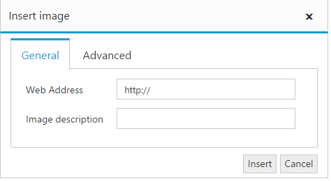
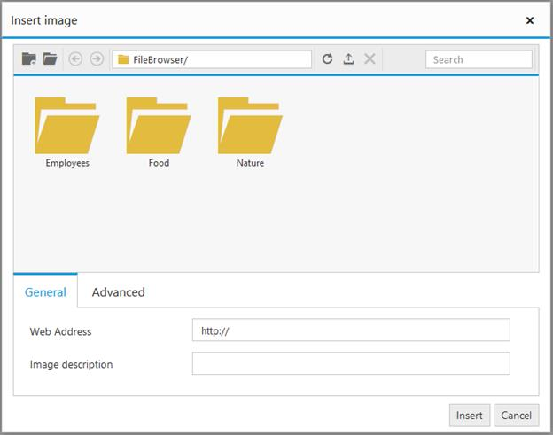
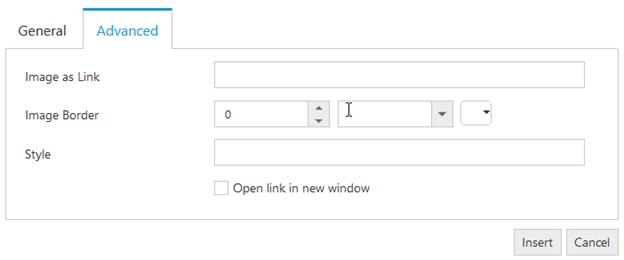
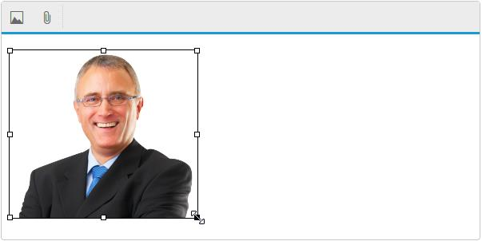
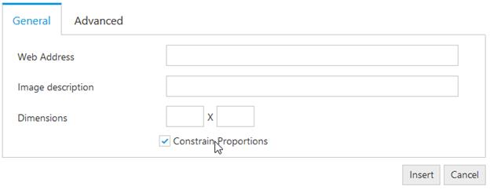

# Image and File browser

The editor allows you to manage the images and files using **FileExplorer**. The FileExplorer enables you to insert images from online source as well as local computer where you want to insert the image in your content. The Image and file browser is the ability to upload pictures and link file to the editor. 

## Insert a Image from Online Source

If you want to insert an image from online source like google, ping, etc., you need to enable images tool on the editor’s toolbar. By default, the images tool is open a simple dialog which allows you to inserting an image from online source.



<textarea id="texteditor"></textarea>



## Insert a Image from Your Computer

Configure the imageBrowser and fileBrowser property to insert an image from your computer. You can specify the settings required by the FileExplorer for create, read, upload, and destroy the files and images from the explorer. 



<textarea id="texteditor"></textarea>



N> FileExplorer component has been implemented and integrated with the editor in Volume 1, 2015 release. For more information about FileExplorer component, see [here](http://helpjs.syncfusion.com/js/fileexplorer/overview#).

## Image Properties

You can set or modify properties of an image using the image dialog. It allows you to add links to images, apply border and additional styles. The editor provides option to specify the alternate text for an image, if the image cannot be displayed.

## Resize an Image

You can able to resize an image either manually or set the width and height in the image dialog. 

### Resize Manually

You can resize an image by manually select an image, and drag a handle until the image is the desired size. 

### Set Width and Height

The editor provides you to set the width and height properties to change the size of an image (rather than forcing you to set in style attributes) using [showDimensions](http://help.syncfusion.com/js/api/ejrte#members:showdimensions) property. By default, the Constrain Proportion checkbox is selected to resize an image to an exact proportion. To apply the exact width and height that you specify into the Height and Width textboxes, uncheck the Constrain Proportions checkbox.



<textarea id="texteditor"></textarea>



