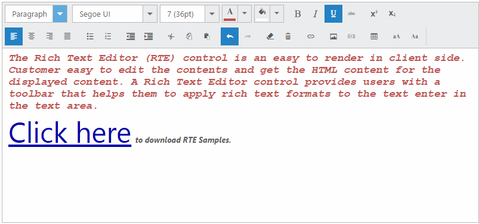

# Insert Hyperlink

**RTE** control provides an option to insert hyperlink in the editing area. Consider your blog has to give a product’s download link, then you can include the download link by using “**insert or edit hyperlink**” tool item. 

By clicking this tool item, you can add **Text**, with hyperlink, and **Tooltip**, where a message appears when a cursor is positioned over a hyperlink. 

Also, this tool item enables you to add or edit the hyperlink, text, tooltip for selected text in the editing area. The following screenshot illustrates the hyperlink of the “**Click here**” text.

Add the following code example in your **HTML** page to initialize the **RTE**.



    <textarea id="rteSample"></textarea>





    // Add the following code in your script section to render RTE with default set of tools.
    $(function() {
       $("#rteSample").ejRTE();
    });



