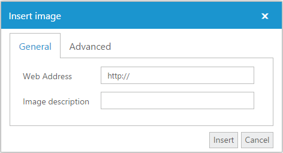
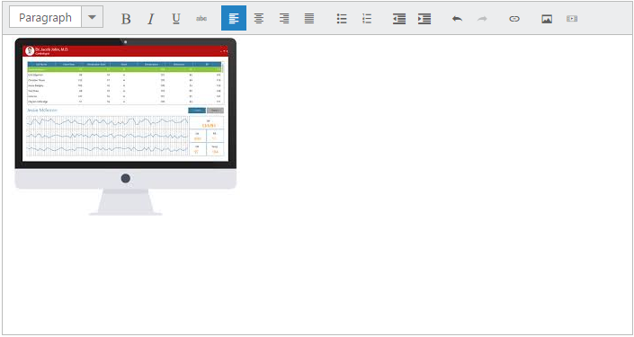

# Insert Image

You can insert all types of images from a defined path in **RichTextEditor** control. You can even insert your company’s logo in the page. And it also provides some additional features such as border support, navigation link support and custom styles for images.

## Steps to Insert the Image

* Specify the **URL** of the image.
* Description of the images is mandatory.

