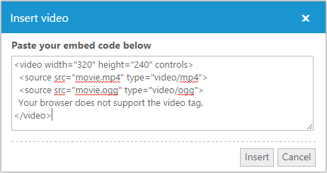

# Insert Video 

Videos can be included in **RTE** by rendering the embedded code of a video. In some cases, you have to add the video in your blog to provide more information about your product. Consider to provide product installation steps in a video format. You can use the “**insert Video**” tool item to insert the video in a blog.

N> Insert video option is enabled only in HTML5 supported browsers.

