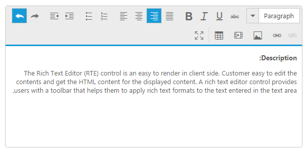

---
layout: post
title: RTL
description: rtl
platform: js
control: RichTextEditor
documentation: ug
---

# RTL

**RTL** control supports right-to-left functionality and features for languages that work in a right-to-left way for entering, editing, and displaying text. You can change your display to read right-to-left. Arabic and Hebrew are written from right to left. The customers with writing style from right-to left can use this feature in **RTE**. You can achieve this in the editing area by using the **enableRTL** property. Setting this property to “**true**” allows you to write in the right-to-left format. Position of the toolbars also changes from right to left.

Add the following code example to the script section in your **HTML** page to initialize the **RTE.**



    <textarea id="RTL"></textarea>





    // Add the following code in your script section to render RTE with right-to-left format.
    $(function () {
        $("#RTL").ejRTE({
            width: "850px",
            enableRTL: true,
            tools: {
					formatStyle: ["format"],
                    font: ["fontName", "fontSize", "fontColor", "backgroundColor"],
                    style: ["bold", "italic", "underline", "strikethrough"],
                    alignment: ["justifyLeft", "justifyCenter", "justifyRight", "justifyFull"],
                    lists: ["unorderedList", "orderedList"],
                    clipboard: ["cut", "copy", "paste"],
                    doAction: ["undo", "redo"],
					indenting: ["outdent", "indent"],
                    clear: ["clearFormat", "clearAll"],
                    links: ["createLink","removeLink"],
                    images: ["image"],
					media:["video"],
                    tables: ["createTable", "addRowAbove", "addRowBelow", "addColumnLeft", "addColumnRight", "deleteRow", "deleteColumn", "deleteTable"],
                    effects: ["superscript", "subscript"],
                    casing: ["upperCase", "lowerCase"],
					view:["fullScreen"]
                }
        });
    });



