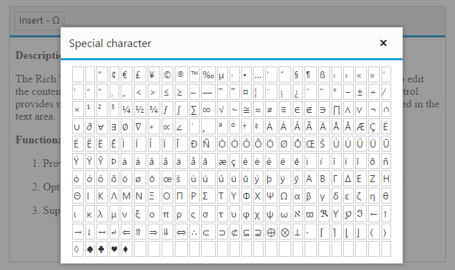

# Toolbar Configuration

The editor’s toolbar contains a collection of tools such as bold, italic and text alignment buttons that are used to format the content.
However, in most integrations, it's desirable to change the toolbar configuration to suit needs. Fortunately, that's quite easy to do too.

<table>
<tr>
    <th> Property   </th>
    <th> Description   </th>
</tr>
<tr>
    <td> {{'[toolsList](https://help.syncfusion.com/api/js/ejrte#members:toolslist)'| markdownify }}   </td>
    <td>  The toolsList option allows you to choose which tools appear on the toolbar, as well as the order and grouping of those items   </td>
</tr>
<tr>
    <td> {{'[tools](https://help.syncfusion.com/api/js/ejrte#members:tools)'| markdownify }}   </td>
    <td> The toolsList property is used to get the root group order and tools property is used to get the inner order of the corresponding groups displayed.  </td>
</tr>
</table>

N> By default, when you tab from the textbox to the RTE, the first tools in the Toolbar of RTE will get focus not in the text area.  
But we can able to focus the RTE text area by setting the tab index attribute as -1 to avoid the focus on RTE toolbar when we tab from textbox to RTE - {{'[Demo](http://jsplayground.syncfusion.com/Sync_1rlmhqbz)'| markdownify }}

## Toolbar Items

The following table lists the available buttons and dropdowns on the toolbar:

<table>
<tr>
<th>
Name  </th><th>
Summary  </th><th>
Initialization  </th><th>
IsDefault?  </th></tr>
<tr>
<td>
Font  </td><td>
Applies font type, size, and color to the content.  </td><td>
tools: {  font: ["fontName", "fontSize", "fontColor", "backgroundColor"] }  </td><td>
No  </td></tr>
<tr>
<td>
Font style  </td><td>
Applies bold, italic, underline, and strikethrough formatting to the content.  </td><td>
tools: { style: ["bold", "italic", "underline", "strikethrough"] }  </td><td>
Yes  </td></tr>
<tr>
<td>
Alignment  </td><td>
Align the content with left, center, and right margin.   </td><td>
tools: { alignment: ["justifyLeft", "justifyCenter", "justifyRight", "justifyFull"] }  </td><td>
Yes  </td></tr>
<tr>
<td>
List  </td><td>
Create a new list item (bulleted/numbered).  </td><td>
tools: { lists: ["unorderedList", "orderedList"] }  </td><td>
Yes  </td></tr>
<tr>
<td>
Indents  </td><td>
Allows to increase/decrease the indent level of the content.   </td><td>
tools: { indenting: ["outdent", "indent"] }  </td><td>
Yes  </td></tr>
<tr>
<td>
Undo/Redo Action  </td><td>
Allows to undo/redo the actions  </td><td>
tools: { doAction: ["undo", "redo"] }  </td><td>
Yes  </td></tr>
<tr>
<td>
Hyperlink  </td><td>
Creates a hyperlink to a text or image to a specific location in the content.  </td><td>
tools: { links: ["createLink","removeLink"] }  </td><td>
Yes  </td></tr>
<tr>
<td>
Images  </td><td>
Inserts an image from an online source or local computer.  </td><td>
tools: { images: ["image"] }  </td><td>
Yes  </td></tr>
<tr>
<td>
Media  </td><td>
Allows to embed a video into the document.  </td><td>
tools: { media: ["video"] }  </td><td>
Yes  </td></tr>
<tr>
<td>
Table  </td><td>
Allows to add or modify Tables.  </td><td>
tools: { tables: ["createTable", "addRowAbove", "addRowBelow", "addColumnLeft", "addColumnRight", "deleteRow", "deleteColumn", "deleteTable"] }  </td><td>
Yes  </td></tr>
<tr>
<td>
Casing  </td><td>
Change the case of selected text in the content  </td><td>
tools: { casing: ["upperCase", "lowerCase"] }  </td><td>
No  </td></tr>
<tr>
<td>
Scripts  </td><td>
Makes the selected text as superscript (higher) or subscript (lower).  </td><td>
tools: { effects: ["superscript", "subscript"] }  </td><td>
No  </td></tr>
<tr>
<td>
Format  </td><td>
Clears the formatting options like bold, italic, underline and more.  </td><td>
tools: { formatStyle: ["format"] }  </td><td>
Yes  </td></tr>
<tr>
<td>
Clipboard Actions  </td><td>
Controls the clipboard actions by applying specific action on the selected content.  </td><td>
tools: { clipboard: ["cut", "copy", "paste"] }  </td><td>
No  </td></tr>
<tr>
<td>
Edit  </td><td>
Allows to make find and replace functionalities with the content.  </td><td>
tools: { edit: ["findAndReplace"]  }  </td><td>
No  </td></tr>
<tr>
<td>
view   </td><td>
Allows to change the editor view mode.  </td><td>
tools: {  view: ["fullScreen","zoomIn","zoomOut"] }  </td><td>
No  </td></tr>
<tr>
<td>
print   </td><td>
Allows to print the editor content.  </td><td>
tools: {  print: ["print"] }  </td><td>
No  </td></tr>
</table>

## Rearrange Group

The toolbar contains groups, which are similar or related functionalities of toolbar items for efficient access. By default, the groups are arranged using the following order


toolsList:["formatStyle","font","style","effects","alignment","lists","indenting","clipboard","doAction", 
"clear","links","images","media","tables","casing","customTools","view"]


The group can be rearranged on customization using the **[toolsList](https://help.syncfusion.com/api/js/ejrte#members:toolslist)** property.



<textarea id="editor"></textarea>



N> If you are not specify any group in **toolsList** property, the editor will create the toolbar with default group.

## Undo and Redo 

Undo and Redo buttons allow you to editing the text by disregard/cancel the recently made changes and restore it to previous state. It is a useful tool to restore the performed action which got changed by mistake. Up to 50 actions can be undo/redo in the editor by default. 

To undo and redo operations, do one of the following:

* Press the undo/redo button on the toolbar
* Press the **Ctrl** **+** **Z**/**Ctrl** **+** **Y** combination on the keyboard



<textarea id ="editor"></textarea>



## Clipboard Operations

The editor provides support for the clipboard operations (cut, copy, and paste) in all text and images using the toolbar buttons and the keyboard shortcuts. Toolbar includes buttons through which the clipboard operations, such as Cut, Copy, and Paste can be accessed.

You can use the keyboard shortcuts to perform the clipboard operations.

* Cut - CTRL+X
* Copy - CTRL+C
* Paste - CTRL+V

N> Some browsers block the clipboard access from JavaScript. If you want to use the Cut, Copy, and Paste buttons on the toolbar, you need to allow JavaScript to use the clipboard. If you don’t want to do this configuration, use CTRL+C, CTRL+X, and CTRL+V keyboard commands.



<textarea id="editor"></textarea>



## Specify Custom Tools

Beside the available built-in tools, the RichTextEditor’s toolbar functionality can be extended through custom tools, defined in the tools through the customTools options, which renders the custom toolbar items along with the built-in toolbar items.

The example below demonstrates how to add a custom tool button



<textarea id="editor"></textarea>

  


Upon clicking the "Insert" button, the special character will be added to the RTE's content.



    function customTdClick(args) {
        rteObj.executeCommand("inserthtml", args.currentTarget.innerText);
        $("#specialCharacter").ejDialog("close");
    }  
    


Define the CSS that will be applied to the custom tool.



.e-special-table tr td
{
    border:1px solid #c8c8c8;
}
.special-table:hover
{
    background-color:#86bcea;
    cursor:pointer;
}
      


N> The CSS class that defined for custom tool is directly applies to the newly added toolbar item - {{'[Demo](http://jsplayground.syncfusion.com/Sync_o1rxw2yj)'| markdownify }}

I> The custom buttons get a `insert-special-character` CSS class to allow styling, where name is the name specified in the custom tool configuration.

## Types of responsive toolbar

Two types of toolbar modes are available for RTE in responsive mode which is enabled by [isResponsive](https://help.syncfusion.com/api/js/ejrte#members:isresponsive) property. This includes "inline" and "popup". Toolbar Type can be set through API [toolbarOverflowMode](https://help.syncfusion.com/api/js/ejrte#members:toolbarOverflowMode)  whose default value is "popup".



     <textarea id="editor"></textarea>

     



N> If you are not specifying toolbarOverflowMode, responsive RTE will be rendered with default popup toolbar.