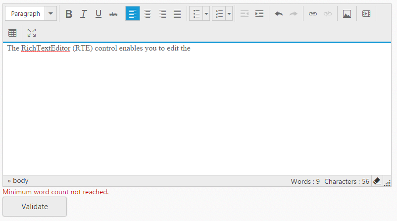

# Validation 

You can validate the RichTextEditor’s value on form submission by applying [validationRules](https://help.syncfusion.com/api/js/ejrte#members:validationrules) and [validationMessage](https://help.syncfusion.com/api/js/ejrte#members:validationmessage) to the RichTextEditor.

N> [jquery.validate.min](http://cdn.syncfusion.com/js/assets/external/jquery.validate.min.js) script file should be referred for validation, for more details, refer [here](http://jqueryvalidation.org/documentation).Please refer [here](https://help.syncfusion.com/js/validation) to know more details on the steps for validation. 

## jQuery Validation Methods

The following are jQuery validation methods.

_List of jQuery validation methods_

<table>
<tr>
<th>
Rules</th><th>
Description</th></tr>
<tr>
<td>
required</td><td>
 Requires value for the RichTextEditor control.</td></tr>
<tr>
<td>
minWordCount</td><td>
 Requires the value to be of given minimum words count.</td></tr>
<tr>
<td>
minlength</td><td>
 Requires the value to be of given minimum characters count.</td></tr>
<tr>
<td>
maxlength</td><td>
 Requires the value to be of given maximum characters count.</td></tr>
</table>

## Validation Rules

The validation rules help you to verify the content by adding validation attributes to the text area. This can be set by using [validationRules](https://help.syncfusion.com/api/js/ejrte#members:validationrules) property.

## Validation Messages 

You can set your own custom error message by using [validationMessage](https://help.syncfusion.com/api/js/ejrte#members:validationmessage) property. To display the error message, specify the corresponding annotation attribute followed by the message to display.

N> jQuery predefined error messages to that annotation attribute will be shown when this property is not defined. The below given example explain this behavior of ‘maxLength’ attribute,

When you initialize the RichTextEditor widget, it creates a text area hidden element which is used to store the value. Hence, the validation is performed based on the value stored in this hidden element.

Required field, `minlength`, maxlength, minWordCount and maxWordCount values validation is demonstrated in the below given example.



    <form id="form1">
                    
        <textarea id ="editor"></textarea>
         
        <button id="save">Validate</button>
            
    </form>





    
  


