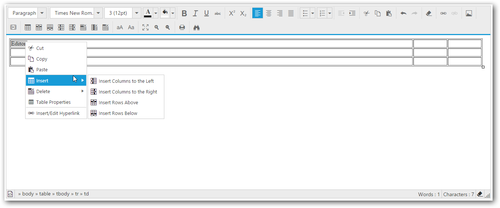

# Context Menu 

Editor provides custom context menu support, which enables more interaction on the content modification and also it can be enabled dynamically. The [showContextMenu](https://help.syncfusion.com/api/js/ejrte#members:showcontextmenu) property helps to enable custom context menu within editor area.
Based on the target content type context menu provides different actions. Refer the details with below table.


<textarea id="editor">     

<b>Description:</b>

        
The Rich Text Editor (RTE) control is easy to render in the
        client side. Customers can easily edit the contents and get the HTML content for
        the displayed content. A rich text editor control provides users with a toolbar
        that helps them to apply rich text formats to the text entered in the text
        area. 
</textarea>



* Based on the target content type contextmenu provides different actions- refer the details with below table.

<table>
<tr>
<td>
Content-Type
</td>
<td>
Supported Actions 
</td>
</tr>
<tr>
<td>
Text content
</td>
<td>
cut, copy, paste, add/edit/open/remove hyperlink.
</td>
</tr>
<tr>
<td>
Image content
</td>
<td>
cut, copy, paste, image properties.
</td>
</tr>
<tr>
<td>
Table content
</td>
<td>
cut, copy, paste, insert row/column, remove row/column/table, edit table properties, add/edit/open/remove hyperlink.
</td>
</tr>
</table>

N> We have given support to own context menu by restricting the default browser context menu, which provides you the options for quick access but, with that clipboard action are restricted based on browser behavior.  

However we can disable the context menu by using ShowContextMenu API and it needs to be set as false, if you wish to continue with default browser context menu.

## Adding an item with the context menu:
  To add a new item to the editor contextmenu, you need to use the ‘[insertMenuOption’](https://help.syncfusion.com/api/js/ejrte#methods:insertMenuOption "") method and in order to handle the contextmenu item click using the ‘[contextMenuClick](https://help.syncfusion.com/api/js/ejrte#events:contextMenuClick "")’ client side-event.



<textarea id="editor">     

<b>Description:</b>

        
The Rich Text Editor (RTE) control is easy to render in the
        client side. Customers can easily edit the contents and get the HTML content for
        the displayed content. A rich text editor control provides users with a toolbar
        that helps them to apply rich text formats to the text entered in the text
        area. 
</textarea>



## Removing an item from the context menu:
  To remove a menu-item from the editor contextmenu, you have to use the ‘removeMenuOption’ method from the ejRTE object and find the method and parameter details with the [API-document](https://help.syncfusion.com/api/js/ejrte#methods:removeMenuOption).


<textarea id="editor">     

<b>Description:</b>

        
The Rich Text Editor (RTE) control is easy to render in the
        client side. Customers can easily edit the contents and get the HTML content for
        the displayed content. A rich text editor control provides users with a toolbar
        that helps them to apply rich text formats to the text entered in the text
        area. 
</textarea>
 


