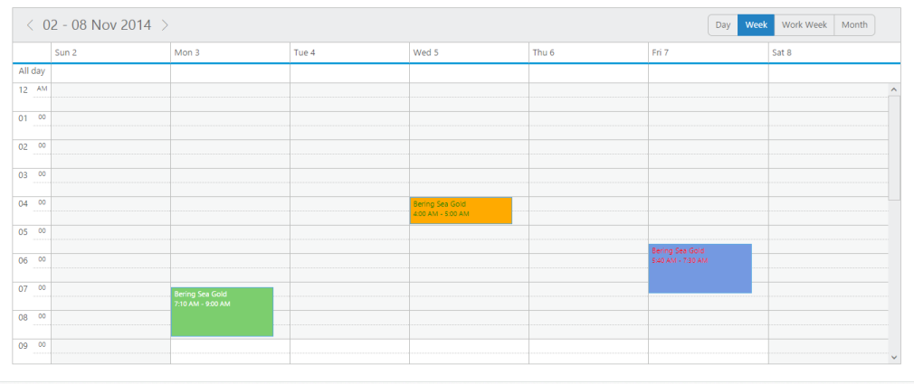

# Categorize	

* This feature allows you to differentiate the appointments with various categorize options and individual colors. You can also denote the status of the appointments using this categorize option and can specify your own user-defined category collection.

You can use the following code example to include the categorize option.



 



**Categorize Settings**

* The **categorizeSettings** is an object collection that holds the categorize related information such as the dataSource. It provides the collection of categorize values that are to be used in appointments, allowMultiple that enables/disables the multiple selection of categorize values and other mapper field names to bind the fields of the dataSource. 

The following are the sub-properties used within the categorizeSettings.

**enable**

* This option accepts either true or false, denoting whether to enable/disable the categorize option.

**allowMultiple**

* This property enables or disables the multiple selection of categories in the appointment window. 

**dataSource**

* It either accepts the local JSON data or remote data for binding the category related information. 

**text**

* It holds****the binding name for text field in the categorize dataSource.

**id**

* It holds the binding name for id field in the categorize dataSource.

**color**

* It holds the binding name for color field in the categorize dataSource.

**fontColor**

* It holds the binding name for fontcolor field in the categorize dataSource.

The following code example illustrates on how to render categorize feature in the **Schedule** control.



 



The output of the above code is illustrated as follows.

{:.image }

Figure 97: Schedule for the categorize option
{:.caption }

