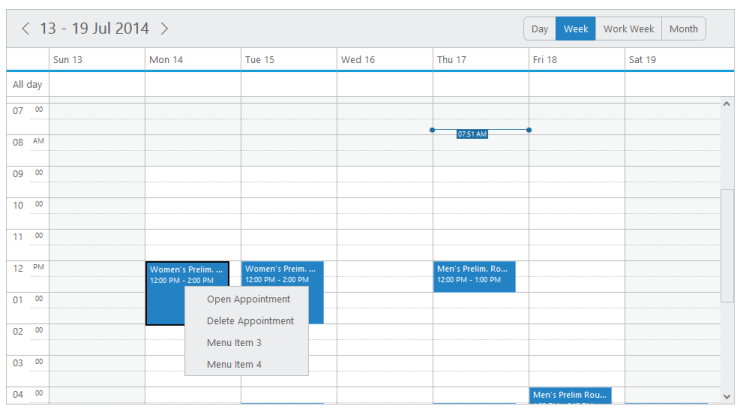
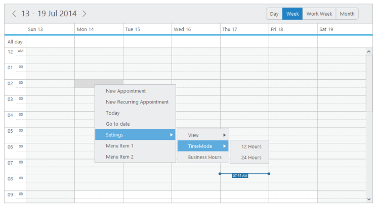

# Context Menu

* **Schedule** control is added with the context menu options that opens when you right-click over the cells or appointments. In addition to the default menu items available, it allows you to add the custom menu items and also the sub menu-items as per your requirement.

**contextMenuSettings**

* It is a collection that holds the menu items data.

**enable**

* It specifies whether to enable/disable the Context menu options.

**menuItems**

* It holds the appointment and cell related menu and custom-menu options.

**appointment**

* This collection accepts the id, text and parent Id of the menu items that are to be displayed when you right-click the appointments. It can also include custom-menu items.

**cells**

* This collection accepts the id, text and parent Id of the menu items that are to be displayed when you right-click the **Schedule** cells. It  also include custom-menu items.

**Appointment Menu Items**

* By default, the appointment menu options are provided with 2 items namely **Open Appointment** and **Delete Appointment**. 

* If you want to customize and use your own custom menu items, then you can replace the appointment menu items with their desired collections as explained in the following code.



 



Execute the above code to render the following output.

{:.image }

{:.caption }

___Figure_ _98__:___ _schedule with_ _appointment menu items_

**Categorize** 

* A new default menu item is included in the appointment menu items to support the categorize option through context menu. 

* The categorize data collection that are passed through the categorizesettings is utilised in rendering the categorize options in the context menu. 

You can refer the following code example to render the categorize options in the context menu.\



 



* Execute the above code to render the following output with categorized appointments. Also when you right click “Appointment”, the context menu with categorize option is displayed as follows.

{:.image }

Figure 99: Schedule for the categorize menu item in context menu
{:.caption }

**Cells** 

* By default, the cells menu options are provided with 5 items namely **New Appointment, New Recurring Appointment, Today, Go to Date** and **Settings with sub-options for views, time-mode and highlighting business hours**. 

* You can customize and use your own custom menu itemsby replacing the cell menu items with the desired collection as explained in the following code example.



 



Execute the above code to render the following output when you right-click on the cells.

{:.image }

{:.caption }

___Figure_ _100__:___ _schedule with_ _cells._

