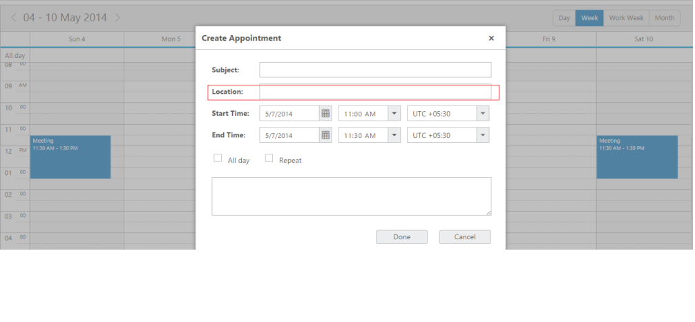
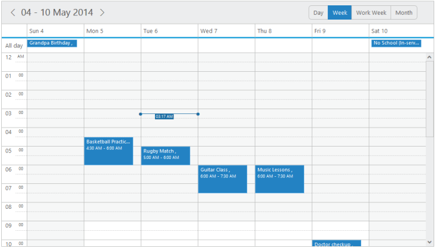
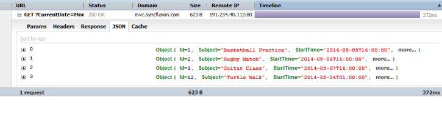
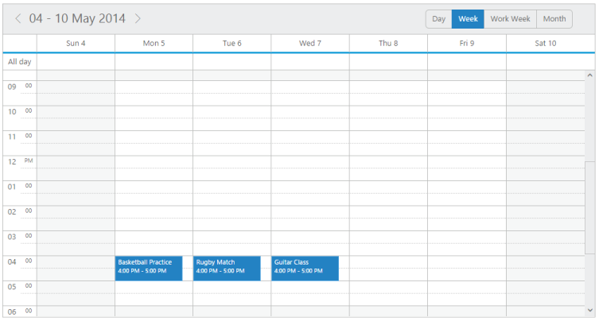

# Data-binding

* To render appointments to the **Schedule** control, you are required to bind the appointment data. The following sub-properties helps you to bind either the local/remote data to the **Schedule** control by binding the appropriate appointment data fields to the corresponding options.

**dataSource**

* This property assigns the local json data or remote (url binding) data to the **Schedule** control.

**query** 

* It accepts the data of object type, which is usually the query string to fetch the required data from a specific table based on certain condition. As this property is optional, it is not specified. 

The entire records that are initially assigned through dataSource is taken into consideration.

**tableName**

* It maps the corresponding name of the table from the location and the records are fetched to the **Schedule** control. As this property is optional, it is not specified. It takes the default dataSource into consideration. 

**id**

* It maps the corresponding id field name from the data table or json data that is assigned to the dataSource with the **id** property of the **Schedule** control. The **id** value that is fetched from the table is unique for each appointment.

**subject**

* It maps the corresponding subject field name from the data table or json data that is assigned to the dataSource with the **subject** property of the **Schedule** control. The **Subject** field denotes the appointment subject and it accepts the value of string type.

**description**

* It maps the corresponding description field name from the data table or json data that is assigned to the dataSource with the **description** property of the **Schedule** control. The **description** field is used to save more information related to the appointments. It accepts the value of string type.

**startTime**

* It maps the corresponding start time field name from the data table or json data that is assigned to the dataSource with the **startTime** property of the **Schedule** control. The **startTime** denotes the starting time of the appointment and it accepts the value of type dateTime.

**endTime**

* It maps the corresponding end time field name from the data table or json data that is assigned to the dataSource with the **endTime** property of the **Schedule** control. The **endTime** denotes the ending time of the appointment and it accepts the dateTime values from the database.

**recurrence**

* It maps the corresponding recurrence field name from the data table or json data that is assigned to the dataSource with the **recurrence** property of the **Schedule** control. This field determines whether the appointment is  normal or recurrence type. It accepts the Boolean type value either true/false. 

**recurrenceRule**

* It maps the corresponding recurrence rule field name from the data table or json data that is assigned to the dataSource with the **recurrenceRule** property of the **Schedule** control. This field defines the recurrence repeat string and accepts the string value.

**allDay**

* It maps the corresponding all day field name from the data table or json data that is assigned to the dataSource with the **allDay** property of the **Schedule** control. This field determines whether the appointment is created for the whole day or not. It accepts the Boolean value and when it is true, the appointment is created as an **allday** appointment in the **Schedule** control.

**resourceFields**

* It accepts the resource related field names as a string separated by a comma separator. When multiple resources are rendered on a **Schedule** control with multiple categories, then the name availed for each resource level is binded.

**categorize**

* It maps the corresponding categorize field name from the data table or JSON data, to the categorize property of the **Schedule** control.

**appointment settings:**

**location**

* It maps the corresponding location field name from the data table or JSON data, to the location property of the **Schedule** control.

* To display the “location field” enable the property “showLocationField”. ShowLocationField is used to display/show the appointments/events location details.

* You can use the following code example to include the “location field” in schedule control.



[JavaScript]

 



On executing the above specified code the **Location** field will be added in the create appointment window as follows:

{:.image }

{:.caption }

**priority**

* It maps the corresponding priority field name from the data table or JSON data, to the priority property of the **Schedule** control.

**Local data**

* You can locally assign the data to **Scheduler** control. Inorder to define the local data to the **Scheduler** control, map the user-defined json data names with its appropriate dataSource column names. 

* Specify the valid array of appointment objects to the dataSource property of the **Schedule** control as shown in the below code.



**[JavaScript]**

 



On executing the above specified code the **Scheduler** displays the appointments across the specific timeslots as follows:

{:.image }

{:.caption }

_Figure_ _50__:_ _schedule____with Local Data Binding_

**Remote data**

* Apart from assinging the local data you can bind the remote data to the **Schedule** control using service url.

* Inorder to avail that option refer the following steps:



**[JavaScript]**

 



The following screenshot displays the remote data bound to the **Schedule** control.

{:.image }

{:.caption }

Figure 51:Schedulewith Remote Data Binding

**Load On Demand**

* **Load on demand** is a powerful technique that is used to reduce the bandwidth size of consuming data. L**oad on demand** support has been added in our Schedule control, so that, it retrieves only the required appointment data from service/database during loading time, and that too for the current view. 

* The__**enableLoadOnDemand**  property is used to enable or disable the load on demand functionality of the schedule.

* If you have developer tools, you can capture the network transfer to check the consumed data of the Schedule. The following screnshot shows the data being loaded in **Schedule**.

{:.image }

{:.caption }

_Figure 3: Schedule Demanded data_

The following code example shows you how **load on demand** works with **Schedule**.



**[Javascript]**
// In this example **oData****service** is used

 



The following screenshot is the result of the above code example.

{:.image }

{:.caption }

_Figure 4: Schedule with load on demand_

* [Click here](http://js.syncfusion.com/demos/web/) to see how **load on demand** works with **Schedule****.**

