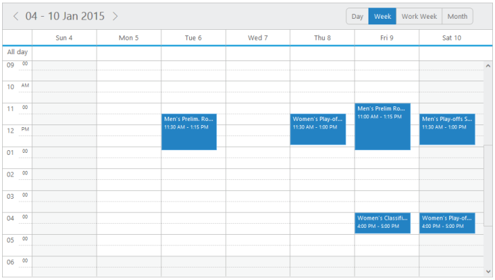
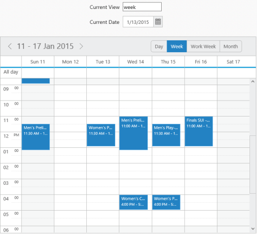
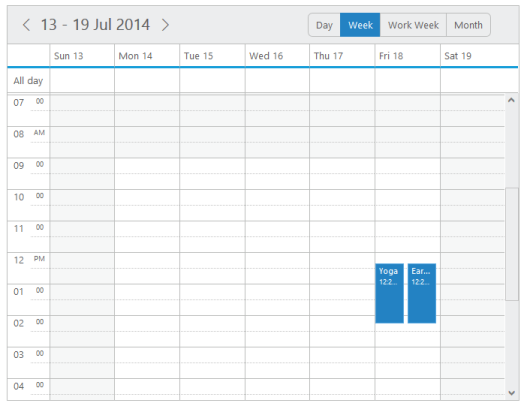

# MVVM

**Angular JS**

* **Schedule** contains angular support. You can add object as well as array object in the **Schedule**.

* The two way binding support is given to the **currentView**, **currentDate and datasource** properties. 

* **ej-Schedule** is the control tag in which **ej** is tag prefix and **Schedule** is the control name.

**Rendering the Schedule**

You can render the **Schedule** by using the following code example. Object in the array collection such as **appointmentSetting**, **contextMenuSettings**, etc. are extended with hyphen in the same tag.

**Example**: e-contextMenuSettings-enable.



<!--To Render the Schedule-->
<!doctype html>
<html ng-app="syncApp">
<head>
<!—Refer the necessary script here-->
</head>
<body ng-controller="Schedule">
<ej-Schedule style="float: left" id="Schedule1"
e-appointmentSettings-datasource="appointments"
e-appointmentSettings-id="Id"
e-appointmentSettings-subject="Subject"
e-appointmentSettings-startTime="StartTime"
e-appointmentSettings-endTime="EndTime"
e-appointmentSettings-description="Description"
e-appointmentSettings-allDay="AllDay"
e-appointmentSettings-recurrence="Recurrence"
e-appointmentSettings-recurrenceRule="RecurrenceRule"
e-width="100%" e-height="525px" e-currentview="setView"
e-currentdate="setDate" e-contextMenuSettings-enable="true">

</ej-Schedule>
</body>
</html>



**Adding Context menu settings**

* **Context menu** is an object type that has inner array object. 

* **contextMenuSettings** contains an object called **menuItem**.

* **Menu item** has two types of array objects for cells and appointment respectively.



<!--To Render the Schedule-->

<ej-Schedule style="float: left" id="Schedule1">

<!--Adding content menu item for appointment -->

<e-contextMenuSettings-menuItems-appointment>
< e-appointment e-id="open" e-text="Open Appointment"></ e-appointment>
< e-appointment e-id="delete" e-text="Delete Appointment"></ e-appointment>
< e-appointment e-id="categorize" e-text="Delete Appointment">
</ e-appointment>
</e-contextMenuSettings-menuItems-appointment>

<!--Adding content menu item for cells -->

<e-contextMenuSettings-menuItems-cells>
<e-contextMenuSettings-menuItems-cell
e-id="new" e-text="Create New Appointment">
</e-contextMenuSettings-menuItems-cell>

<e-contextMenuSettings-menuItems-cell
e-id="recurrence" e-text="Create recurrence Appointment">
</e-contextMenuSettings-menuItems-cell>

</e-contextMenuSettings-menuItems-cells>

</ej-Schedule>



**Adding Categorize option**

* **Categorize****option** is an array object. 

* **contextMenuSettings** contains an object called **menuItem**.

* **Menu item** has two types of array objects for cells and appointment respectively.



<!--To Render the Schedule-->

<ej-Schedule style="float: left" id="Schedule1" e-categorizesetting-enable="true"
e-categorizesetting-allowMultiple="true" e-categorizesetting-text="text"
e-categorizesetting-color="color"
e-categorizesetting-fontcolor="fontcolor" e-categorizesetting-id="id">

<!--Adding content menu item for appointment -->
<e-contextMenuSettings-menuItems-appointment>
</e-contextMenuSettings-menuItems-appointment>

<!--Adding content menu item for cells -->

<e-contextMenuSettings-menuItems-cells>
</e-contextMenuSettings-menuItems-cells>

<e-categorizesetting-datasource>

<e-categorizesetting-datasource text="Blue category"
color="Blue" fontcolor="Red" id="1">
</e-categorizesetting-datasource>

<e-categorizesetting-datasource text="yellow category"
color="yellow" fontcolor="Red" id="2">
</e-categorizesetting-datasource>

<e-categorizesetting-datasource text="red category" color="red"
fontcolor="Red" id="3">
</e-categorizesetting-datasource>

<e-categorizesetting-datasource text="orange category" color="orange"
fontcolor="Red" id="4">
</e-categorizesetting-datasource>

</e-categorizesetting-datasource>

</ej-Schedule>



Execute the above codes to render the Resultant schedule as follows.

{:.image }

Figure 132: Schedule Rendered in Angular JS
{:.caption }

**Two Way Binding** 

* **Schedule** control supports two way binding for the property **currentView**, **currentDate and datasource** as mentioned earlier. 

* [Click here](http://js.syncfusion.com/demos/web/) to see how Konckout binding works with schedule.

* The following code example explains how to achieve the two way binding to the **Schedule** control.



<!DOCTYPE html>
<html ng-app="syncApp" xmlns="http://www.w3.org/1999/xhtml">
<head>
<meta name="viewport" charset="utf-8" content="width=device-width, initial-scale=1.0" />
<!—Refer the necessary script here-->
</head>
<body ng-controller="ScheduleCtrl" style="width:50%">
Current View
<input id="ddlView" ej-dropdownlist e-datasource="dataList" e-value="drpvalue" e-width="107px" />
Current Date
<input id="datepick1" ej-datepicker e-value="setDate" e-width="107px" />
<ej-Schedule style="float: left" width="400" id="Schedule1"
e-appointmentSettings-datasource="appointments"
e-appointmentSettings-id="Id" e-appointmentSettings-subject="Subject"
e-appointmentSettings-startTime="StartTime"
e-appointmentSettings-endTime="EndTime"
e-appointmentSettings-description="Description"
e-appointmentSettings-allDay="AllDay"
e-appointmentSettings-recurrence="Recurrence"
e-appointmentSettings-recurrenceRule="RecurrenceRule"
e-width="100%" e-height="525px" e-currentview="setView"
e-currentdate="setDate" e-contextMenuSettings-enable="true"
e-categorizesetting-enable="true" e-categorizesetting-allowMultiple="true"
e-categorizesetting-text="text" e-categorizesetting-color="color"
e-categorizesetting-fontcolor="fontcolor" e-categorizesetting-id="id">
<e-categorizesetting-datasource>
<e-categorizesetting-datasource text="Blue category" color="Blue" fontcolor="Red" id="1"></e-categorizesetting-datasource>
<e-categorizesetting-datasource text="yellow category" color="yellow" fontcolor="Red" id="2"></e-categorizesetting-datasource>
<e-categorizesetting-datasource text="red category" color="red" fontcolor="Red" id="3"></e-categorizesetting-datasource>
<e-categorizesetting-datasource text="orange category" color="orange" fontcolor="Red" id="4"></e-categorizesetting-datasource>
</e-categorizesetting-datasource>
<e-contextMenuSettings-menuItems-appointment>
<appointment e-id="open" e-text="Open Appointment"></appointment>
<appointment e-id="delete" e-text="Delete Appointment"></appointment>
</e-contextMenuSettings-menuItems-appointment>
<e-contextMenuSettings-menuItems-cells>
<e-contextMenuSettings-menuItems-cell
e-id="new" e-text="Create New Appointment">
</e-contextMenuSettings-menuItems-cell>
<e-contextMenuSettings-menuItems-cell
e-id="recurrence" e-text="Create recurrence Appointment">
</e-contextMenuSettings-menuItems-cell>
<e-contextMenuSettings-menuItems-cell
e-id="today" e-text="Today">
</e-contextMenuSettings-menuItems-cell>
<e-contextMenuSettings-menuItems-cell
e-id="gotodate" -text="Go to date">
</e-contextMenuSettings-menuItems-cell>
</e-contextMenuSettings-menuItems-cells>
</ej-Schedule>

</body>
</html>



Execute the above code to render the following output.

{:.image }

Figure 133: ScheduleControl with two way binding in Angular JS
{:.caption }

**Knockout binding**

* **Knockout****support** allows you to bind the html elements against the available data models.One-way binding and Two-way binding are the two types of **knockout****binding** supported.

* **One way binding** refers to the process of applying observable values to all the available properties of the **Schedule** control. The changes made in **Schedule** control is not reflected and triggered in turn to the observable collection. This kind of binding applies to all the properties of the **Schedule** control.

* **Two-way binding** supports both the processes – it applies the observable values to the **Schedule** properties along with the changes made in the **Schedule** control is reflected back and triggered within the observable collections. Only few **Schedule** properties support **two-way binding** and they are CurrentView, CurrentDate and dataSource (within appointmentSettings object).

* Apply the plugin and property assigning to the **Schedule** element through the directive that starts with a letter **“e-“.** The following example depicts the way to bind data to the **Schedule** control through the **knockout****support**.

* [Click here](http://js.syncfusion.com/demos/web/) to see how Konckout binding works with schedule.



<!DOCTYPE html>
<html xmlns="http://www.w3.org/1999/xhtml">
<head>
<title>Essential JavaScript for Knockout</title>
</head>
<body>

</body>
</html>



Output of the above code example is as follows.

{:.image }

Figure 134: Schedule with Knockout Binding
{:.caption }

