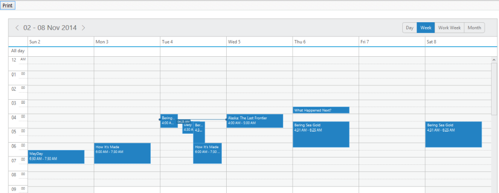
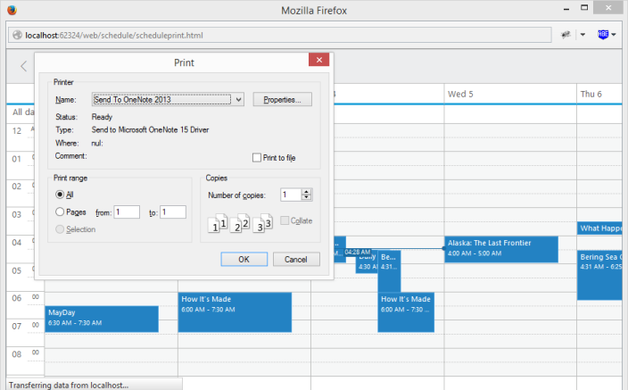
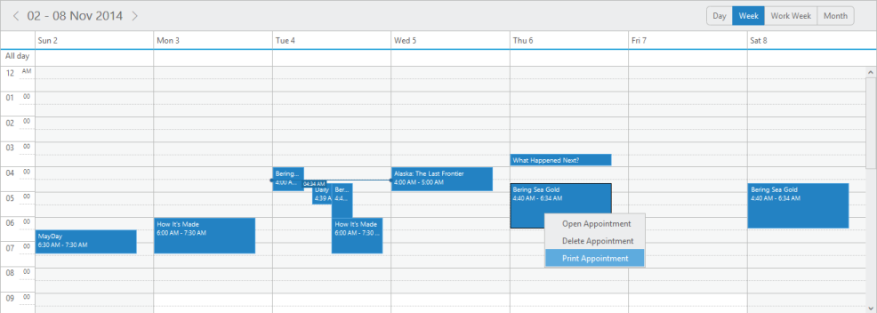

# Print

**Schedule** control is provided with the Print feature. You can print the entire **Schedule** control or separately print the appointment based on your requirement.

**Schedule Print**

You can print the **Schedule** control by using **print()** method. Use the following code example to print the **Schedule** control.



<!DOCTYPE html>
<html xmlns="http://www.w3.org/1999/xhtml">
<head>
<title>Schedule JS Print Sample</title>
<!-- Refer the necessary scripts here-->
</head>
<body>
<input class="print" type="button" value="Print" />

 

</body>
</html>



Execute the above code to render the following output.

{:.image }

{:.caption }

_Figure_ _121__: Schedule with print button_

Click the print button to render the following output.

{:.image }

{:.caption }

_Figure_ _122__: Schedule with Print window_

**Appointment Print**

* In **Schedule** control, you can print the appointment alone by using context menu. Add print as menu item in the context menu settings as in the following code example.



 



* Right click on the appointment and select print appointment in the context menu as follows.

{:.image }

{:.caption }

_Figure_ _123__: Schedule with Print option in Context Menu_

* Now, the widow is promoted to new document with appointment details and print window opens.

{:.image }

{:.caption }

_Figure_ _124__: Schedule with Appointment Print_

