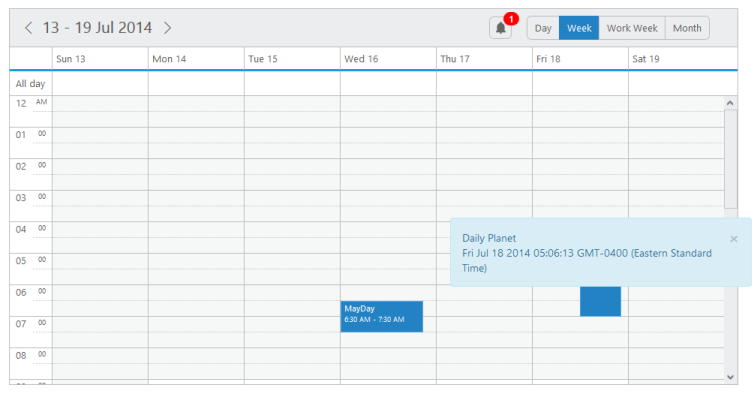

# Reminder

* **Reminder** option provides the list of reminder appointments and you can use those appointments for your own customized scenarios like displaying it as an end-user notification. To enable the reminder settings for the **Schedule** control, you can set the **enable** property as ‘**true’** within the **reminderSettings** option. 

* The **reminderSettings** option includes another optional property **alertBefore** that accepts integer value to denote the time before how long the reminder is notified to the user.

* For such case, you can also use an in-built event **reminder** that triggers when there is a reminder appointment. It provides the details of the list of reminder appointment details.

The following code example explains how to get the reminder list and display it as a notification for users.



<!DOCTYPE html>
<html xmlns="http://www.w3.org/1999/xhtml">
<head>
<title>Schedule JS Reminder options</title>
</head>
<body>
<!-- For Reminder list div elements-->

<a class="pull-left" href="#" style="margin-top: 9px; outline: medium none;">

0
</a>

<!-- Notification div element-->

<!-- Schedule div element-->

 

<!-- Styles applied for the reminder list divs and notification -->

</body>
</html>



Execute the above code to render the following output.

{:.image }

{:.caption }

___Figure_ _106__:___ _schedule with_ _Reminder._

