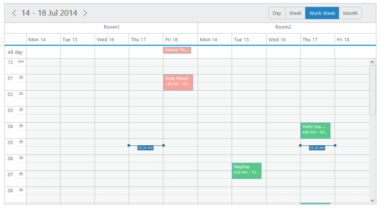
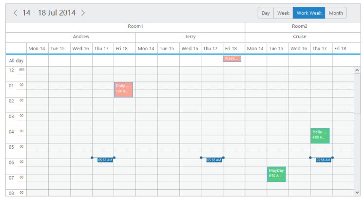
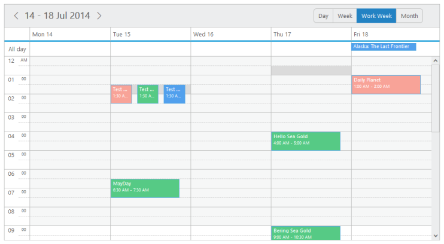

# Resources

**Multiple Resources**

* **Multiple Resource** feature provides support for rendering multiple resources on the **Schedule** control. You can group multiple resources under certain categories. 

* You can also save the appointments simultaneously on multiple resources or within the multiple categories using **allowMultiple** property enabled for different levels of resources.

* The two important properties to be defined for grouping the multiple resources are as follows:

**Resources**

* It accepts the resource data as an array collection. Here, you can define the field name with **resourceFields** to each of the resource level. The order of resource data objects that you provide within the resource collection defines the rendering order of the resources in the **Schedule**. 

* The first resource data object provided within the collection is always rendered as the top level order in the **Schedule**. The important sub-options available are as follows:

_field_

* This option holds the field name to be bound to each level of the resources.

_title_

* This option accepts a title string from the user that is displayed as the appropriate title for the resource field on the appointment window.

_name_

* It uniquely identifies each resource level while grouping.

_resourceSettings_

* It accepts the dataSource and bind field names related to the resources data. The sub-options present within it are as follows,

_dataSource_

* It either accepts the local JSON data or remote data for the resource related information. The field names it accepts are 

_text_

* It holds the binding name for text field in the resource dataSource.

_id_

* It holds the binding name for id field in the resource dataSource.

_groupId_

* It holds the binding name for group id field in the resource dataSource.

_color_

* It holds the binding name for color field in the resource dataSource.

_appointmentClass_

* It specifies the custom css class name to be applied for the appointments that belongs to each resource.

_allowMultiple_

* This property enables or disables the multiple selections of each resource in the appointment window. 

The following code example explains how to render the multiple resources on the **Schedule** control,







  $(function () {
        var dManager = ej.DataManager(window.ResourcesData).executeLocal(ej.Query().take(10));
        $("#Schedule1").ejSchedule({
            width: "100%",
            height: "525px",
            currentView: ej.Schedule.CurrentView.Workweek,
            // Groups the resources listed out in the below collection
          group: {
          resources: ["Rooms"]
          },
            // resource data collection
          resources: [
          {
          field: "roomId",
          title: "Room",
          name: "Rooms",
            // disables the multiple selection of resources in the appointment window.
          allowMultiple: false,
          resourceSettings: { dataSource: [
          { text: "Room1", id: 1, color: "#f8a398" },
          { text: "Room2", id: 2, color: "#56ca85"}],
          text: "text", id: "id", color: "color"
          }
          }],
            appointmentSettings: {
                dataSource: dManager,
                id: "Id",
                subject: "Subject",
                startTime: "StartTime",
                endTime: "EndTime",
                allDay: "AllDay",
                recurrence: "Recurrence",
                recurrenceRule: "RecurrenceRule",
                // bind the resource id fields collection of each level
                resourceFields: "roomId"

            }
        });
    });

    // The appointment data along with resource data to be passed to the dataSource are as follows,

    window.ResourcesData = [{
        Id: 100,
        Subject: "Bering Sea Gold",
        StartTime: new Date().setHours(9, 0),
        EndTime: new Date().setHours(10, 30),
        AllDay: false,
        Recurrence: true,
        RecurrenceRule: "FREQ=DAILY;INTERVAL=2;COUNT=10",
        roomId: 2
    }, {
        Id: 101,
        Subject: "Hello Sea Gold",
        StartTime: new Date().setHours(4, 0),
        EndTime: new Date().setHours(5, 0),
        AllDay: false,
        Recurrence: false,
        roomId: 2
    }, {
        Id: 105,
        Subject: "Daily Planet",
        StartTime: new Date(new Date().getTime() + 86400 * 1000 * 1).setHours(1, 0),
        EndTime: new Date(new Date().getTime() + 86400 * 1000 * 1).setHours(2, 0),
        AllDay: false,
        Recurrence: false,
        roomId: 1
    }, {
        Id: 106,
        Subject: "Alaska: The Last Frontier",
        StartTime: new Date(new Date().getTime() + 86400 * 1000 * 1).setHours(4, 0),
        EndTime: new Date(new Date().getTime() + 86400 * 1000 * 2).setHours(5, 0),
        AllDay: false,
        Recurrence: false,
        roomId: 1
    }, {
        Id: 109,
        Subject: "MayDay",
        StartTime: new Date(new Date().getTime() + 86400 * 1000 * -2).setHours(6, 30),
        EndTime: new Date(new Date().getTime() + 86400 * 1000 * -2).setHours(7, 30),
        AllDay: false,
        Recurrence: false,
        roomId: 2
    }];



The output of the above code looks as follows.

{:.image }

{:.caption }

___Figure_ _87__:___ _schedule with_ _multiple resource._

**Resource Grouping**

* The **Schedule** control supports another important property **group** related to the multiple resources. It accepts the unique name assigned to each resources in the resource collection. The names that are all listed in this option is grouped in the **Schedule** control.

The following steps defines the way to start with rendering multiple resources on the **Schedule** control.

* Define the appointment data with required resource-related information fields as follows.







 $(function () {
        window.ResourcesData = [{
            Id: 100,
            Subject: "Bering Sea Gold",
            StartTime: new Date().setHours(8, 0),
            EndTime: new Date().setHours(10, 0),
            AllDay: false,
            Recurrence: true,
            RecurrenceRule: "FREQ=DAILY;INTERVAL=2;COUNT=10",
            roomId: 1, ownerId: 1
        }, {
            Id: 101,
            Subject: "Hello Sea Gold",
            StartTime: new Date().setHours(4, 0),
            EndTime: new Date().setHours(5, 0),
            AllDay: false,
            Recurrence: false,
            roomId: 2, ownerId: 3
        }, {
            Id: 105,
            Subject: "Daily Planet",
            StartTime: new Date(new Date().getTime() + 86400 * 1000 * 1).setHours(1, 0),
            EndTime: new Date(new Date().getTime() + 86400 * 1000 * 1).setHours(2, 0),
            AllDay: false,
            Recurrence: false,
            roomId: 1, ownerId: 1
        }, {
            Id: 106,
            Subject: "Alaska: The Last Frontier",
            StartTime: new Date(new Date().getTime() + 86400 * 1000 * 1).setHours(4, 0),
            EndTime: new Date(new Date().getTime() + 86400 * 1000 * 1).setHours(5, 0),
            AllDay: false,
            Recurrence: false,
            roomId: 1, ownerId: 5
        }, {
            Id: 109,
            Subject: "MayDay",
            StartTime: new Date(new Date().getTime() + 86400 * 1000 * 2).setHours(6, 30),
            EndTime: new Date(new Date().getTime() + 86400 * 1000 * 2).setHours(7, 30),
            AllDay: false,
            Recurrence: false,
            roomId: 2, ownerId: 3
        }];
    });



* The above specified resource related fields are require to  bound to the resource dataSource and the following code defines the way to provide data to the resources and group collection. This step helps you to render multiple resources on the **Schedule** control,







 $(function () {
        // retrieve the appointment data through query
        var dManager = ej.DataManager(window.ResourcesData).executeLocal(ej.Query().take(10));

        $("#Schedule1").ejSchedule({
            width: "990px",
            height: "525px",
            currentView: ej.Schedule.CurrentView.Workweek,

            // define the resource collection as below
          resources: [
          { field: "roomId", // bind field name

          // title display for resources in the appointment window
          title: "Room",

          // for unique identification of resource levels
          name: "Rooms",

          // enable/disable the multiple selection of resources
          allowMultiple: false,

          resourceSettings: { dataSource: [
          { text: "Room1", id: 1, color: "#f8a398" },
          { text: "Room2", id: 2, color: "#51a0ed" }],
          text: "text", id: "id", color: "color"
          }
          },
          {
          field: "ownerId",
          title: "Owner",
          name: "Owners", allowMultiple: true,
          resourceSettings: { dataSource: [
          { text: "Andrew", id: 1, groupId: 1, color: "#f8a398" },
          { text: "Cruise", id: 3, groupId: 2, color: "#56ca85" },
          { text: "Jerry", id: 5, groupId: 1, color: "#51a0ed" }],
          text: "text", id: "id", groupId: "groupId", color: "color"
          }
          }],

          group: {
          // unique names of the resources to be grouped
          resources: ["Rooms", "Owners"]
          },

            appointmentSettings: {
                dataSource: dManager,
                id: "Id",
                subject: "Subject",
                startTime: "StartTime",
                endTime: "EndTime",
                allDay: "AllDay",
                recurrence: "Recurrence",
                recurrenceRule: "RecurrenceRule",
                // bind the resource id fields collection of each level
                resourceFields: "roomId,ownerId"
            }
        });
    });



* Execute the above code to render the output as follows.

{:.image }

{:.caption }

___Figure_ _88__:___ _schedule with_ _resource grouping._

**Multiple Appointment Creation**

* The “**allowMultiple**” option available for each resource object within the resource collection enables/disables the functionality of saving same appointment for multiple resources. 

* When this property is set to true, the resource related fields in the appointment window allows you to select multiple resources. Refer the following code example.







 $(function () {
        // retrieve the appointment data through query
        var dManager = ej.DataManager(window.ResourcesData).executeLocal(ej.Query().take(10));
        $("#Schedule1").ejSchedule({
            width: "100%",
            height: "525px",
            showCurrentTimeIndicator: false,
            currentDate: new Date (2014,4,5),
            currentView: ej.Schedule.CurrentView.Workweek,
          resources: [{
          field: "ownerId",
          title: "Owner",
          name: "Owners",
            // enables the multiple selection of resources in the appointment window.
          allowMultiple: true,
          resourceSettings: { dataSource: [
          { text: "Andrew", id: 1, color: "#f8a398" },
          { text: "Cruise", id: 3, color: "#56ca85" },
          { text: "Jerry", id: 5, color: "#51a0ed" }],
          text: "text", id: "id", color: "color"
          }
          }],
            appointmentSettings: {
                dataSource: dManager,
                id: "Id",
                subject: "Subject",
                startTime: "StartTime",
                endTime: "EndTime",
                allDay: "AllDay",
                recurrence: "Recurrence",
                recurrenceRule: "RecurrenceRule",
                // bind the resource id fields collection of each level
                resourceFields: "ownerId"

            }
        });
    });



* Execute the above code to display the **Schedule** control with appointments saved for multiple resources differentiated with its specific colors.

{:.image }

{:.caption }

___Figure_ _89__:___ _schedule with_ _multiple resource creation._

* To save the same appointment for multiple resources, refer the following steps,

* Double-click on the required work cell, the appointment window pops up as shown in the following image with an individual autocomplete field for selecting the available resources.

{:.image }

{:.caption }

_Figure_ _90__:  schedule with multiple appointment window._

* Since the **allowMultiple** property is set to ‘true’ for this resource object, so you can select any number of available resources in it as follows.

{:.image }

{:.caption }

_Figure_ _91__:___ _schedule with_ _multiple appointment window with different type owner._

* The same appointment with the subject **Test Ride** is created for each resource individually as follows when you click the **Done** button.

{:.image }

{:.caption }

_Figure_ _92__:___ _schedule with_ _saved multiple appointments with different type owner_

