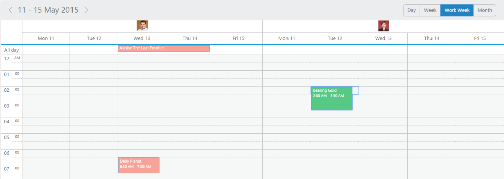

# Template

## Appointment Template

* The appointments are provided with rich template support, so that the customizations are done easily. You can add the appointment template to the **Schedule** control as follows.



**[JavaScript]**

 

// appointment template definition
****



* The output for the above code is as follows that displays the appointment with the template defined for it.

{:.image }

{:.caption }

___Figure_ _82__:____schedule with_ _template._

## Resource Header Template

* The resources are provided with rich template support, so that the customizations are done easily. You can add the resource header template to the **Schedule** control as follows.



**[JavaScript]**

 

// resourceheader template definition





> _**Important: The above used images should be present in a separate images folder, so that it will be referred properly.The images name should be saved with id as same as given in the resourceSettings inorder to set unqiue images to all resources.**_



* The output for the above code which displays the resource with the template defined for it is given below.

{:.image }

{:.caption }

