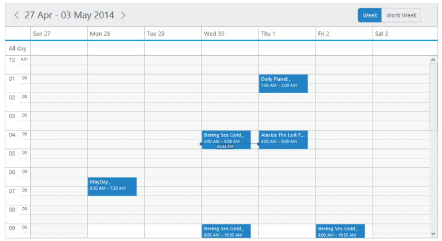

# Views

**View Customization**

* The **views** option in the **Schedule** control is a collection that allows you to add/remove the view items to it. The items that are added to it is displayed in the date-header section of the **Schedule** control.

* It accepts **Day,Week,WorkWeek,Month,CustomView** string array collections

The following code example describes how to customize the display of view options of the **Schedule** control.



**[JavaScript]**

 



* The following screenshot displays the output of the above code with the view customizations by displaying only two views namely **Week** and **Workweek** in the toolbar.

{:.image }

{:.caption }

_Figure_ _84__:____schedule with_ _view customization._

**Current View**

* By default, the **Schedule** control is displayed with the **Week** view. It is possible to change the current view of the **Schedule** control by setting the **currentView** option with the required view name. 

* **ej.Schedule.CurrentView.Day,ej.Schedule.CurrentView.Week, ej.Schedule.CurrentView.WorkWeek, ej.Schedule.CurrentView.Month, ej.Schedule.CurrentView.CustomView** are the valid enum values that are accepted by **currentView** property. 

* By setting **CustomView** option to the **currentView** property, the dates specified as the start and end in the **renderDates** object are rendered in the **Schedule**

The following code example explains how to change the current view of the **Schedule** control.



**[JavaScript]**

 



* Execute the above code to render the following screenshot that displays **day** view as the **currentView** of the **Schedule** control,

{:.image }

{:.caption }

___Figure_ _85__:___ _schedule with_ _current view._

**Custom Date Rendering**

* It is possible to render only the user-specified date ranges in the **Schedule** control by using the **renderDates** property. 

* To render the **Schedule** control with specific date ranges, it is necessary to specify the start and end dates as follows.



**[JavaScript]**

 



The output of the above code example is as follows.

{:.image }

Figure 86: Currentview as customView to render the custom dates
{:.caption }



> _**Important: When the date ranges specified in the renderDates property yield more than the difference of 7 days, then the schedule is rendered in the month-like view with the user provided dates. When the date difference yields less than 7, then the schedule gets rendered in the normal view with the specified dates.**_



