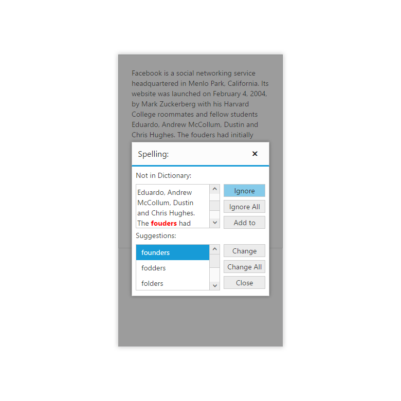

# Responsive

The SpellCheck control has support for responsive behavior based on client browser’s width and height. To enable responsive, [isResponsive](/api/js/ejspellcheck#members:isresponsive) property should be true.

The following code example describes the above behavior.



    



The dialog of spell check control is rendering based on the client browser’s width and height. Refer to the following code to render the spellcheck dialog control with responsive.



     <input type="button" id="Spell" />



Mobile Rendering Screenshot:

