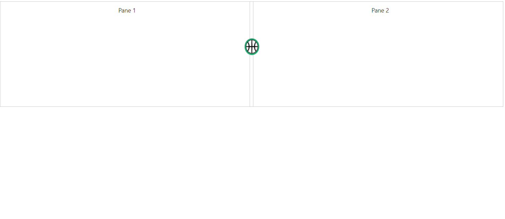

# How To?

### Change Expand/Collapse icons

By default, you are provided with collapse/expand icons in **Split bar** to collapse or expand the splitter panes. We have provided template support to replace existing expand/collapse icons. The template support will only replace the icons, where you need to define the actions for the template icons.

* [expanderTemplate](https://help.syncfusion.com/api/js/ejsplitter#members:expandertemplate) Specifies HTML element string to replace template with existing expand/collapse icons. 

* [clickOnExpander](https://help.syncfusion.com/api/js/ejsplitter#events:clickonexpander) event is triggered when we click on the template icon. This will allow you to define action to be performed on clicking the template icon.



    

        

            
Pane 1 

        

        

            
Pane 2 

        

    
                   





        $("#innerSplitter").ejSplitter({
             height: 250,width:"80%",
             expanderTemplate: '',
			 clickOnExpander: function(args)
			{
			      if(flag) {this.collapse(0); flag=false;}
			      else {this.expand(0); flag=true;}
			}
		};)





        .cont {
            padding: 10px 0 0 10px;
            text-align: center;
        }   
        .eimg {
            height:40px;
            width:35px;
			margin-left: -13px;
        }  
       .e-splitter .e-splitbar .e-splitter-h-template {
            top: 15%;
       }



The output for Splitter with **Template support**.

 

### Change the splitter pane size dynamically

Splitter pane size can be changed by updating model property of [`paneSize`](https://help.syncfusion.com/api/js/ejsplitter#members:properties) and by refreshing the control using [`refresh`](https://help.syncfusion.com/api/js/ejsplitter#methods:refresh) public method.  As shown in the below code, based on the selected dropdown list value, pane size of splitter is changed.



Select PaneSize
<input type="text" id="paneSize" />

    <ul>
       <li>25</li>
       <li>50</li>
       <li>75</li>
    </ul>

 

    

        
Pane 1 

    

    

        
Pane 2 

    







 